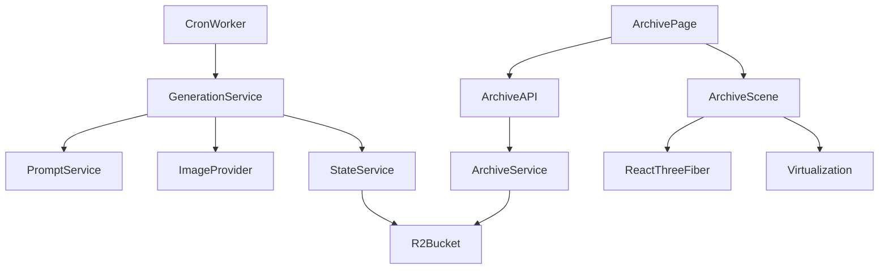
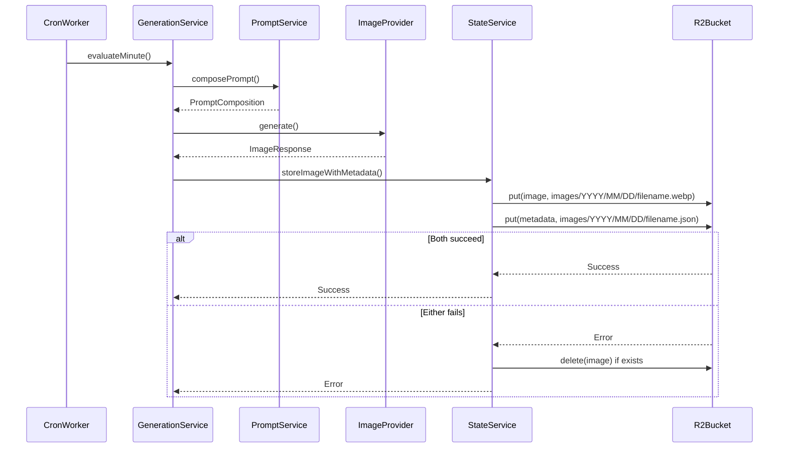
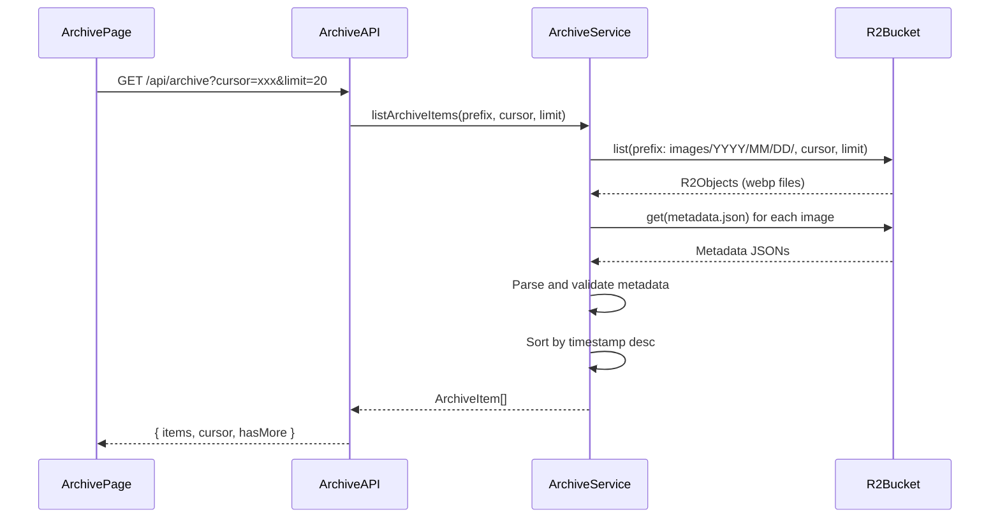
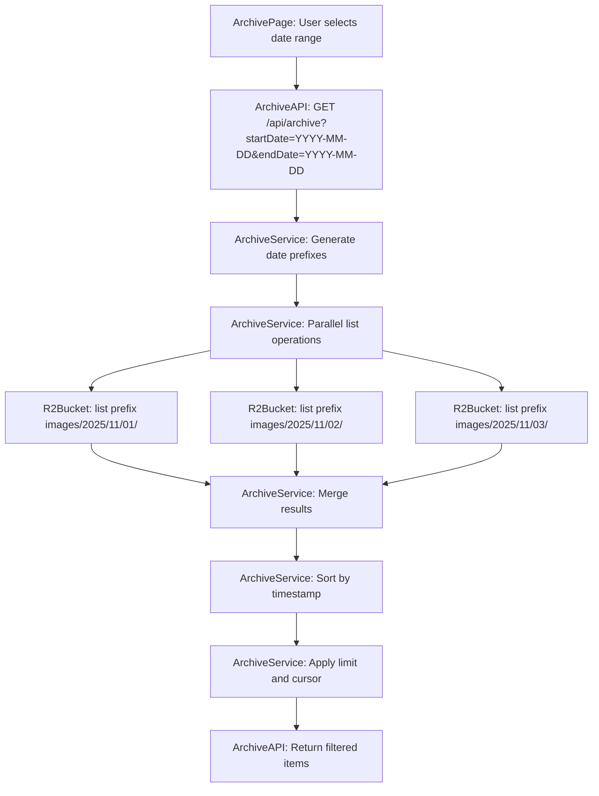
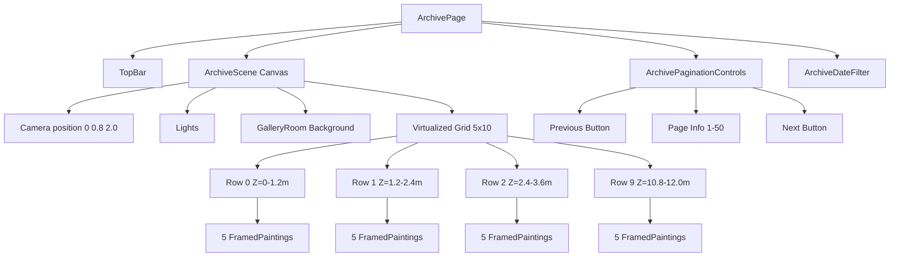
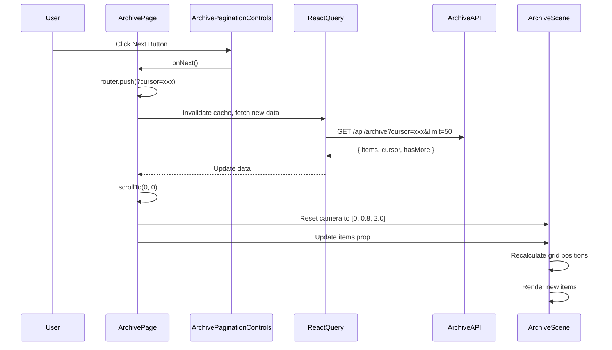

# Design Document

## Overview

アーカイブページ機能は、DOOM INDEXで生成された全ての絵画を時系列で一覧表示し、各作品の生成パラメータ（Market Cap値、視覚パラメータ、シード値など）を閲覧可能にする。数万枚規模の画像を効率的に扱うため、R2ストレージの日付ベースプレフィックス構造とリスト機能を活用し、時間ベースのソート・フィルタリングを実現する。Three.js内で3Dギャラリーとして表示することで、既存の美術館体験と一貫性を保つ。

**Purpose**: この機能は、過去に生成された全ての絵画を時系列で閲覧し、各作品の生成パラメータを分析可能にする価値を提供する。研究者やアート愛好家が、市場データの変動と生成アートの関係を探索できるようにする。

**Users**: アーカイブページは、過去の作品を閲覧したいユーザー、生成パラメータを分析したい研究者、特定の期間の作品を探したいコレクターが利用する。

**Impact**: 現在のシステムは最新の1枚のみを表示しているが、この機能により全履歴へのアクセスが可能になる。画像生成フローにメタデータ保存を追加し、R2ストレージ構造を日付ベースのプレフィックス構造に刷新する。

### Goals

- 数万枚規模の画像を効率的にページネーション表示する
- 時間ベースのソート・フィルタリングを実現する
- 各画像の生成パラメータ（MC値、視覚パラメータ、シード値）を閲覧可能にする
- Three.js内で仮想化された3Dギャラリーとして表示し、既存の美術館体験と一貫性を保つ
- メタデータJSONを必須とし、クリーンなデータ構造を強制する
- モバイルとデスクトップの両方で快適に閲覧できるレスポンシブデザインを実現する
- 各絵画を詳細に閲覧できるモーダルビューを提供する

### Non-Goals

- 既存画像の移行や後方互換性の提供
- 画像の編集や削除機能
- ユーザーアカウントや認証機能
- 画像のダウンロード機能
- ソーシャル共有機能（既存の共有機能は維持）

## Architecture

### Existing Architecture Analysis

DOOM INDEXの既存アーキテクチャは以下の構造を持つ：

- **サービス層**: `src/services/`にビジネスロジックが集約され、`neverthrow`の`Result`型でエラーハンドリングを行う
- **ストレージ層**: `src/lib/r2.ts`でR2操作を抽象化し、Workers環境とNext.js環境の差を吸収
- **状態管理**: `StateService`がR2への読み書きを担当し、`storeImage()`メソッドで画像を保存
- **画像生成**: `GenerationService`が`PromptService`と`ImageProvider`を使用して画像を生成し、`StateService.storeImage()`で保存
- **フロントエンド**: Next.js App Routerを使用し、React Queryでデータ取得、React Three Fiberで3D表示
- **API層**: `src/app/api/`にEdge RuntimeのAPI Routesを配置

既存パターンを維持しつつ、以下の拡張を行う：

- `GenerationService`にメタデータ保存機能を追加
- `StateService`に日付ベースのプレフィックス構造での保存機能を追加
- 新規`ArchiveService`を作成してR2の`list`操作を担当
- 新規`/api/archive`エンドポイントを追加
- 新規`ArchiveScene`コンポーネントを作成して3Dアーカイブ表示を実現

### High-Level Architecture



**Architecture Integration**:

- 既存パターン維持: サービス層の`Result`型、R2抽象化層、React Queryパターンを継続利用
- 新規コンポーネント導入: `ArchiveService`、`ArchiveAPI`、`ArchiveScene`を追加
- 技術整合性: R2の`list` APIを活用し、既存のR2操作パターンと整合
- Cloudflare統合: R2 Bindingを既存と同様に使用し、Edge Runtimeで実行

### Technology Alignment

本機能は既存の技術スタックに完全に整合する：

- **フロントエンド**: Next.js 16 App Router、React 19、TypeScript 5.9
- **3D表示**: React Three Fiber、Three.js（既存の`GalleryScene`パターンを継承）
- **データ取得**: TanStack Query（既存の`useMc`、`useGlobalState`パターンを継承）
- **エラー処理**: neverthrowの`Result`型（既存のサービス層パターンを継承）
- **ストレージ**: Cloudflare R2（既存の`StateService`パターンを拡張）
- **API層**: Next.js Edge Runtime（既存の`/api/mc`パターンを継承）

**新規依存関係**: なし（既存の技術スタックのみを使用）

**Key Design Decisions**:

1. **日付ベースプレフィックス構造の採用**
   - **Context**: 数万枚の画像を効率的にクエリする必要がある
   - **Alternatives**:
     - フラット構造（`images/DOOM_*.webp`）: 全オブジェクトスキャンが必要
     - ハッシュベース構造（`images/{hash}/DOOM_*.webp`）: 時間フィルタリングが困難
     - 日付ベース構造（`images/{YYYY}/{MM}/{DD}/DOOM_*.webp`）: 時間フィルタリングが効率的
   - **Selected Approach**: 日付ベースプレフィックス構造を採用
   - **Rationale**: R2の`list` APIで`prefix`オプションを使用することで、特定の日付範囲のクエリが効率的になる。全オブジェクトをスキャンする必要がなく、リクエスト数とコストを削減できる
   - **Trade-offs**: ファイル名にタイムスタンプを含める必要があるが、これは既存の`buildGenerationFileName()`関数で実現可能

2. **メタデータJSONの必須化**
   - **Context**: アーカイブクエリで生成パラメータを取得する必要がある
   - **Alternatives**:
     - メタデータなし: ファイル名から推測（情報が限定的）
     - オプショナルメタデータ: 後方互換性が必要（複雑性が増す）
     - 必須メタデータ: 全ての画像にメタデータが存在（シンプルで一貫性がある）
   - **Selected Approach**: メタデータJSONを必須とする
   - **Rationale**: 後方互換性を無視することで、クリーンで一貫性のあるデータ構造を実現できる。メタデータがない画像はスキップすることで、システムの整合性を保つ
   - **Trade-offs**: 既存画像は移行が必要だが、新規生成画像からは一貫性が保証される

3. **仮想化による3Dレンダリング最適化**
   - **Context**: 数万枚の画像を3D空間に表示する必要がある
   - **Alternatives**:
     - 全画像をレンダリング: メモリとパフォーマンスの問題
     - 2Dグリッド表示: 既存の3D体験と不一致
     - 仮想化された3D表示: ビューポート内のみレンダリング（パフォーマンスとUXの両立）
   - **Selected Approach**: 仮想化された3D表示を採用
   - **Rationale**: 既存の`GalleryScene`と一貫性を保ちながら、大量データを効率的に表示できる。ビューポート外の画像はメモリから削除し、スクロール時に動的に読み込む
   - **Trade-offs**: 実装の複雑性が増すが、UXとパフォーマンスの両立が可能

## System Flows

### 画像生成時のメタデータ保存フロー



### アーカイブ一覧取得フロー



### 時間ベースフィルタリングフロー



## Requirements Traceability

| Requirement | Requirement Summary                                     | Components                         | Interfaces                        | Flows                                                    |
| ----------- | ------------------------------------------------------- | ---------------------------------- | --------------------------------- | -------------------------------------------------------- |
| 1.1-1.9     | 画像生成時の統一されたデータ構造とメタデータ保存        | GenerationService, StateService    | storeImageWithMetadata()          | 画像生成時のメタデータ保存フロー                         |
| 2.1-2.12    | R2リストAPIによる画像一覧取得と時間ベースフィルタリング | ArchiveService, ArchiveAPI         | listArchiveItems()                | アーカイブ一覧取得フロー、時間ベースフィルタリングフロー |
| 3.1-3.5     | アーカイブアイテムの型定義とAPIレスポンス               | ArchiveService, ArchiveAPI         | ArchiveItem型、型ガード           | アーカイブ一覧取得フロー                                 |
| 4.1-4.4     | アーカイブページのNext.jsルート実装                     | ArchivePage                        | /archive route                    | -                                                        |
| 5.1-5.5     | Three.js内でのアーカイブギャラリー表示                  | ArchiveScene                       | ArchiveScene component            | -                                                        |
| 6.1-6.5     | 仮想化によるレンダリング負荷低減                        | ArchiveScene                       | Virtualization logic              | -                                                        |
| 7.1-7.5     | ページネーションUIとナビゲーション                      | ArchivePage, ArchiveUI             | Pagination controls               | -                                                        |
| 8.1-8.8     | 画像メタデータの表示と時間ベースフィルタリング          | ArchivePage, ArchiveUI, ArchiveAPI | Date range picker, Metadata modal | 時間ベースフィルタリングフロー                           |
| 9.1-9.6     | クリーンなデータ構造の強制と整合性保証                  | GenerationService, ArchiveService  | Validation logic                  | 画像生成時のメタデータ保存フロー                         |
| 10.1-10.7   | パフォーマンス最適化とキャッシュ戦略                    | ArchiveAPI, ArchivePage            | React Query cache                 | -                                                        |

## Components and Interfaces

### Storage Layer

#### StateService Extension

**Responsibility & Boundaries**

- **Primary Responsibility**: 日付ベースのプレフィックス構造で画像とメタデータを保存する
- **Domain Boundary**: ストレージ層、R2操作の抽象化
- **Data Ownership**: R2ストレージへの画像とメタデータの書き込み
- **Transaction Boundary**: 画像とメタデータの保存をアトミックに扱う

**Dependencies**

- **Inbound**: GenerationService
- **Outbound**: R2Bucket（Cloudflare R2 Binding）
- **External**: なし

**Contract Definition**

```typescript
interface StateService {
  // Existing methods...
  storeImage(key: string, buf: ArrayBuffer): Promise<Result<string, AppError>>;

  // New method for archive feature
  storeImageWithMetadata(
    imageBuffer: ArrayBuffer,
    metadata: ArchiveItemMetadata,
    minuteBucket: string,
  ): Promise<Result<{ imageUrl: string; imageKey: string; metadataKey: string }, AppError>>;
}
```

- **Preconditions**: `minuteBucket`はISO 8601形式（`YYYY-MM-DDTHH:mm`）、`metadata`は必須フィールドを含む
- **Postconditions**: 画像とメタデータの両方がR2に保存され、公開URLが返却される。いずれかが失敗した場合、両方がロールバックされる
- **Invariants**: 画像とメタデータは同一プレフィックス（`images/{YYYY}/{MM}/{DD}/`）に保存される

**Integration Strategy**

- **Modification Approach**: 既存の`StateService`に`storeImageWithMetadata()`メソッドを追加
- **Backward Compatibility**: 既存の`storeImage()`メソッドは維持（既存コードとの互換性のため）
- **Migration Path**: `GenerationService`を段階的に移行し、新規生成画像から新しいメソッドを使用

### Archive Domain

#### ArchiveService

**Responsibility & Boundaries**

- **Primary Responsibility**: R2の`list` APIを使用してアーカイブアイテムを取得し、メタデータを読み込んで検証する
- **Domain Boundary**: アーカイブドメイン、R2クエリ操作
- **Data Ownership**: アーカイブアイテムの取得と変換
- **Transaction Boundary**: 読み取り専用操作のため、トランザクション境界なし

**Dependencies**

- **Inbound**: ArchiveAPI
- **Outbound**: R2Bucket（Cloudflare R2 Binding）
- **External**: なし

**Contract Definition**

```typescript
interface ArchiveService {
  listArchiveItems(options: ArchiveListOptions): Promise<Result<ArchiveListResponse, AppError>>;
}

type ArchiveListOptions = {
  prefix?: string; // Date-based prefix: images/YYYY/MM/DD/
  cursor?: string; // R2 cursor for pagination
  limit?: number; // Max 100, default 20
  startDate?: string; // YYYY-MM-DD format
  endDate?: string; // YYYY-MM-DD format
};

type ArchiveListResponse = {
  items: ArchiveItem[];
  cursor?: string;
  hasMore: boolean;
};
```

- **Preconditions**: `limit`は1-100の範囲、`startDate`と`endDate`は`YYYY-MM-DD`形式
- **Postconditions**: メタデータが存在し、必須フィールドが揃っている画像のみが`items`に含まれる。`timestamp`降順でソートされる
- **Invariants**: メタデータがない画像はスキップされ、エラーログが記録される

#### ArchiveAPI

**Responsibility & Boundaries**

- **Primary Responsibility**: Next.js API Routeとしてアーカイブ一覧を提供する
- **Domain Boundary**: API層、Edge Runtime
- **Data Ownership**: HTTPリクエスト/レスポンスの変換
- **Transaction Boundary**: 読み取り専用操作のため、トランザクション境界なし

**Dependencies**

- **Inbound**: ArchivePage（フロントエンド）
- **Outbound**: ArchiveService
- **External**: なし

**Contract Definition**

**API Contract**:

| Method | Endpoint     | Request                                              | Response                                                      | Errors   |
| ------ | ------------ | ---------------------------------------------------- | ------------------------------------------------------------- | -------- |
| GET    | /api/archive | Query: `cursor?`, `limit?`, `startDate?`, `endDate?` | `{ items: ArchiveItem[], cursor?: string, hasMore: boolean }` | 400, 500 |

**Request Schema**:

- `cursor`: string (optional) - R2 cursor for pagination
- `limit`: number (optional, default: 20, max: 100) - Number of items per page
- `startDate`: string (optional) - Date in `YYYY-MM-DD` format
- `endDate`: string (optional) - Date in `YYYY-MM-DD` format

**Response Schema**:

```typescript
{
  items: ArchiveItem[];
  cursor?: string;
  hasMore: boolean;
}
```

### Frontend Layer

#### ArchivePage

**Responsibility & Boundaries**

- **Primary Responsibility**: アーカイブページのNext.jsルートを提供し、初期データをSSRで取得する
- **Domain Boundary**: ページ層、Next.js App Router
- **Data Ownership**: ページの状態管理とデータ取得
- **Transaction Boundary**: 読み取り専用操作のため、トランザクション境界なし

**Dependencies**

- **Inbound**: Next.js Router
- **Outbound**: ArchiveAPI、ArchiveScene、React Query
- **External**: なし

**Contract Definition**

**Page Route**: `src/app/archive/page.tsx`

- **SSR Behavior**: 初期ページ（`cursor`なし、`limit=50`）のデータを取得して表示
- **Client Navigation**: React Queryを使用してページネーションを管理
- **Error Handling**: エラーメッセージとリトライボタンを表示

**UI/UX設計**:

**1. ページレイアウト**:

- **構造**: `TopBar`（固定ヘッダー）+ `ArchiveScene`（3D Canvas、全画面）+ `ArchivePaginationControls`（固定フッター）
- **レイアウト**: Canvasは全画面（`position: fixed, width: 100vw, height: 100vh`）、ページネーションコントロールは画面下部に固定配置

**2. 1ページあたりの表示枚数**:

- **初期表示**: 50枚（`limit=50`）
- **3D空間での配置**: 5列×10行のグリッド（合計50枚）
- **仮想化**: ビューポート内の約25-30枚のみをレンダリング（5列×5-6行）
- **理由**:
  - 50枚は1ページのデータ量として適切（APIの`limit`最大100件の半分）
  - 5列×10行のグリッドは、スクロール体験とパフォーマンスのバランスが良い
  - 仮想化により、実際にレンダリングするのは25-30枚程度

**3. ページネーションUI**:

- **配置**: 画面下部中央に固定配置（`position: fixed, bottom: 32px, left: 50%, transform: translateX(-50%)`）
- **スタイル**: 既存の`TopBar`や`RealtimeDashboard`と同様のデザイン（`rgba(0, 0, 0, 0.8)`背景、`backdrop-blur`、`border`）
- **コンポーネント構成**:
  - **前へボタン**: 左矢印アイコン、`cursor`が存在する場合のみ有効
  - **ページ情報**: 現在のページ範囲表示（例: "1-50 of 1,234"）
  - **次へボタン**: 右矢印アイコン、`hasMore`が`true`の場合のみ有効
  - **ローディングインジケータ**: データ取得中はスピナーを表示
- **インタラクション**:
  - ボタンクリックで`cursor`を更新し、URLクエリパラメータを変更
  - ブラウザの戻る/進むボタンで動作（URLクエリパラメータに基づく）

**4. 日付フィルタUI**:

- **配置**: 画面右上（`TopBar`の下、または`TopBar`内に統合）
- **コンポーネント**: 日付範囲ピッカー（開始日・終了日）
- **スタイル**: 既存のUIパターンに合わせたモーダルまたはドロップダウン
- **動作**: 日付選択で`startDate`と`endDate`クエリパラメータを更新

**5. 詳細モーダル**:

- **トリガー**: 画像クリック
- **配置**: 画面中央にモーダル表示（全画面オーバーレイ）
- **内容**:
  - 高解像度画像（拡大表示）
  - メタデータ（生成時刻、MC値、視覚パラメータ、シード値、ファイルサイズ）
  - プロンプトテキスト（全文表示）
  - ネガティブプロンプト
  - 各トークンのMC値の詳細表示（`mcRounded`の全8トークン）
- **スタイル**: 既存の`RealtimeDashboard`のヘルプオーバーレイと同様のデザイン
- **操作**:
  - 閉じるボタン（右上）
  - ESCキーで閉じる
  - オーバーレイクリックで閉じる
  - 画像のピンチズーム・パン操作（モバイル）

**6. レスポンシブデザイン（モバイル対応）**:

- **デスクトップ（`>= 768px`）**:
  - グリッドレイアウト: 5列×10行（50枚/ページ）
  - ページネーション: 画面下部中央に固定
  - 日付フィルタ: 画面右上に配置
  - 詳細モーダル: 画面中央、画像とメタデータを横並び表示
- **モバイル（`< 768px`）**:
  - グリッドレイアウト: 2列×25行（50枚/ページ）
  - グリッド間隔: X軸1.0m、Z軸1.0m（デスクトップより狭く）
  - カメラ初期位置: `[0, 0.8, 1.5]`（より近い位置から見る）
  - ページネーション: 画面下部全幅、ボタンサイズ拡大（タップしやすく）
  - 日付フィルタ: `TopBar`内に統合、ハンバーガーメニューから開く
  - 詳細モーダル: 全画面表示、画像とメタデータを縦並び表示、スクロール可能

#### ArchiveScene

**Responsibility & Boundaries**

- **Primary Responsibility**: Three.js内でアーカイブアイテムを3D空間に表示し、仮想化を実装する
- **Domain Boundary**: 3D表示層、React Three Fiber
- **Data Ownership**: 3Dシーンの状態と仮想化ロジック
- **Transaction Boundary**: 読み取り専用操作のため、トランザクション境界なし

**Dependencies**

- **Inbound**: ArchivePage
- **Outbound**: React Three Fiber、Three.js、ArchiveAPI
- **External**: なし

**Contract Definition**

**Component Interface**:

```typescript
interface ArchiveSceneProps {
  items: ArchiveItem[];
  onLoadMore?: () => void;
  hasMore: boolean;
  isLoading: boolean;
}
```

**実装詳細**:

**1. Canvas設定**:

- 既存の`GalleryScene`と同様のCanvas設定を使用
- `frameloop="demand"`で省電力化
- 既存の`Lights`コンポーネントを再利用
- 既存の`GalleryRoom`コンポーネントを再利用（背景として）

**2. グリッドレイアウト**:

- **デスクトップ（`>= 768px`）**:
  - **グリッドサイズ**: 横5列、縦は可変（1ページあたり10行、合計50枚）
  - **各画像の間隔**: X軸方向1.2m、Z軸方向1.2m
  - **開始位置**: `[0, 0.8, 0]`（既存の`FramedPainting`のY位置に合わせる）
  - **グリッド計算**: `gridX = index % 5`, `gridZ = Math.floor(index / 5)`
  - **位置計算**: `position = [gridX * 1.2 - 2.4, 0.8, gridZ * 1.2]`
  - **1ページの範囲**: Z軸方向に0mから12m（10行×1.2m）まで配置
  - **次のページ**: 前のページの最後のZ位置から続けて配置（例: 1ページ目が0-12m、2ページ目が12-24m）
- **モバイル（`< 768px`）**:
  - **グリッドサイズ**: 横2列、縦は可変（1ページあたり25行、合計50枚）
  - **各画像の間隔**: X軸方向1.0m、Z軸方向1.0m
  - **開始位置**: `[0, 0.8, 0]`
  - **グリッド計算**: `gridX = index % 2`, `gridZ = Math.floor(index / 2)`
  - **位置計算**: `position = [gridX * 1.0 - 0.5, 0.8, gridZ * 1.0]`
  - **1ページの範囲**: Z軸方向に0mから25m（25行×1.0m）まで配置
  - **次のページ**: 前のページの最後のZ位置から続けて配置（例: 1ページ目が0-25m、2ページ目が25-50m）

**3. 仮想化の実装**:

- **ビューポート計算**: `useThree`フックでカメラ位置とビューポートを取得
- **可視判定**: 各画像の3D位置をカメラの視錐台（frustum）と比較
- **レンダリング範囲**: カメラ前方±2列、上下±3行のバッファ領域をレンダリング
- **メモリ管理**: ビューポート外の画像のテクスチャを`dispose()`で解放
- **動的読み込み**: スクロール時に新しい画像を`Suspense`で遅延読み込み

**4. スクロールとカメラ連動**:

- **スクロール方式**: HTMLのスクロールイベントを監視し、Z軸方向にカメラを移動
- **デスクトップ（`>= 768px`）**:
  - **カメラ初期位置**: `[0, 0.8, 2.0]`（1ページ目の中央付近を見る）
  - **カメラ移動**: `useFrame`でスクロール位置に応じてカメラのZ位置を更新
  - **スクロール計算**:
    - 1行あたりの高さ: 120px（仮想スクロール高さ）
    - スクロール位置からZ座標への変換: `targetZ = 2.0 + (scrollY / 120) * 1.2`
    - カメラを`[0, 0.8, targetZ]`に配置
  - **スムーズスクロール**: `lerp`を使用してカメラ移動をスムーズに補間（`lerpFactor = 0.1`）
  - **仮想スクロール高さ**: 全アイテム数×120px（1行あたりの高さ）で計算し、HTMLの`scrollHeight`を設定
- **モバイル（`< 768px`）**:
  - **カメラ初期位置**: `[0, 0.8, 1.5]`（より近い位置から見る）
  - **カメラ移動**: `useFrame`でスクロール位置に応じてカメラのZ位置を更新
  - **スクロール計算**:
    - 1行あたりの高さ: 100px（仮想スクロール高さ、デスクトップより狭く）
    - スクロール位置からZ座標への変換: `targetZ = 1.5 + (scrollY / 100) * 1.0`
    - カメラを`[0, 0.8, targetZ]`に配置
  - **スムーズスクロール**: `lerp`を使用してカメラ移動をスムーズに補間（`lerpFactor = 0.1`）
  - **仮想スクロール高さ**: 全アイテム数×100px（1行あたりの高さ）で計算し、HTMLの`scrollHeight`を設定

**5. 画像コンポーネント**:

- **ArchiveFramedPainting**: 既存の`FramedPainting`をベースに、位置とクリックハンドラを追加
- **テクスチャ管理**: `useTexture`で各画像のテクスチャを読み込み、`Suspense`でローディング状態を管理
- **クリック処理**: 画像クリックで詳細モーダルを表示（メタデータを表示）

**6. パフォーマンス最適化**:

- **InstancedMesh**: 同一の額縁モデルは`InstancedMesh`で描画（検討）
- **LOD**: 遠景の画像は低解像度テクスチャを使用（検討）
- **テクスチャプール**: 使用済みテクスチャをプールして再利用
- **バッチレンダリング**: 同一マテリアルの画像をバッチでレンダリング

**実装例（擬似コード）**:

```typescript
// ArchivePage.tsx
const ArchivePage: React.FC = () => {
  const searchParams = useSearchParams();
  const cursor = searchParams.get("cursor") ?? undefined;
  const startDate = searchParams.get("startDate") ?? undefined;
  const endDate = searchParams.get("endDate") ?? undefined;

  const { data, isLoading, error } = useQuery({
    queryKey: ["archive", cursor, startDate, endDate],
    queryFn: () => fetchArchive({ cursor, startDate, endDate }),
  });

  return (
    <main style={{ width: "100vw", height: "100vh", position: "relative" }}>
      <TopBar />
      <ArchiveScene
        items={data?.items ?? []}
        hasMore={data?.hasMore ?? false}
        isLoading={isLoading}
        onLoadMore={() => {
          if (data?.cursor) {
            router.push(`/archive?cursor=${data.cursor}`);
          }
        }}
      />
      <ArchivePaginationControls
        cursor={data?.cursor}
        hasMore={data?.hasMore ?? false}
        isLoading={isLoading}
        currentRange={data?.items ? `1-${data.items.length}` : "0-0"}
        totalCount={data?.totalCount} // オプション: 総件数がAPIから返される場合
        onPrevious={() => router.back()}
        onNext={() => {
          if (data?.cursor) {
            router.push(`/archive?cursor=${data.cursor}`);
          }
        }}
      />
      <ArchiveDateFilter
        startDate={startDate}
        endDate={endDate}
        onDateChange={(newStartDate, newEndDate) => {
          const params = new URLSearchParams();
          if (newStartDate) params.set("startDate", newStartDate);
          if (newEndDate) params.set("endDate", newEndDate);
          router.push(`/archive?${params.toString()}`);
        }}
      />
    </main>
  );
};

// ArchiveScene.tsx
const ArchiveScene: React.FC<ArchiveSceneProps> = ({ items, onLoadMore, hasMore, isLoading }) => {
  const { camera } = useThree();
  const [visibleRange, setVisibleRange] = useState({ start: 0, end: 25 });
  const scrollY = useScrollY(); // カスタムフックでスクロール位置を取得
  const isMobile = useIsMobile(); // カスタムフックでモバイル判定

  // レスポンシブなグリッド設定
  const gridConfig = useMemo(() => {
    if (isMobile) {
      return {
        columns: 2,
        spacing: 1.0,
        initialCameraZ: 1.5,
        rowHeight: 100, // px
        zSpacing: 1.0,
      };
    }
    return {
      columns: 5,
      spacing: 1.2,
      initialCameraZ: 2.0,
      rowHeight: 120, // px
      zSpacing: 1.2,
    };
  }, [isMobile]);

  // ビューポート計算（毎フレーム）
  useFrame(() => {
    const cameraZ = camera.position.z;
    // カメラ位置から可視範囲を計算（バッファ±3行）
    const visibleStart = Math.max(
      0,
      Math.floor((cameraZ - gridConfig.initialCameraZ) / gridConfig.zSpacing) * gridConfig.columns - gridConfig.columns * 3
    );
    const visibleEnd = Math.min(
      items.length,
      Math.ceil((cameraZ - gridConfig.initialCameraZ) / gridConfig.zSpacing) * gridConfig.columns + gridConfig.columns * 8
    );
    setVisibleRange({ start: visibleStart, end: visibleEnd });
  });

  // スクロールに応じてカメラを移動
  useFrame(() => {
    const rowIndex = Math.floor(scrollY / gridConfig.rowHeight);
    const targetZ = gridConfig.initialCameraZ + rowIndex * gridConfig.zSpacing;
    camera.position.z = lerp(camera.position.z, targetZ, 0.1);
  });

  const visibleItems = items.slice(visibleRange.start, visibleRange.end);

  return (
    <Canvas frameloop="demand" shadows>
      <CameraRig preset="painting" />
      <Lights />
      <GalleryRoom />
      <Suspense fallback={null}>
        {visibleItems.map((item, index) => {
          const globalIndex = visibleRange.start + index;
          const gridX = globalIndex % gridConfig.columns;
          const gridZ = Math.floor(globalIndex / gridConfig.columns);
          const position: [number, number, number] = [
            gridX * gridConfig.spacing - (gridConfig.columns - 1) * gridConfig.spacing / 2,
            0.8,
            gridZ * gridConfig.zSpacing
          ];
          return (
            <ArchiveFramedPainting
              key={item.id}
              item={item}
              position={position}
              onClick={() => showDetailModal(item)}
            />
          );
        })}
      </Suspense>
    </Canvas>
  );
};

// ArchivePaginationControls.tsx
const ArchivePaginationControls: React.FC<ArchivePaginationControlsProps> = ({
  cursor,
  hasMore,
  isLoading,
  currentRange,
  onPrevious,
  onNext,
}) => {
  return (
    <div
      style={{
        position: "fixed",
        bottom: "32px",
        left: "50%",
        transform: "translateX(-50%)",
        display: "flex",
        gap: "24px",
        alignItems: "center",
        padding: "12px 24px",
        background: "rgba(0, 0, 0, 0.8)",
        backdropFilter: "blur(10px)",
        border: "1px solid rgba(255, 255, 255, 0.1)",
        borderRadius: "12px",
        zIndex: 1000,
      }}
    >
      <button
        type="button"
        onClick={onPrevious}
        disabled={!cursor || isLoading}
        style={{
          width: "36px",
          height: "36px",
          borderRadius: "50%",
          border: "1px solid rgba(255, 255, 255, 0.2)",
          background: cursor && !isLoading ? "rgba(255, 255, 255, 0.08)" : "rgba(255, 255, 255, 0.04)",
          color: cursor && !isLoading ? "white" : "rgba(255, 255, 255, 0.4)",
          cursor: cursor && !isLoading ? "pointer" : "not-allowed",
        }}
      >
        ←
      </button>
      <span style={{ color: "white", fontSize: "14px", minWidth: "160px", textAlign: "center" }}>
        {isLoading ? "Loading..." : totalCount ? `${currentRange} of ${totalCount}` : currentRange}
      </span>
      <button
        type="button"
        onClick={onNext}
        disabled={!hasMore || isLoading}
        style={{
          width: "36px",
          height: "36px",
          borderRadius: "50%",
          border: "1px solid rgba(255, 255, 255, 0.2)",
          background: hasMore && !isLoading ? "rgba(255, 255, 255, 0.08)" : "rgba(255, 255, 255, 0.04)",
          color: hasMore && !isLoading ? "white" : "rgba(255, 255, 255, 0.4)",
          cursor: hasMore && !isLoading ? "pointer" : "not-allowed",
        }}
      >
        →
      </button>
    </div>
  );
};
```

- **Virtualization**: ビューポート内の画像のみをレンダリングし、画面外の画像はメモリから削除
- **Layout**: グリッドレイアウト（5列）で表示し、スクロールに応じてZ軸方向に拡張
- **Interaction**: 画像クリックで詳細ビュー（モーダル）を表示

**追加実装コンポーネント**:

**ArchiveFramedPainting**:

- 既存の`FramedPainting`を拡張したコンポーネント
- `position`プロップで3D空間内の位置を指定
- `onClick`プロップでクリックハンドラを追加
- テクスチャの読み込みは`useTexture`を使用し、`Suspense`でラップ
- メモリ管理: アンマウント時にテクスチャを`dispose()`で解放

**useScrollY** (カスタムフック):

- HTMLのスクロールイベントを監視
- `window.scrollY`を取得し、React stateとして管理
- デバウンス処理でパフォーマンスを最適化

**useViewportRange** (カスタムフック):

- カメラ位置とビューポートから可視範囲を計算
- バッファ領域を考慮した範囲を返却
- `useFrame`内で呼び出し、毎フレーム更新

**実装の詳細な流れ**:

1. **初期化**:
   - `ArchivePage`が`ArchiveAPI`から初期データを取得（SSR）
   - `ArchiveScene`が`items`プロップを受け取り、Canvasを初期化
   - 既存の`Lights`と`GalleryRoom`を配置

2. **グリッド配置**:
   - `items`配列を5列のグリッドに配置
   - 各画像の位置を計算: `[gridX * 1.2 - 2.4, 0.8, gridZ * 1.2]`
   - `ArchiveFramedPainting`コンポーネントに位置を渡す

3. **仮想化**:
   - `useFrame`でカメラ位置を監視
   - カメラのZ位置から可視範囲を計算
   - バッファ領域（±3行）を含めた範囲の画像のみをレンダリング
   - 範囲外の画像はReactから削除（テクスチャも解放）

4. **スクロール連動**:
   - HTMLのスクロールイベントを監視
   - スクロール位置をZ座標に変換: `targetZ = scrollY / 100`
   - `useFrame`で`lerp`を使用してカメラをスムーズに移動
   - カメラ移動に応じて可視範囲を再計算

5. **画像読み込み**:
   - `useTexture`で各画像のテクスチャを読み込み
   - `Suspense`でラップしてローディング状態を管理
   - プレースホルダー（低解像度サムネイル）を表示

6. **インタラクション**:
   - 画像クリックで詳細モーダルを表示
   - モーダルにはメタデータ（MC値、生成時間など）を表示
   - モーダル閉じるボタンで閉じる

**パフォーマンス考慮事項**:

- **テクスチャサイズ**: 1024x1024のWebP画像を使用（既存と同じ）
- **バッチサイズ**: 一度にレンダリングする画像は最大25-30枚（5列×5-6行）
- **メモリ管理**: ビューポート外のテクスチャは即座に`dispose()`
- **フレームレート**: `frameloop="demand"`で必要時のみレンダリング
- **LOD**: 将来的に遠景の画像は低解像度テクスチャを使用可能

**シーン設計の詳細**:

**1. カメラ設定**:

- **初期位置**: `[0, 0.8, 2.0]`（1ページ目の中央付近を見る）
- **LookAt**: `[0, 0.8, 4.0]`（既存の`GalleryScene`と同じ）
- **FOV**: 50度（既存と同じ）
- **制約**: カメラはZ軸方向にのみ移動（X、Yは固定）

**2. スクロール領域**:

- **仮想スクロール高さ**: `totalItems * 120px`（1行あたり120px）
- **スクロールコンテナ**: HTMLの`<div>`で全高さを確保し、`overflow-y: auto`
- **スクロール連動**: `scrollY`を監視し、カメラのZ位置を更新

**3. ページネーションとスクロールの関係**:

- **ページ切り替え**: 前へ/次へボタンで`cursor`を変更し、新しいデータを取得
- **スクロール位置**: ページ切り替え時にスクロール位置をリセット（`scrollTo(0, 0)`）
- **カメラ位置**: ページ切り替え時にカメラを初期位置（`[0, 0.8, 2.0]`）にリセット

**4. 無限スクロールの検討**:

- **実装方式**: スクロールが最下部に近づいたら`onLoadMore`を呼び出し、次のページを読み込む
- **統合**: 既存のページネーションUIと併用可能（「もっと見る」ボタンまたは自動読み込み）
- **メリット**: 連続的な閲覧体験
- **デメリット**: メモリ使用量の増加（仮想化で緩和）

**5. レスポンシブ対応**:

- **モバイル**: グリッドを3列に変更（5列から3列へ）
- **タブレット**: 4列に変更
- **デスクトップ**: 5列を維持
- **カメラ位置**: 画面サイズに応じて調整（モバイルではより近くに配置）

**シーン構造図**:



**グリッドレイアウト詳細図**:

```
Top View (X-Z平面):
Z軸方向（奥行き）→
X軸方向（横）↓

Row 0 (Z=0):    [0] [1] [2] [3] [4]
Row 1 (Z=1.2):  [5] [6] [7] [8] [9]
Row 2 (Z=2.4):  [10][11][12][13][14]
Row 3 (Z=3.6):  [15][16][17][18][19]
...
Row 9 (Z=10.8): [45][46][47][48][49]

各画像の位置:
- X: -2.4, -1.2, 0, 1.2, 2.4 (5列)
- Y: 0.8 (固定)
- Z: 0, 1.2, 2.4, ..., 10.8 (10行)

カメラ位置:
- 初期: [0, 0.8, 2.0] (Row 1-2の間を見る)
- スクロール時: Z軸方向に移動
```

**ページネーションUI配置図**:

```
┌─────────────────────────────────────────┐
│ TopBar (固定ヘッダー)                   │
├─────────────────────────────────────────┤
│                                         │
│  ArchiveScene (3D Canvas)              │
│  ┌─────────────────────────────────┐  │
│  │  Grid Layout (5列×10行)         │  │
│  │  [0] [1] [2] [3] [4]            │  │
│  │  [5] [6] [7] [8] [9]            │  │
│  │  ...                             │  │
│  │  [45][46][47][48][49]            │  │
│  └─────────────────────────────────┘  │
│                                         │
├─────────────────────────────────────────┤
│ ArchivePaginationControls (固定フッター)│
│  [←]  1-50 of 1,234  [→]              │
└─────────────────────────────────────────┘
```

**UIコンポーネントの詳細仕様**:

**ArchivePaginationControls**:

- **位置**: `position: fixed, bottom: 32px, left: 50%, transform: translateX(-50%)`
- **サイズ**: `padding: 12px 24px`, `gap: 24px`
- **背景**: `rgba(0, 0, 0, 0.8)`, `backdrop-filter: blur(10px)`
- **ボタンサイズ**: `36px × 36px`（既存の`GalleryScene`のカメラ切り替えボタンと同サイズ）
- **ページ情報**: `minWidth: 120px`, `textAlign: center`, `fontSize: 14px`
- **無効状態**: `opacity: 0.4`, `cursor: not-allowed`

**ArchiveDateFilter**:

- **位置**: `TopBar`内に統合、または`position: fixed, top: 80px, right: 32px`
- **スタイル**: 既存の`TopBar`のリンクボタンと同様のデザイン
- **機能**: クリックでモーダルまたはドロップダウンを表示
- **日付ピッカー**: HTML5の`<input type="date">`を使用

**ArchiveDetailModal**:

- **位置**: 画面中央（`position: fixed, top: 50%, left: 50%, transform: translate(-50%, -50%)`）
- **サイズ**: `maxWidth: 600px`, `maxHeight: 80vh`, `overflow-y: auto`
- **背景**: `rgba(12, 12, 18, 0.97)`, `backdrop-filter: blur(10px)`（既存の`RealtimeDashboard`のヘルプオーバーレイと同様）
- **内容**:
  - 画像プレビュー（上部）
  - メタデータテーブル（生成時刻、MC値、視覚パラメータ、シード値、ファイルサイズ）
  - 閉じるボタン（右上）

**ページネーション動作フロー**:



**ページネーション状態管理**:

- **URLクエリパラメータ**: `cursor`をURLに保持し、ブラウザの戻る/進むボタンで動作
- **React Queryキャッシュ**: `queryKey: ["archive", cursor, startDate, endDate]`でキャッシュ管理
- **ローディング状態**: `isLoading`でページネーションボタンを無効化
- **エラー状態**: エラー時はエラーメッセージとリトライボタンを表示

**1ページあたりの表示枚数の決定理由**:

- **50枚（5列×10行）**:
  - APIの`limit`最大100件の半分で、適度なデータ量
  - 5列×10行のグリッドは、スクロール体験とパフォーマンスのバランスが良い
  - 仮想化により、実際にレンダリングするのは25-30枚程度（ビューポート内のみ）
  - 1ページのZ軸範囲が12m（10行×1.2m）で、カメラの視野角内に収まりやすい

**代替案の検討**:

- **20枚（5列×4行）**:
  - メリット: より軽量、初期読み込みが速い
  - デメリット: ページ切り替えが頻繁になり、UXが悪い
- **100枚（5列×20行）**:
  - メリット: ページ切り替えが少ない
  - デメリット: 初期読み込みが遅い、メモリ使用量が増加
- **選択**: 50枚が最適（バランスが良い）

**スクロールとページネーションの統合設計**:

**方式1: ページネーション優先（採用）**:

- **動作**: 前へ/次へボタンでページを切り替え、各ページ内でスクロール可能
- **スクロール範囲**: 1ページあたり50枚（5列×10行）、スクロール高さ1200px（10行×120px）
- **ページ切り替え**: ボタンクリックで`cursor`を変更し、新しいデータを取得
- **スクロールリセット**: ページ切り替え時に`scrollTo(0, 0)`でスクロール位置をリセット
- **カメラリセット**: ページ切り替え時にカメラを初期位置`[0, 0.8, 2.0]`にリセット
- **メリット**: 明確なページ境界、メモリ使用量を制御可能
- **デメリット**: ページ間の連続性が低い

**方式2: 無限スクロール（将来の拡張）**:

- **動作**: スクロールが最下部に近づいたら自動的に次のページを読み込む
- **実装**: `onScroll`イベントで`scrollY + viewportHeight >= scrollHeight - threshold`を検知
- **統合**: ページネーションUIと併用可能（「もっと見る」ボタンも提供）
- **メリット**: 連続的な閲覧体験、ページ境界を意識しない
- **デメリット**: メモリ使用量の増加（仮想化で緩和）

**採用方針**: 初期実装では方式1（ページネーション優先）を採用し、将来的に方式2（無限スクロール）を追加可能な設計とする。

**スクロール実装の詳細**:

**仮想スクロールコンテナ**:

- **HTML構造**:
  ```html
  <div style="height: 100vh; overflow-y: auto;">
    <div style="height: 1200px;">
      <!-- 仮想高さ（10行×120px） -->
      <!-- ArchiveScene Canvas (position: fixed, 全画面) -->
    </div>
  </div>
  ```
- **スクロール監視**: `useScrollY`フックで`scrollY`を取得
- **カメラ連動**: `useFrame`で`scrollY`に応じてカメラのZ位置を更新
- **仮想化**: スクロール位置に応じて可視範囲を計算し、必要な画像のみをレンダリング
- **スクロール計算**: `scrollY`から行番号を計算: `rowIndex = Math.floor(scrollY / 120)`
- **Z座標変換**: `targetZ = 2.0 + rowIndex * 1.2`（カメラのZ位置）

**ページ切り替え時の動作**:

1. ユーザーが「次へ」ボタンをクリック
2. `cursor`をURLクエリパラメータに設定
3. React Queryが新しいデータを取得
4. スクロール位置を`scrollTo(0, 0)`でリセット
5. カメラ位置を`[0, 0.8, 2.0]`にリセット
6. 新しい`items`でグリッドを再計算
7. 仮想化範囲を再計算し、必要な画像のみをレンダリング

## Data Models

### Domain Model

**Core Concepts**:

- **ArchiveItem**: アーカイブアイテムの集約ルート。画像URL、メタデータ、生成パラメータを含む
- **ArchiveItemMetadata**: メタデータの値オブジェクト。生成パラメータ、タイムスタンプ、ファイル情報を含む
- **DatePrefix**: 日付ベースのプレフィックス値オブジェクト。`images/{YYYY}/{MM}/{DD}/`形式

**Business Rules & Invariants**:

- メタデータJSONは必須であり、必須フィールドが欠落している場合はエラーとして扱う
- 画像とメタデータは同一プレフィックスに保存される
- アーカイブアイテムは常に`timestamp`降順でソートされる
- データ構造に合致しないオブジェクトはスキップされる

### Logical Data Model

**ArchiveItem Structure**:

```typescript
type ArchiveItem = {
  id: string; // File name without extension
  imageUrl: string; // Public URL via /api/r2/[...key]
  timestamp: string; // ISO 8601 format
  minuteBucket: string; // Minute bucket (e.g., "2025-11-14T12:34:00Z")
  paramsHash: string; // Visual params hash (8 chars, lowercase)
  seed: string; // Seed value (12 chars, lowercase)
  mcRounded: McMapRounded; // Rounded MC values per token
  visualParams: VisualParams; // Visual parameters
  fileSize: number; // Bytes
  prompt: string; // Prompt text
  negative: string; // Negative prompt
};
```

**ArchiveItemMetadata Structure** (stored in JSON):

```typescript
type ArchiveItemMetadata = {
  id: string;
  timestamp: string;
  minuteBucket: string;
  paramsHash: string;
  seed: string;
  mcRounded: McMapRounded;
  visualParams: VisualParams;
  imageUrl: string;
  fileSize: number;
  prompt: string;
  negative: string;
};
```

**Consistency & Integrity**:

- メタデータJSONの構造は型ガードで検証される
- ファイル名パターン（`DOOM_{YYYYMMDDHHmm}_{paramsHash}_{seed}.webp`）は正規表現で検証される
- プレフィックス構造（`images/{YYYY}/{MM}/{DD}/`）は`minuteBucket`から抽出される

### Physical Data Model

**R2 Storage Structure**:

- **Key Pattern**: `images/{YYYY}/{MM}/{DD}/DOOM_{YYYYMMDDHHmm}_{paramsHash}_{seed}.webp`
- **Metadata Key Pattern**: `images/{YYYY}/{MM}/{DD}/DOOM_{YYYYMMDDHHmm}_{paramsHash}_{seed}.json`
- **Indexing**: R2の`list` APIで`prefix`オプションを使用して日付範囲をクエリ
- **Partitioning**: 日付ベースのプレフィックスにより、自然なパーティショニングが実現される

**Example Keys**:

- Image: `images/2025/11/14/DOOM_202511141234_abc12345_def45678.webp`
- Metadata: `images/2025/11/14/DOOM_202511141234_abc12345_def45678.json`

## Error Handling

### Error Strategy

アーカイブ機能では、既存の`neverthrow`パターンを継承し、`Result<T, AppError>`型でエラーを伝播する。

### Error Categories and Responses

**User Errors** (4xx):

- **400 Bad Request**: 無効なクエリパラメータ（`limit`が範囲外、日付形式が不正）
  - **Response**: フィールドレベルのバリデーションエラーメッセージ
  - **Recovery**: ユーザーに正しい形式を提示

- **404 Not Found**: 指定された日付範囲に画像が存在しない
  - **Response**: 空の`items`配列と`hasMore: false`
  - **Recovery**: ユーザーに別の日付範囲を提案

**System Errors** (5xx):

- **500 Internal Server Error**: R2操作の失敗、メタデータの解析エラー
  - **Response**: 汎用エラーメッセージ（詳細はログに記録）
  - **Recovery**: リトライボタンを提供、エラーログを記録

**Business Logic Errors** (422):

- **422 Unprocessable Entity**: メタデータが存在しない、必須フィールドが欠落している
  - **Response**: 該当アイテムをスキップし、エラーログを記録
  - **Recovery**: スキップされたアイテムの数をログに記録し、残りのアイテムを返却

### Monitoring

- **Error Tracking**: Cloudflare Logsにエラーイベントを記録
- **Logging**: メタデータの欠落、構造の不一致、R2操作の失敗をログに記録
- **Health Monitoring**: アーカイブAPIのレスポンスタイムとエラー率を監視

## UI Components

### ArchiveDetailModal

**Responsibility & Boundaries**

- **Primary Responsibility**: 選択された絵画の詳細情報を表示するモーダルコンポーネント
- **Scope**: 画像の拡大表示、メタデータの詳細表示、操作UI（閉じる、ズーム、パン）
- **Data Ownership**: モーダルの開閉状態、選択された`ArchiveItem`
- **Transaction Boundary**: 読み取り専用操作のため、トランザクション境界なし

**Dependencies**

- **Inbound**: ArchivePage、ArchiveScene
- **Outbound**: なし（純粋な表示コンポーネント）
- **External**: なし

**Contract Definition**

**Component Interface**:

```typescript
interface ArchiveDetailModalProps {
  item: ArchiveItem | null;
  isOpen: boolean;
  onClose: () => void;
}
```

**実装詳細**:

**1. レイアウト構造**:

- **デスクトップ（`>= 768px`）**:
  - 画面中央に配置、最大幅`1200px`、最大高さ`90vh`
  - 左側: 画像表示エリア（60%幅）
  - 右側: メタデータ表示エリア（40%幅）
  - 閉じるボタン: 右上に固定
- **モバイル（`< 768px`）**:
  - 全画面表示（`width: 100vw, height: 100vh`）
  - 縦並び: 画像表示エリア（上部、50vh）+ メタデータ表示エリア（下部、50vh、スクロール可能）
  - 閉じるボタン: 右上に固定

**2. 画像表示エリア**:

- **画像**: `object-fit: contain`で高解像度画像を表示
- **ズーム操作**:
  - デスクトップ: マウスホイールでズーム、ドラッグでパン
  - モバイル: ピンチズーム、スワイプでパン
- **初期表示**: 画像全体が収まるサイズで表示
- **最大ズーム**: 200%（2倍）
- **背景**: `rgba(0, 0, 0, 0.9)`

**3. メタデータ表示エリア**:

- **セクション構成**:
  1. **基本情報**:
     - 生成時刻（`timestamp`、ローカル時刻に変換）
     - ファイルサイズ（`fileSize`、KB/MB表記）
     - シード値（`seed`）
     - パラメータハッシュ（`paramsHash`）
  2. **Market Cap値**:
     - 各トークンのMC値（`mcRounded`の全8トークン）
     - トークンアイコンとティッカー、MC値を表示
     - 既存の`RealtimeDashboard`のトークン表示と同様のスタイル
  3. **視覚パラメータ**:
     - `visualParams`の全フィールドを表示
     - キー: 値の形式で表示
  4. **プロンプト**:
     - プロンプトテキスト（`prompt`、全文表示）
     - ネガティブプロンプト（`negative`、全文表示）
     - 折りたたみ可能（デフォルトで展開）
- **スタイル**: 既存の`RealtimeDashboard`と同様のデザイン（`rgba(0, 0, 0, 0.8)`背景、`backdrop-blur`）
- **スクロール**: メタデータが長い場合はスクロール可能

**4. 操作UI**:

- **閉じるボタン**:
  - 配置: 右上（`position: fixed, top: 16px, right: 16px`）
  - スタイル: 既存の`TopBar`のアイコンボタンと同様
  - 操作: クリック/タップで閉じる
- **ESCキー**: モーダルを閉じる
- **オーバーレイクリック**: 画像表示エリア外をクリックで閉じる（モバイルでは無効化）

**実装例（擬似コード）**:

```typescript
// ArchiveDetailModal.tsx
const ArchiveDetailModal: React.FC<ArchiveDetailModalProps> = ({ item, isOpen, onClose }) => {
  const [zoom, setZoom] = useState(1.0);
  const [pan, setPan] = useState({ x: 0, y: 0 });
  const isMobile = useIsMobile();

  useEffect(() => {
    const handleEsc = (e: KeyboardEvent) => {
      if (e.key === "Escape") onClose();
    };
    if (isOpen) {
      document.addEventListener("keydown", handleEsc);
      document.body.style.overflow = "hidden"; // スクロール無効化
    }
    return () => {
      document.removeEventListener("keydown", handleEsc);
      document.body.style.overflow = "auto";
    };
  }, [isOpen, onClose]);

  if (!isOpen || !item) return null;

  return (
    <div
      style={{
        position: "fixed",
        top: 0,
        left: 0,
        width: "100vw",
        height: "100vh",
        backgroundColor: "rgba(0, 0, 0, 0.95)",
        zIndex: 1000,
        display: "flex",
        flexDirection: isMobile ? "column" : "row",
        alignItems: "center",
        justifyContent: "center",
      }}
      onClick={(e) => {
        if (e.target === e.currentTarget && !isMobile) onClose();
      }}
    >
      {/* 閉じるボタン */}
      <button
        type="button"
        onClick={onClose}
        style={{
          position: "fixed",
          top: "16px",
          right: "16px",
          width: "40px",
          height: "40px",
          backgroundColor: "rgba(255, 255, 255, 0.1)",
          border: "1px solid rgba(255, 255, 255, 0.2)",
          borderRadius: "8px",
          color: "white",
          fontSize: "20px",
          cursor: "pointer",
          zIndex: 1001,
        }}
      >
        ✕
      </button>

      {/* 画像表示エリア */}
      <div
        style={{
          width: isMobile ? "100%" : "60%",
          height: isMobile ? "50vh" : "90vh",
          display: "flex",
          alignItems: "center",
          justifyContent: "center",
          overflow: "hidden",
          position: "relative",
        }}
      >
         1 ? "grab" : "default",
          }}
          onWheel={(e) => {
            e.preventDefault();
            const delta = e.deltaY > 0 ? -0.1 : 0.1;
            setZoom(Math.max(1, Math.min(2, zoom + delta)));
          }}
          // ピンチズーム・パン操作はライブラリ（react-zoom-pan-pinch）を使用
        />
      </div>

      {/* メタデータ表示エリア */}
      <div
        style={{
          width: isMobile ? "100%" : "40%",
          height: isMobile ? "50vh" : "90vh",
          overflowY: "auto",
          padding: "24px",
          backgroundColor: "rgba(0, 0, 0, 0.8)",
          backdropFilter: "blur(10px)",
          borderLeft: isMobile ? "none" : "1px solid rgba(255, 255, 255, 0.1)",
        }}
      >
        {/* 基本情報 */}
        <section style={{ marginBottom: "24px" }}>
          <h3 style={{ color: "white", fontSize: "18px", marginBottom: "12px" }}>基本情報</h3>
          <div style={{ color: "rgba(255, 255, 255, 0.7)", fontSize: "14px" }}>
            <p>生成時刻: {new Date(item.timestamp).toLocaleString("ja-JP")}</p>
            <p>ファイルサイズ: {(item.fileSize / 1024).toFixed(2)} KB</p>
            <p>シード値: {item.seed}</p>
            <p>パラメータハッシュ: {item.paramsHash}</p>
          </div>
        </section>

        {/* Market Cap値 */}
        <section style={{ marginBottom: "24px" }}>
          <h3 style={{ color: "white", fontSize: "18px", marginBottom: "12px" }}>Market Cap</h3>
          <div style={{ display: "grid", gridTemplateColumns: "repeat(2, 1fr)", gap: "8px" }}>
            {Object.entries(item.mcRounded).map(([ticker, mc]) => (
              <div
                key={ticker}
                style={{
                  display: "flex",
                  alignItems: "center",
                  gap: "8px",
                  padding: "8px",
                  backgroundColor: "rgba(255, 255, 255, 0.05)",
                  borderRadius: "4px",
                }}
              >
                
                <span style={{ color: "white", fontSize: "12px" }}>{ticker.toUpperCase()}</span>
                <span style={{ color: "rgba(255, 255, 255, 0.7)", fontSize: "12px", marginLeft: "auto" }}>
                  ${mc.toLocaleString()}
                </span>
              </div>
            ))}
          </div>
        </section>

        {/* 視覚パラメータ */}
        <section style={{ marginBottom: "24px" }}>
          <h3 style={{ color: "white", fontSize: "18px", marginBottom: "12px" }}>視覚パラメータ</h3>
          <div style={{ color: "rgba(255, 255, 255, 0.7)", fontSize: "14px" }}>
            {Object.entries(item.visualParams).map(([key, value]) => (
              <p key={key}>
                {key}: {typeof value === "number" ? value.toFixed(2) : String(value)}
              </p>
            ))}
          </div>
        </section>

        {/* プロンプト */}
        <section>
          <h3 style={{ color: "white", fontSize: "18px", marginBottom: "12px" }}>プロンプト</h3>
          <div style={{ color: "rgba(255, 255, 255, 0.7)", fontSize: "14px", whiteSpace: "pre-wrap" }}>
            <p style={{ marginBottom: "12px" }}>{item.prompt}</p>
            <h4 style={{ color: "white", fontSize: "16px", marginBottom: "8px" }}>ネガティブプロンプト</h4>
            <p>{item.negative}</p>
          </div>
        </section>
      </div>
    </div>
  );
};
```

**パフォーマンス最適化**:

- 画像のプリロード: モーダルを開く前に高解像度画像をプリロード
- ズーム・パン操作: `react-zoom-pan-pinch`ライブラリを使用して最適化
- メタデータのメモ化: `useMemo`で計算結果をキャッシュ

## Testing Strategy

### Unit Tests

- **ArchiveService.listArchiveItems()**:
  - 日付プレフィックスの生成ロジック
  - メタデータの解析と検証ロジック
  - ソートロジック（`timestamp`降順）
  - ページネーションロジック（`cursor`、`limit`）

- **StateService.storeImageWithMetadata()**:
  - 日付プレフィックスの抽出ロジック
  - アトミックな保存ロジック（両方成功または両方失敗）
  - ロールバックロジック

- **型ガード関数**:
  - `ArchiveItemMetadata`の検証ロジック
  - 必須フィールドのチェック

- **ArchiveDetailModal**:
  - モーダルの開閉状態管理
  - ESCキーでの閉じる操作
  - オーバーレイクリックでの閉じる操作
  - レスポンシブレイアウトの切り替え

### Integration Tests

- **ArchiveAPI → ArchiveService → R2Bucket**:
  - R2の`list`操作の統合テスト
  - メタデータの並行取得の統合テスト
  - エラーハンドリングの統合テスト

- **GenerationService → StateService → R2Bucket**:
  - 画像とメタデータの同時保存の統合テスト
  - ロールバックの統合テスト

- **ArchivePage → ArchiveAPI**:
  - SSRでの初期データ取得の統合テスト
  - クライアント側でのページネーションの統合テスト

### E2E/UI Tests

- **アーカイブページの表示**:
  - 初期ページの表示
  - ページネーション操作（次へ/前へ）
  - 日付範囲フィルタの適用
  - 画像クリックでの詳細表示

- **詳細モーダルの操作**:
  - 画像クリックでモーダルが開くこと
  - 閉じるボタンでモーダルが閉じること
  - ESCキーでモーダルが閉じること
  - オーバーレイクリックでモーダルが閉じること（デスクトップのみ）
  - ズーム・パン操作が正常に動作すること（デスクトップ）
  - ピンチズーム・スワイプが正常に動作すること（モバイル）
  - メタデータが正しく表示されること
  - レスポンシブレイアウトが正しく切り替わること

- **仮想化の動作**:
  - ビューポート外の画像がレンダリングされないこと
  - スクロール時の動的読み込み
  - メモリ解放の動作

- **モバイル対応**:
  - グリッドレイアウトが2列×25行に切り替わること
  - ページネーションUIが全幅表示になること
  - 詳細モーダルが全画面表示になること
  - タッチ操作が正常に動作すること

### Performance/Load Tests

- **R2 list操作のパフォーマンス**:
  - 日付プレフィックスによるクエリ効率化の検証
  - 並行`list`操作のパフォーマンス

- **仮想化のパフォーマンス**:
  - 1000件以上の画像を表示した際のメモリ使用量
  - スクロール時のフレームレート

## Security Considerations

- **入力検証**: クエリパラメータ（`limit`、`startDate`、`endDate`）の検証を実装
- **パストラバーサル対策**: R2キーの構築時にパストラバーサル攻撃を防ぐ検証を実装
- **レート制限**: アーカイブAPIにレート制限を実装（既存のAPIパターンに従う）
- **データ公開**: メタデータには機密情報が含まれないことを確認（MC値、プロンプトは公開情報）

## Performance & Scalability

### Target Metrics

- **API Response Time**: 95パーセンタイルで500ms以下
- **ページロード時間**: 初期ページのSSRが1秒以下
- **メモリ使用量**: 1000件の画像表示で100MB以下

### Scaling Approaches

- **Horizontal Scaling**: Cloudflare Edge Networkにより自動的にスケール
- **Caching Strategy**: React Queryのキャッシュを活用し、同一`cursor`とフィルタ条件のリクエストはキャッシュから返却
- **Query Optimization**: 日付ベースのプレフィックス構造により、R2の`list`操作が効率的に実行される

### Optimization Techniques

- **並行処理**: 複数の日付プレフィックスに対して並行して`list`操作を実行
- **遅延読み込み**: メタデータJSONの読み込みを並行実行し、`Promise.allSettled`でエラー耐性を確保
- **仮想化**: ビューポート内の画像のみをレンダリングし、メモリ使用量を削減
- **プリロード**: 次のページの画像をバックグラウンドでプリロード
