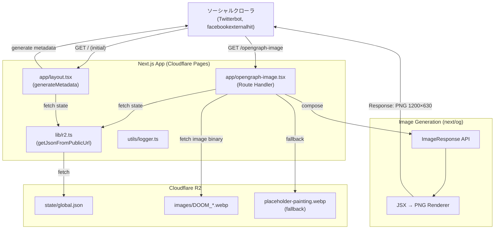
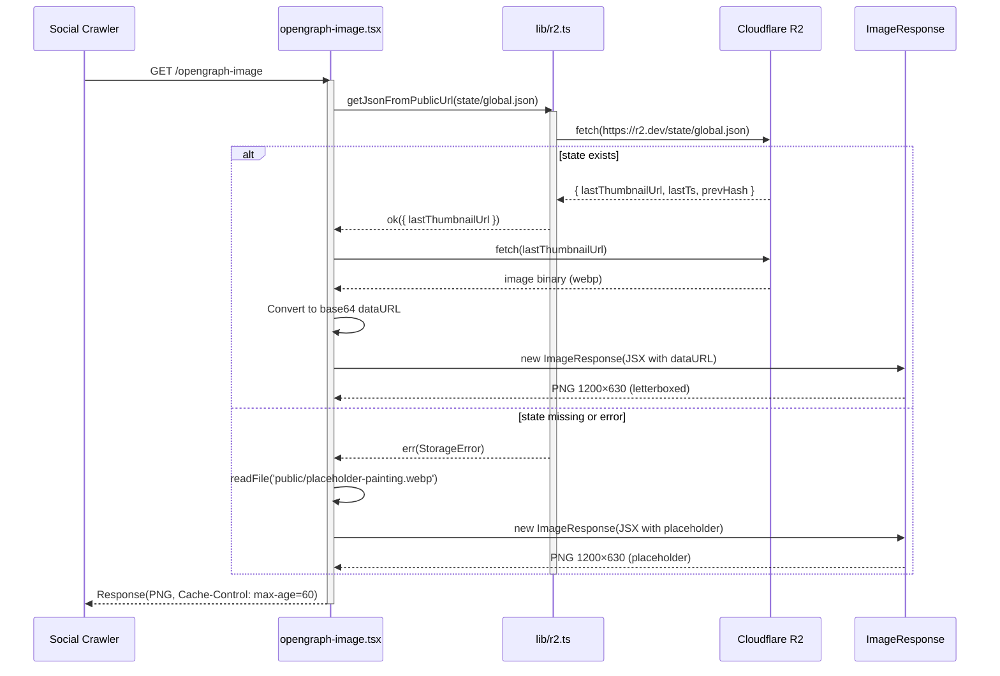
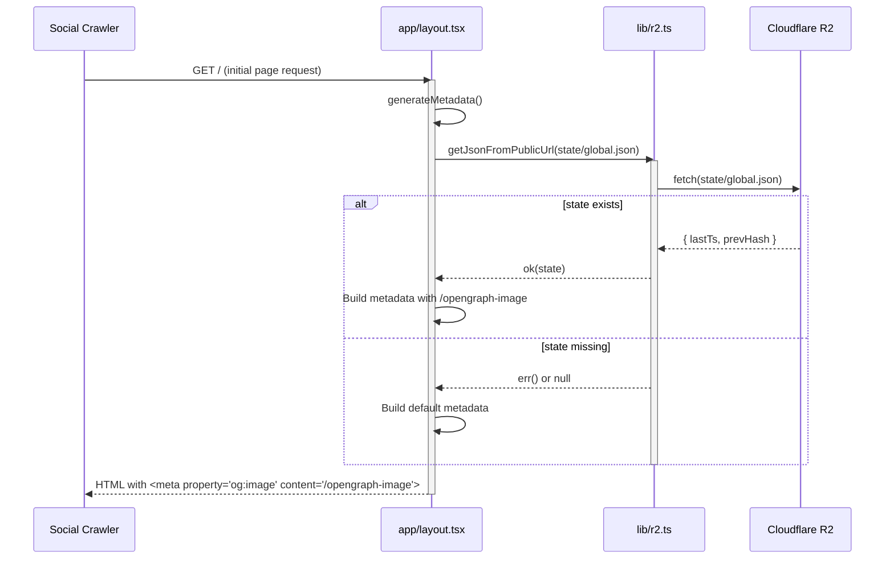
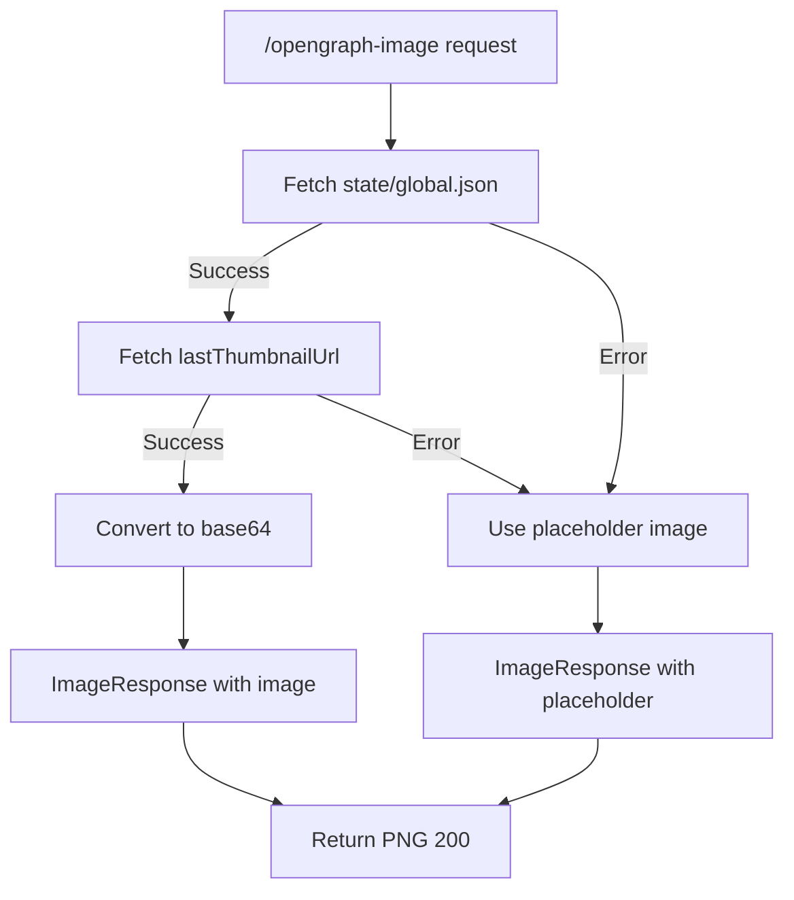

# Technical Design — dynamic-ogp

## Overview

Dynamic OGP は、DOOM INDEX の生成画像を Twitter、Facebook、Discord、LinkedIn などのソーシャルプラットフォームで効果的に共有するための動的 Open Graph Protocol 画像生成機能である。Next.js の `opengraph-image.tsx` ファイル規約と `next/og` の `ImageResponse` API を活用し、R2 に保存された 1:1（1024×1024 px）の正方形画像を OGP 標準アスペクト比（1200×630 px）に変換し、装飾的な額縁オーバーレイを追加した上で、黒背景でレターボックス形式にて配信する。

主対象ユーザーは、Twitter や Discord でリンクをシェアするコミュニティメンバーであり、最新の世界状態を表す生成画像をギャラリーのような高級感のあるソーシャルカードとして表示させたい。技術的には、Cloudflare Pages の Edge Runtime と Next.js の ISR（Incremental Static Regeneration）機能を活用し、1 分間隔で更新される最新画像を常に反映する。キャッシュ戦略は `Cache-Control: max-age=60, stale-while-revalidate=30` を基本とし、エッジキャッシュとの協調により R2 への負荷を最小化する。

### Goals

- Next.js の `opengraph-image.tsx` ファイル規約により `/opengraph-image` エンドポイントを自動生成する
- `ImageResponse` を使用して R2 の正方形画像を 1200×630 px にレターボックス変換する
- R2 の `state/global.json` から最新の `lastThumbnailUrl` を取得し、動的に画像を合成する
- `app/layout.tsx` の `generateMetadata` で OGP メタデータを設定し、ソーシャルプラットフォームに最適化する
- プレースホルダ画像によるフォールバックで、R2 障害時も OGP カードを常に表示する

### Non-Goals

- トークン別（`/share/[ticker]`）の個別 OGP 画像生成
- 画像のリアルタイム編集機能（テキストオーバーレイ、フィルタなど）
- OGP 画像の複数バージョン管理や A/B テスト
- 動画 OGP（`og:video`）のサポート

## Architecture

### Existing Architecture Analysis

- Next.js App Router を前提とし、`generateMetadata` による SSR メタデータ生成を活用する。
- `lib/r2.ts` の既存 R2 I/O 関数（`getJsonFromPublicUrl`）を再利用し、state 取得の一貫性を保つ。
- エラーハンドリングは `neverthrow.Result` を継続使用し、`AppError` 型との統合を維持する。
- Cloudflare Pages の Edge Runtime で動作するため、Node.js 専用 API（`fs.readFile`）は条件付きで使用する。

### Architecture Pattern & Boundary Map



**Architecture Integration**

- 既存パターン維持: `lib/r2.ts` の公開 URL fetch、`logger` によるエラーログ、`Result` 型によるエラー伝播。
- 新規コンポーネント導入: `app/opengraph-image.tsx` を Route Handler として追加し、`ImageResponse` で画像合成を実装。
- 境界設計: OGP 生成は読み取り専用（R2 への書き込みなし）、Cron Worker の状態管理とは独立。
- Next.js ファイル規約: `opengraph-image.tsx` は Next.js が自動的に `/opengraph-image` としてルーティング。

### Technology Stack

| Layer            | Choice / Version           | Role in Feature                             | Notes                                            |
| ---------------- | -------------------------- | ------------------------------------------- | ------------------------------------------------ |
| Frontend / SSR   | Next.js 16.x App Router    | OGP メタデータ生成、opengraph-image 提供    | `generateMetadata` と `opengraph-image.tsx` 活用 |
| Image Generation | `next/og` (Satori + resvg) | JSX → PNG 変換、1200×630 レターボックス合成 | Edge Runtime 対応、Node.js API 不要              |
| Storage          | Cloudflare R2              | `state/global.json` 取得、画像バイナリ取得  | 公開 URL 経由で fetch                            |
| Runtime          | Cloudflare Pages (workerd) | Edge SSR、動的ルート配信                    | `export const dynamic = 'force-dynamic'` 設定    |
| Caching          | Cloudflare Edge Cache      | `/opengraph-image` の 60 秒キャッシュ       | `Cache-Control` ヘッダーで制御                   |
| Error Handling   | `neverthrow.Result`        | R2 取得失敗時のフォールバック               | プレースホルダ画像で常に OGP 表示                |
| Logging          | `utils/logger.ts`          | エラーログ、ソーシャルクローラアクセス記録  | Cloudflare Logs で確認                           |

### Key Design Decisions

- **Decision: Next.js opengraph-image ファイル規約の採用**
  - Context: OGP 画像を動的に生成し、ソーシャルクローラに配信する必要がある。
  - Alternatives: 手動 Route Handler（`/api/og`）、静的画像生成（Build 時）、外部 OGP サービス（og:image.com など）。
  - Selected Approach: `app/opengraph-image.tsx` を作成し、Next.js の [opengraph-image ファイル規約](https://nextjs.org/docs/app/api-reference/file-conventions/metadata/opengraph-image)に従う。`export default` 関数で `ImageResponse` を返す。
  - Rationale: Next.js の標準規約に従うことで、`/opengraph-image` パスの自動生成、メタデータとの自動統合、型安全性を享受できる。
  - Trade-offs: ファイル規約に依存するため、カスタムパス（例: `/api/og-image`）は使用できないが、標準化により保守性が向上。

- **Decision: ImageResponse による画像合成と額縁オーバーレイ**
  - Context: 正方形画像（1024×1024）を横長 OGP（1200×630）に変換し、黒背景でレターボックスを追加する必要がある。さらに、ギャラリーのような視覚体験を提供するため、生成画像に装飾的な額縁を追加する。
  - Alternatives: R2 画像をそのままプロキシ配信（アスペクト比不一致）、サーバーサイドで sharp を使用した画像処理（Node.js 依存）、外部画像処理 API（Cloudinary など）、Canvas API による動的合成。
  - Selected Approach: `next/og` の `ImageResponse` を使用し、JSX で黒背景コンテナ + 中央配置の生成画像 + 額縁画像オーバーレイを定義して動的にレンダリング。`position: relative` コンテナ内に `position: absolute` で画像を重ねる。
  - Rationale: Edge Runtime 対応、追加依存なし、アスペクト比変換がフレキシブル、ソーシャルプラットフォーム最適化が容易。額縁オーバーレイにより、ギャラリー展示のような高級感のある視覚表現を実現。
  - Trade-offs: 画像のレンダリングコストが発生するが、60 秒キャッシュにより実質的な負荷は低い。額縁画像の fetch が追加されるが、`public/` からの取得のため高速。

- **Decision: 1200×630 px レターボックスフォーマット**
  - Context: 主要ソーシャルプラットフォーム（Twitter、Facebook、LinkedIn）の推奨 OGP サイズは 1200×630 px（1.91:1）。
  - Alternatives: 1024×1024 正方形そのまま（Twitter では左右がクロップされる）、複数サイズ生成（1200×630 と 1024×1024）、動的リサイズ（クエリパラメータで切り替え）。
  - Selected Approach: 1200×630 px 固定で生成し、1024×1024 画像を高さ 630 px にフィットさせ（幅約 630 px）、左右の余白（各約 285 px）を黒（`#000000`）で埋める。
  - Rationale: ソーシャルプラットフォームの表示領域を最大限活用し、トリミングを回避。黒背景は DOOM INDEX の暗闇テーマと整合。
  - Trade-offs: Discord や一部プラットフォームでは正方形が好まれるケースもあるが、標準的な 1.91:1 を優先。

- **Decision: ISR（Incremental Static Regeneration）with 60 秒 revalidate**
  - Context: Cron Worker が 1 分間隔で画像を更新するため、OGP 画像も 1 分間隔での更新で十分。毎リクエストでの生成はコスト的に非効率。
  - Alternatives: `dynamic = 'force-dynamic'`（毎リクエスト生成）、完全静的生成（Build 時のみ）、On-Demand Revalidation。
  - Selected Approach: `export const revalidate = 60` を設定し、ISR で 60 秒ごとに再生成。初回リクエストで生成、60 秒間キャッシュ、期限切れ後の次のリクエストでバックグラウンド再生成。
  - Rationale: 1 分間隔の Cron 更新と同期、コスト最小化（アクセスがない場合は生成しない）、Edge Cache との相性が良い。個人開発プロジェクトのため、コスト効率を優先。
  - Trade-offs: 60 秒のキャッシュ期間中は古い画像が表示される可能性があるが、Cron も 1 分間隔のため実質的な問題はない。

- **Decision: プレースホルダ画像によるフォールバック戦略**
  - Context: R2 障害または `state/global.json` 不在時も OGP カードを表示し続ける必要がある。
  - Alternatives: エラー画像（"Error - Image unavailable"）、空レスポンス（ソーシャルクローラが再試行）、前回のキャッシュ画像（Edge で保持）。
  - Selected Approach: `public/placeholder-painting.webp` を用意し、R2 取得失敗時は同じレターボックス形式でプレースホルダを返す。
  - Rationale: ユーザー体験を維持し、ソーシャルプラットフォームでの表示を保証。プレースホルダは 5 分間キャッシュして R2 への再試行負荷を軽減。
  - Trade-offs: プレースホルダが時代遅れの情報を示すリスクがあるが、完全なエラーよりも優れている。

## System Flows

### OGP Image Generation Flow



### Metadata Generation Flow



## Requirements Traceability

| Requirement | Summary                      | Components                         | Interfaces           | Flows                |
| ----------- | ---------------------------- | ---------------------------------- | -------------------- | -------------------- |
| 1.1         | opengraph-image 実装         | opengraph-image.tsx, ImageResponse | Route Handler        | OGP Image Generation |
| 1.2         | R2 state 取得                | lib/r2.ts                          | getJsonFromPublicUrl | OGP Image Generation |
| 1.3         | レターボックス配置           | ImageResponse JSX                  | Flexbox layout       | OGP Image Generation |
| 1.4         | ImageResponse JSX 構築       | opengraph-image.tsx                | JSX                  | OGP Image Generation |
| 1.5         | プレースホルダフォールバック | opengraph-image.tsx                | readFile             | OGP Image Generation |
| 1.6         | キャッシュヘッダー設定       | Response headers                   | Cache-Control        | OGP Image Generation |
| 2.1         | generateMetadata 実装        | app/layout.tsx                     | Metadata API         | Metadata Generation  |
| 2.2         | メタデータ設定               | app/layout.tsx                     | openGraph, twitter   | Metadata Generation  |
| 2.3         | Twitter カード設定           | app/layout.tsx                     | twitter.card         | Metadata Generation  |
| 2.4         | 画像 URL 指定                | app/layout.tsx                     | openGraph.images     | Metadata Generation  |
| 2.5         | デフォルトメタデータ         | app/layout.tsx                     | Fallback metadata    | Metadata Generation  |
| 3.1-3.5     | キャッシュ戦略               | Response headers, Edge Cache       | Cache-Control        | All flows            |
| 4.1-4.4     | Route Segment Config         | opengraph-image.tsx exports        | Config exports       | OGP Image Generation |
| 5.1-5.5     | エラーハンドリング           | Error handlers, logger             | Result<T, E>         | Error flows          |
| 6.1-6.5     | プラットフォーム検証         | QA Process                         | Manual testing       | Validation           |
| 7.1-7.4     | state 整合性保証             | Cron Worker (existing)             | R2 atomic write      | State management     |
| 8.1-8.5     | 監視とログ                   | logger, Cloudflare Logs            | Structured logs      | All flows            |

## Components and Interfaces

### OGP Image Generation Layer

#### app/opengraph-image.tsx

| Field             | Detail                                                                              |
| ----------------- | ----------------------------------------------------------------------------------- |
| Intent            | R2 から最新画像を取得し、1200×630 レターボックス形式で OGP 画像生成                 |
| Requirements      | 1.1, 1.2, 1.3, 1.4, 1.5, 1.6, 4.1, 4.2, 4.3, 5.1, 5.2, 5.3, 5.4, 8.1, 8.2, 8.3, 8.5 |
| Owner / Reviewers | Frontend Team                                                                       |

**Responsibilities & Constraints**

- R2 の `state/global.json` から `lastThumbnailUrl` を取得
- R2 から画像バイナリを fetch し、base64 dataURL に変換
- `ImageResponse` で 1200×630 px の黒背景 + 中央配置画像を生成
- R2 取得失敗時は `public/placeholder-painting.webp` をフォールバック
- ISR（`revalidate = 60`）で 60 秒ごとに再生成、コスト効率を優先
- Edge Cache により実質的なキャッシュ効果を最大化

**Dependencies**

- Inbound: ソーシャルクローラ（Twitterbot、facebookexternalhit など）— OGP 画像取得 (P0)
- Outbound: `lib/r2.ts` — state 取得 (P0)
- Outbound: Cloudflare R2 — 画像バイナリ取得 (P0)
- External: `next/og` ImageResponse — PNG 生成 (P0)

**Contracts**: Route Handler [✓] / State [✓]

##### Route Handler Interface

```typescript
// app/opengraph-image.tsx
import { ImageResponse } from 'next/og'

// Route Segment Config
export const revalidate = 60 // ISR: 60秒ごとに再生成
export const size = { width: 1200, height: 630 }
export const contentType = 'image/png'
export const alt = 'DOOM INDEX - Current world state visualization'

export default async function Image(): Promise<ImageResponse> {
  // R2 から state 取得
  // R2 から画像取得 or プレースホルダ
  // ImageResponse で 1200×630 レターボックス生成
  return new ImageResponse(/* JSX */, { ...size })
}
```

- Preconditions: Cloudflare R2 が読み取り可能、`state/global.json` と `lastThumbnailUrl` が存在（または不在時フォールバック）
- Postconditions: PNG 画像（1200×630 px）を `Cache-Control: max-age=60, stale-while-revalidate=30` で返す
- Invariants: 画像アスペクト比は常に 1.91:1、背景色は `#000000`

##### State Management

- State model: 読み取り専用（R2 の `state/global.json`、書き込みは Cron Worker が担当）
- Persistence & consistency: R2 から毎回 fetch（`cache: "no-store"`）、Edge Cache で 60 秒キャッシュ
- Concurrency strategy: ステートレス、並行リクエストは独立して処理

**Implementation Notes**

- Integration: `getJsonFromPublicUrl<GlobalState>(url)` で state 取得、`fetch(lastThumbnailUrl)` で画像バイナリ取得
- Validation: `lastThumbnailUrl` の URL 形式検証、画像 fetch の 404/5xx ハンドリング
- Risks: R2 レイテンシが高い場合、ソーシャルクローラのタイムアウト（通常 5-10 秒）に抵触する可能性。Edge Cache で軽減。

---

#### app/layout.tsx (generateMetadata)

| Field             | Detail                                                       |
| ----------------- | ------------------------------------------------------------ |
| Intent            | OGP メタデータを生成し、`/opengraph-image` を画像 URL に設定 |
| Requirements      | 2.1, 2.2, 2.3, 2.4, 2.5, 4.4, 5.5                            |
| Owner / Reviewers | Frontend Team                                                |

**Responsibilities & Constraints**

- R2 の `state/global.json` から `lastTs`、`prevHash` を取得（オプション）
- `title`、`description`、`openGraph.images`、`twitter.card` を設定
- `/opengraph-image` を OGP 画像 URL として指定（Next.js が絶対 URL に変換）
- R2 取得失敗時はデフォルトメタデータ（`title="DOOM INDEX"`、汎用説明文）を返す

**Dependencies**

- Inbound: Next.js App Router — SSR 時にメタデータ生成 (P0)
- Outbound: `lib/r2.ts` — state 取得 (P1, optional for enhanced metadata)
- Outbound: `opengraph-image.tsx` — OGP 画像提供 (P0)

**Contracts**: Metadata API [✓]

##### Metadata API

```typescript
// app/layout.tsx
import type { Metadata } from "next";

export async function generateMetadata(): Promise<Metadata> {
  // Optional: R2 から state 取得して動的な description 生成
  // const stateResult = await getJsonFromPublicUrl<GlobalState>(...)

  return {
    title: "DOOM INDEX - World State Visualization",
    description:
      "8 global indicators ($CO2, $ICE, $FOREST, $NUKE, $MACHINE, $PANDEMIC, $FEAR, $HOPE) visualized as generative art in real-time.",
    openGraph: {
      type: "website",
      siteName: "DOOM INDEX",
      locale: "en_US",
      images: [
        {
          url: "/opengraph-image", // Next.js が絶対 URL に自動変換
          width: 1200,
          height: 630,
        },
      ],
    },
    twitter: {
      card: "summary_large_image",
      site: "@doomindex",
      title: "DOOM INDEX - World State Visualization",
      description: "8 global indicators visualized as generative art.",
      images: ["/opengraph-image"],
    },
  };
}
```

- Preconditions: Next.js SSR 環境、`/opengraph-image` エンドポイントが利用可能
- Postconditions: HTML `<head>` に OGP/Twitter メタタグが挿入される
- Invariants: `openGraph.images` と `twitter.images` は常に `/opengraph-image` を参照

**Implementation Notes**

- Integration: `lib/r2.ts` の `getJsonFromPublicUrl` を使用（オプション）、エラー時はデフォルトメタデータ
- Validation: R2 state の取得は optional、失敗しても SSR は継続
- Risks: R2 取得に時間がかかると SSR が遅延するため、タイムアウト設定（5 秒）を検討

---

### Storage Layer

#### lib/r2.ts (Existing, Reused)

| Field             | Detail                           |
| ----------------- | -------------------------------- |
| Intent            | R2 公開 URL から JSON/画像を取得 |
| Requirements      | 1.2, 2.1, 5.1, 7.3, 8.2          |
| Owner / Reviewers | Backend Team                     |

**Responsibilities & Constraints**

- `getJsonFromPublicUrl<T>(url)` で R2 公開 URL から JSON を fetch
- `fetch(url, { cache: "no-store" })` で最新データを取得（Next.js の静的キャッシュを回避）
- HTTP 404 の場合は `ok(null)`、5xx/timeout の場合は `err(StorageError)` を返す
- 画像バイナリ取得は `fetch(lastThumbnailUrl).then(res => res.arrayBuffer())`

**Dependencies**

- Inbound: `opengraph-image.tsx`, `app/layout.tsx` — state/画像取得 (P0)
- External: Cloudflare R2 — HTTP fetch (P0)

**Contracts**: Service [✓]

##### Service Interface

```typescript
// lib/r2.ts (既存)
export async function getJsonFromPublicUrl<T>(url: string): Promise<Result<T | null, AppError>> {
  try {
    const res = await fetch(url, { cache: "no-store" });
    if (res.status === 404) return ok(null);
    if (!res.ok) return err({ type: "StorageError", op: "get", key: url, message: `HTTP ${res.status}` });
    return ok((await res.json()) as T);
  } catch (e) {
    return err({ type: "StorageError", op: "get", key: url, message: String(e) });
  }
}
```

- Preconditions: `url` は有効な HTTPS URL
- Postconditions: JSON パース成功 → `ok(data)`、404 → `ok(null)`、エラー → `err(StorageError)`
- Invariants: `cache: "no-store"` により常に最新データを取得

---

### Image Composition Layer

#### next/og ImageResponse (External)

| Field             | Detail                                    |
| ----------------- | ----------------------------------------- |
| Intent            | JSX から PNG 画像を生成                   |
| Requirements      | 1.1, 1.3, 1.4, 4.2                        |
| Owner / Reviewers | Vercel/Next.js Team (External Dependency) |

**Responsibilities & Constraints**

- Satori (JSX → SVG) + resvg (SVG → PNG) による画像生成
- Edge Runtime 対応、Node.js API 不要
- Flexbox レイアウトをサポート（`display: flex`, `alignItems`, `justifyContent`）
- `` で base64 dataURL からの画像埋め込みをサポート

**Dependencies**

- Inbound: `opengraph-image.tsx` — 画像生成 (P0)
- External: Satori, resvg — レンダリングエンジン (P0)

**Contracts**: API [✓]

##### API Contract

```typescript
// next/og
import { ImageResponse } from 'next/og'

new ImageResponse(
  element: React.ReactElement,
  options?: {
    width?: number
    height?: number
    fonts?: { name: string; data: ArrayBuffer; style: string }[]
  }
): Response
```

**Implementation Notes**

- Integration: JSX 内で `` 形式で画像を埋め込む
- Validation: base64 dataURL の長さ制限（通常 1MB 程度まで問題なし）
- Risks: 複雑な CSS（`filter`, `backdrop-filter` など）は未サポート、Flexbox に限定

## Data Models

### Domain Model

#### GlobalState (R2 JSON)

```typescript
type GlobalState = {
  prevHash: string; // SHA256 hash of rounded MC map
  lastTs: string; // ISO 8601 timestamp of last generation
  lastThumbnailUrl: string; // R2 public URL of latest image (webp)
};
```

**Business Rules & Invariants**

- `lastThumbnailUrl` は常に R2 公開 URL（`https://your-bucket.r2.dev/images/DOOM_*.webp`）
- `prevHash` は Cron Worker が更新、OGP Generator は読み取り専用
- `lastTs` は生成時刻、1 分間隔で更新される

---

#### OGPImageData (Runtime)

```typescript
type OGPImageData = {
  imageDataUrl: string; // base64-encoded dataURL of source image
  width: number; // Original image width (1024)
  height: number; // Original image height (1024)
  useFallback: boolean; // Whether placeholder is used
};
```

**Business Rules & Invariants**

- `imageDataUrl` は `data:image/webp;base64,...` 形式
- `useFallback = true` の場合、`public/placeholder-painting.webp` を使用
- ImageResponse の JSX 内で `objectFit: 'contain'` により中央配置

### Data Contracts & Integration

#### Request/Response Schemas

**GET /opengraph-image**

- Request: None (query parameters not used)
- Response: PNG image (1200×630 px)
- Headers:
  - `Content-Type: image/png`
  - `Cache-Control: public, max-age=60, stale-while-revalidate=30`
  - `CDN-Cache-Control: max-age=60` (Cloudflare Pages)
- Status Codes:
  - 200: Success (image or fallback)
  - 500: Internal error (Next.js default error handling)

**R2 Public URL Fetch**

- Request: `GET https://{R2_DOMAIN}/state/global.json`
- Response: JSON (`GlobalState`) or 404
- Timeout: 5 秒（fetch の `signal: AbortSignal.timeout(5000)` で制御）

## Error Handling

### Error Strategy

Dynamic OGP は、R2 障害やネットワークエラー時も OGP カードを常に表示することを最優先とする。エラー発生時はログに記録し、プレースホルダ画像でグレースフルにフォールバックする。ソーシャルクローラは通常リトライしないため、初回リクエストで確実にレスポンスを返す。

### Error Categories and Responses

**Storage Errors (R2 fetch failure)**

- Scenario: `state/global.json` が 404、5xx、timeout
- Response: `logger.warn("ogp.state-fetch-failed", { url, status })` → プレースホルダ画像を返す
- User Impact: 最新画像ではなくプレースホルダが表示されるが、OGP カードは正常にレンダリングされる
- Recovery: R2 復旧後、次回のキャッシュ期限切れ（60 秒後）で自動的に最新画像に戻る

**Image Fetch Errors (lastThumbnailUrl の 404/5xx)**

- Scenario: `lastThumbnailUrl` が R2 に存在しない、または取得失敗
- Response: `logger.error("ogp.image-fetch-failed", { url, status })` → プレースホルダ画像を返す
- User Impact: 同上
- Recovery: Cron Worker が次回生成時に新しい画像を作成し、`lastThumbnailUrl` を更新

**ImageResponse Errors (レンダリング失敗)**

- Scenario: base64 dataURL が不正、メモリ不足、Satori エラー
- Response: `logger.error("ogp.render-failed", { error, stack })` → Next.js のデフォルトエラーハンドリング（500 エラー）
- User Impact: OGP カードが表示されない（ソーシャルプラットフォームのデフォルト表示）
- Recovery: 次回のリクエスト時に再試行、または R2 state の修正

**Fallback Priority**



### Monitoring

- **Structured Logs**: `logger.info("ogp.generated", { stateFound, imageProxied, fallbackUsed, durationMs })`
- **Error Logs**: `logger.error("ogp.error", { type, url, status, message, stack })`
- **Social Crawler Detection**: User-Agent ヘッダーから `Twitterbot`, `facebookexternalhit`, `Discordbot` を識別し、`logger.info("ogp.social-crawler", { platform })`
- **Performance Metrics**: レスポンス時間が 2000ms を超える場合はアラート（Cloudflare Workers Analytics）
- **Cache Hit Rate**: Cloudflare Logs で `/opengraph-image` の `Cf-Cache-Status` ヘッダーを監視

## Testing Strategy

### Unit Tests

1. **R2 state 取得テスト**
   - Input: モック R2 URL（200, 404, 500, timeout）
   - Expected: `getJsonFromPublicUrl` が正しく `Result<GlobalState | null, AppError>` を返す
   - Test Case: 200 → `ok(state)`, 404 → `ok(null)`, 500 → `err(StorageError)`, timeout → `err(StorageError)`

2. **base64 dataURL 変換テスト**
   - Input: ArrayBuffer（webp バイナリ）
   - Expected: `data:image/webp;base64,iVBORw...` 形式の文字列
   - Test Case: 正常な webp → 有効な dataURL、空 buffer → エラー

3. **プレースホルダ読み込みテスト**
   - Input: `public/placeholder-painting.webp` が存在/不在
   - Expected: 存在 → base64 dataURL、不在 → エラー（ビルド時に検出）
   - Test Case: ファイル存在確認、base64 変換成功

### Integration Tests

1. **opengraph-image エンドポイントテスト**
   - Input: `GET /opengraph-image` with モック R2（state あり/なし）
   - Expected: PNG 画像（1200×630 px）を `Content-Type: image/png` で返す
   - Test Case: state あり → 最新画像使用、state なし → プレースホルダ使用、Cache-Control ヘッダー検証

2. **generateMetadata 統合テスト**
   - Input: `app/layout.tsx` の `generateMetadata` 実行 with モック R2
   - Expected: `openGraph.images[0].url === '/opengraph-image'`、`twitter.card === 'summary_large_image'`
   - Test Case: R2 成功 → メタデータ生成、R2 失敗 → デフォルトメタデータ

3. **ImageResponse レンダリングテスト**
   - Input: JSX with base64 dataURL（正常画像、プレースホルダ）
   - Expected: PNG 出力、サイズ 1200×630、黒背景、中央配置
   - Test Case: Snapshot テスト（生成された PNG のバイトサイズ、ピクセル比較は不要）

### E2E Tests

1. **ソーシャルプラットフォーム検証**
   - Test: Twitter Card Validator、Facebook Sharing Debugger、Discord 埋め込み、LinkedIn Post Inspector
   - Expected: OGP カードが正しく表示され、画像が 1200×630 でレターボックス形式
   - Validation: 手動テスト（開発・ステージング環境）

2. **キャッシュ動作確認**
   - Test: `/opengraph-image` に連続リクエスト（60 秒以内）
   - Expected: 初回 → R2 fetch、2 回目以降 → Edge Cache から返却（`Cf-Cache-Status: HIT`）
   - Validation: Cloudflare Logs で確認、レスポンスヘッダー検証

3. **R2 障害シミュレーション**
   - Test: R2 を一時的に停止（または URL を無効化）
   - Expected: プレースホルダ画像が返され、OGP カードが表示される
   - Validation: `/opengraph-image` のレスポンスがエラーにならず、PNG が返る

### Performance Tests

1. **レスポンス時間測定**
   - Target: `/opengraph-image` のレスポンス時間 < 2000ms (p95)
   - Method: Apache Bench または k6 で 100 リクエスト実行
   - Validation: p95 が 2000ms 以下、Edge Cache 有効時は p95 < 100ms

2. **並行リクエスト処理**
   - Target: 10 並行リクエストで安定動作
   - Method: k6 で 10 VUs × 30 秒実行
   - Validation: すべてのリクエストが 200 OK、エラー率 0%

3. **キャッシュ効率測定**
   - Target: Cache Hit Rate > 90%（60 秒間隔でのアクセス想定）
   - Method: Cloudflare Logs で 24 時間の `/opengraph-image` リクエストを分析
   - Validation: `Cf-Cache-Status: HIT` の割合が 90% 以上

## Optional Sections

### Security Considerations

- **URL Validation**: `lastThumbnailUrl` は R2 ドメイン（`https://your-bucket.r2.dev/`）のみ許可し、外部 URL へのリダイレクトを防ぐ
- **SSRF Prevention**: `fetch` の URL は R2 公開 URL に限定、User-Agent から取得した URL は使用しない
- **Content-Type Validation**: R2 から取得した画像の `Content-Type` が `image/webp` または `image/png` であることを確認
- **Rate Limiting**: Cloudflare Pages の Edge Cache により、R2 への過剰リクエストを自動的に制限

### Performance & Scalability

- **Target Metrics**:
  - レスポンス時間: p50 < 500ms, p95 < 2000ms, p99 < 5000ms
  - Cache Hit Rate: > 90% (60 秒キャッシュ)
  - R2 Requests: < 1440 req/day（1 分間隔 × 1440 分/日、キャッシュミス想定）

- **Scaling Approaches**:
  - Horizontal: Cloudflare Edge Network により自動的にスケール
  - Vertical: ImageResponse のレンダリングは CPU バウンド、Edge Runtime の制約内で動作

- **Caching Strategies**:
  - Edge Cache: 60 秒、`stale-while-revalidate=30` で古いキャッシュを即座に返しつつバックグラウンド更新
  - Browser Cache: ソーシャルクローラは通常キャッシュしないため、`max-age=60` で CDN キャッシュを優先
  - R2 Cache: R2 自体がキャッシュを持つため、重複 fetch は低コスト

### Migration Strategy

Dynamic OGP は新機能であり、既存の OGP 実装を置き換えない（現在 OGP 画像は静的または未実装）。個人開発プロジェクトのため、本番環境に直接デプロイし、シンプルな展開とします。

**実装と本番デプロイ**

1. `app/opengraph-image.tsx` を作成し、ローカル環境でテスト
   - `bun run dev` でローカル動作確認
   - `/opengraph-image` に直接アクセスして画像生成を確認

2. `app/layout.tsx` の `generateMetadata` を更新し、`/opengraph-image` を参照
   - `openGraph.images = ['/opengraph-image']` を設定
   - `twitter.card = 'summary_large_image'` を設定

3. 本番環境にデプロイ（Cloudflare Pages）
   - `git push` で自動デプロイ
   - Cloudflare Pages の Build Logs で確認

4. ソーシャルプラットフォームで検証
   - [Twitter Card Validator](https://cards-dev.twitter.com/validator) でプレビュー確認
   - [Facebook Sharing Debugger](https://developers.facebook.com/tools/debug/) でキャッシュクリア＋検証
   - Discord でテスト投稿してプレビュー確認

**Rollback Triggers**

- OGP カードが全く表示されない（ソーシャルプラットフォームで確認）
- `/opengraph-image` にアクセスしてエラーが返る
- Cloudflare Logs で大量のエラーログが出力される

**Rollback Procedure**

1. `app/opengraph-image.tsx` を削除（または `export default` をコメントアウト）
2. `app/layout.tsx` の `openGraph.images` を静的 URL（`/placeholder-painting.webp`）に戻す
3. `git commit` & `git push` で再デプロイ（Cloudflare Pages は自動デプロイ、約 2-3 分）

## Supporting References

### ImageResponse JSX Example

```tsx
// app/opengraph-image.tsx (Full implementation example)
import { ImageResponse } from "next/og";
import { getJsonFromPublicUrl } from "@/lib/r2";
import { logger } from "@/utils/logger";
import type { GlobalState } from "@/types/domain";

export const revalidate = 60; // ISR: 60秒ごとに再生成
export const size = { width: 1200, height: 630 };
export const contentType = "image/png";
export const alt = "DOOM INDEX - Current world state visualization";

export default async function Image(): Promise<ImageResponse> {
  const startTime = Date.now();
  let imageDataUrl: string;
  let useFallback = false;

  try {
    // Fetch state from R2
    const stateUrl = `https://${process.env.R2_PUBLIC_DOMAIN}/state/global.json`;
    const stateResult = await getJsonFromPublicUrl<GlobalState>(stateUrl);

    if (stateResult.isOk() && stateResult.value && stateResult.value.lastThumbnailUrl) {
      // Fetch image binary from R2
      const imageResponse = await fetch(stateResult.value.lastThumbnailUrl);
      if (imageResponse.ok) {
        const arrayBuffer = await imageResponse.arrayBuffer();
        const base64 = Buffer.from(arrayBuffer).toString("base64");
        imageDataUrl = `data:image/webp;base64,${base64}`;
      } else {
        throw new Error(`Image fetch failed: ${imageResponse.status}`);
      }
    } else {
      throw new Error("State not found or invalid");
    }
  } catch (error) {
    logger.warn("ogp.fallback-used", { error: String(error) });
    useFallback = true;

    // Load placeholder image from public directory
    // Note: In Edge Runtime, use fetch instead of fs.readFile
    const placeholderResponse = await fetch(new URL("/placeholder-painting.webp", "https://doomindex.art"));
    const placeholderBuffer = await placeholderResponse.arrayBuffer();
    const base64 = Buffer.from(placeholderBuffer).toString("base64");
    imageDataUrl = `data:image/webp;base64,${base64}`;
  }

  const durationMs = Date.now() - startTime;
  logger.info("ogp.generated", { useFallback, durationMs });

  return new ImageResponse(
    (
      <div
        style={{
          display: "flex",
          width: "100%",
          height: "100%",
          backgroundColor: "#000000",
          alignItems: "center",
          justifyContent: "center",
        }}
      >
        
      </div>
    ),
    {
      ...size,
      headers: {
        "Cache-Control": "public, max-age=60, stale-while-revalidate=30",
        "CDN-Cache-Control": "max-age=60",
      },
    },
  );
}
```

### Cloudflare Pages Deployment Configuration

```toml
# wrangler.toml (Next.js deployment)
name = "doom-index"
compatibility_date = "2024-01-01"
compatibility_flags = ["nodejs_compat"]

# R2 公開ドメインは環境変数で設定
# Cloudflare Pages の Settings → Environment variables で設定
# R2_PUBLIC_DOMAIN = "your-bucket.r2.dev"

[[r2_buckets]]
binding = "R2_BUCKET"
bucket_name = "doom-index-storage"
```

### Social Platform OGP Requirements

| Platform | Recommended Size | Aspect Ratio | Min Size | Max File Size | Format         |
| -------- | ---------------- | ------------ | -------- | ------------- | -------------- |
| Twitter  | 1200×630         | 1.91:1       | 600×314  | 5 MB          | PNG, JPG, WebP |
| Facebook | 1200×630         | 1.91:1       | 600×315  | 8 MB          | PNG, JPG       |
| LinkedIn | 1200×627         | 1.91:1       | 1200×627 | 5 MB          | PNG, JPG       |
| Discord  | 1200×630         | 1.91:1       | 200×200  | 8 MB          | PNG, JPG, WebP |

**Reference**:

- [Twitter Card Validator](https://cards-dev.twitter.com/validator)
- [Facebook Sharing Debugger](https://developers.facebook.com/tools/debug/)
- [LinkedIn Post Inspector](https://www.linkedin.com/post-inspector/)
