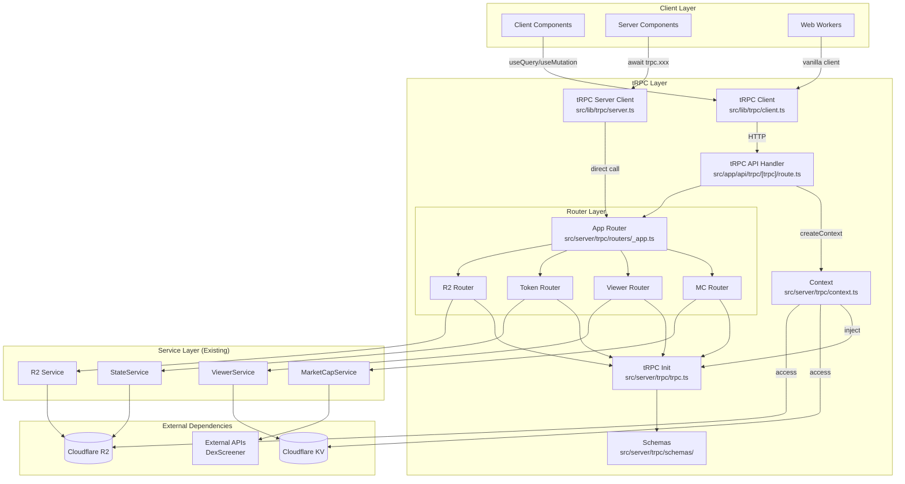
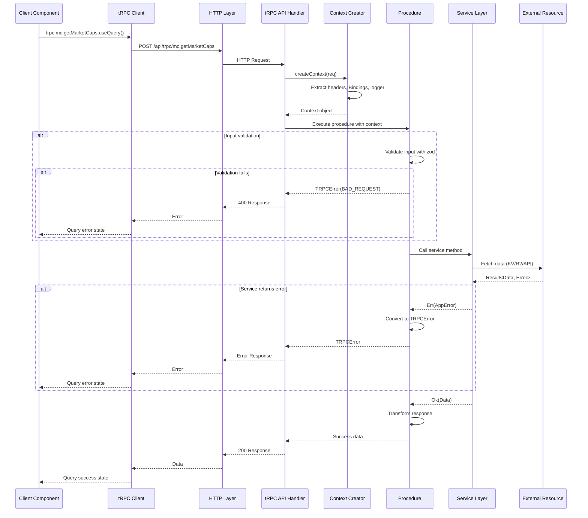
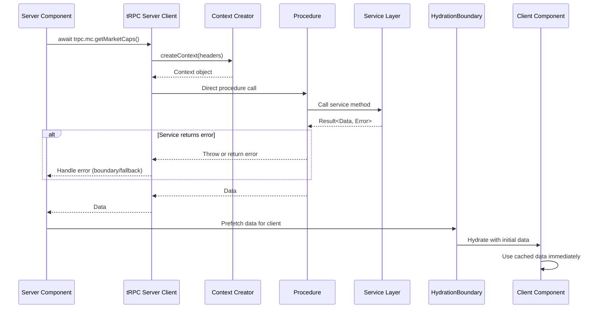
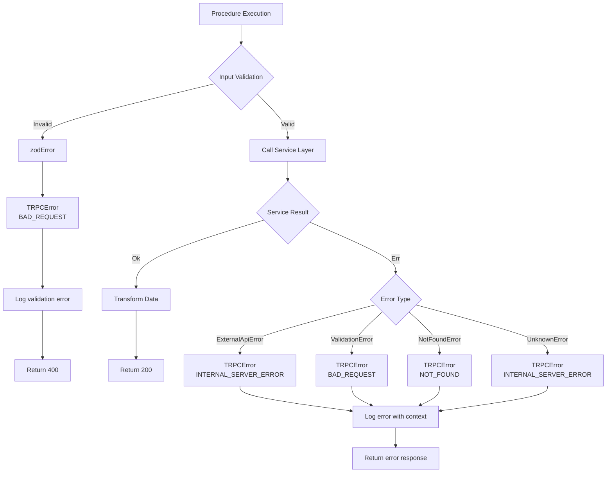
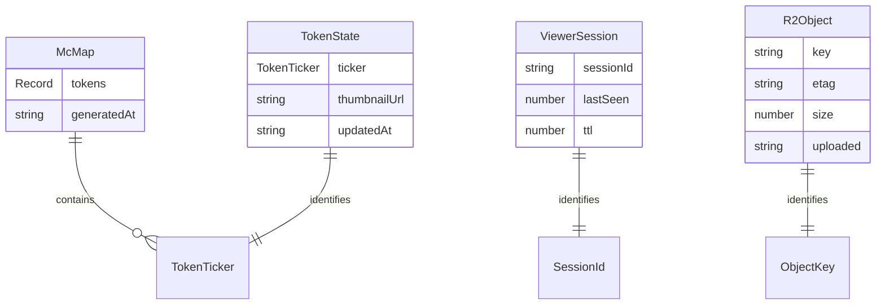
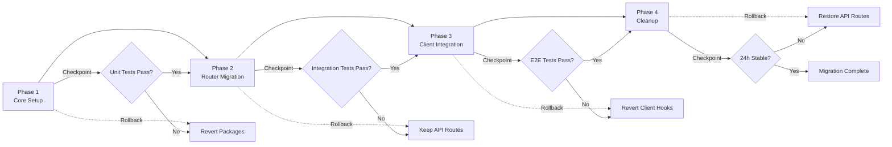

# Design Document

## Overview

本設計は、DOOM INDEXプロジェクトにtRPC v11を導入し、既存のNext.js App Router API Routes（`/api/mc`, `/api/viewer`, `/api/tokens/[ticker]`, `/api/r2/[...key]`）を型安全なtRPCプロシージャに完全移行するものです。

**Purpose**: エンドツーエンドの型安全性を確保し、開発体験を向上させ、実行時エラーを削減します。TanStack QueryおよびReact Server Componentsとの統合により、クライアント・サーバー間のデータフローを最適化します。

**Users**: フロントエンド開発者、バックエンド開発者、QAエンジニアが、型補完とバリデーションの恩恵を受けながら、より安全で保守性の高いコードを記述できます。

**Impact**: 既存のREST API Routesを完全に置き換え、Cloudflare Pages + Workers環境でのEdge Runtime実行を維持しながら、型安全性を大幅に向上させます。既存のサービス層（`src/services/*`）、neverthrowによるエラーハンドリング、zodバリデーションパターンは全て保持します。

### Goals

- 既存4つのAPI Routesを型安全なtRPCプロシージャに完全移行
- TanStack QueryとReact Server Componentsの両方でtRPCを活用
- Cloudflare Workers/Pages環境（Edge Runtime）での動作保証
- 既存のサービス層、エラーハンドリング、ロギングパターンの保持
- 80%以上のテストカバレッジ達成

### Non-Goals

- 既存サービス層のリファクタリング（再利用を優先）
- REST API Routesとの共存期間（完全移行を前提）
- GraphQLやgRPCなど他のAPIプロトコルへの対応
- tRPC以外のRPCフレームワークの検討

## Architecture

### Existing Architecture Analysis

**現在のアーキテクチャパターン**:

- Next.js App Router（Edge Runtime）
- API Routes: `/api/*` 配下のRoute Handlers
- サービス層: `src/services/*` でビジネスロジックを抽象化
- エラーハンドリング: neverthrowのResult型を全体で使用
- データ取得: TanStack Query（クライアント）+ fetch（サーバー）
- 環境: Cloudflare Pages + Workers（KV, R2 Bindings）

**保持すべき既存パターン**:

- サービス層の依存性注入パターン（`createMarketCapService`, `createViewerService`等）
- neverthrowによる関数型エラーハンドリング
- zodによる型定義とバリデーション
- 構造化ロギング（`src/utils/logger`）
- Edge Runtime対応（Node.js専用API不使用）

**技術的制約**:

- Cloudflare Workers環境でのNode.js APIの制限
- R2 Bindingsへのアクセス方法（Workers: Binding、Next.js: 公開URL）
- Edge Runtimeでのストリーミングレスポンス対応

### Architecture Pattern & Boundary Map



**Architecture Integration**:

- **選択パターン**: tRPC v11 + TanStack Query + React Server Components
  - 理由: Next.js App Routerとの公式統合、型安全性、既存TanStack Queryとの互換性
- **ドメイン境界**:
  - tRPC Layer: API定義、ルーティング、バリデーション、型推論
  - Service Layer: ビジネスロジック、外部API統合、データ永続化
  - Client Layer: UI、状態管理、ユーザーインタラクション
- **既存パターン保持**:
  - サービス層の依存性注入
  - neverthrowのResult型
  - zodバリデーション
  - 構造化ロギング
- **新規コンポーネント追加理由**:
  - tRPC Context: Cloudflare Bindings、headers、loggerの注入
  - tRPC Routers: 型安全なプロシージャ定義とルーティング
  - Schemas: zodスキーマの再利用可能な定義
- **Steering準拠**:
  - Edge Firstアーキテクチャ維持
  - 純関数と副作用の分離
  - Provider抽象化パターン継続

### Technology Stack

| Layer                    | Choice / Version                   | Role in Feature                    | Notes                     |
| ------------------------ | ---------------------------------- | ---------------------------------- | ------------------------- |
| Frontend / CLI           | @trpc/client ^11.x                 | クライアントサイドtRPCクライアント | TanStack Query統合        |
|                          | @trpc/react-query ^11.x            | React Query統合フック              | useQuery/useMutation提供  |
|                          | @trpc/next ^11.x                   | Next.js統合ヘルパー                | App Router対応            |
| Backend / Services       | @trpc/server ^11.x                 | サーバーサイドtRPCルーター         | Edge Runtime対応          |
|                          | zod ^4.x（既存）                   | 入力バリデーションとスキーマ定義   | 既存zodバージョン継続使用 |
|                          | neverthrow ^7.x（既存）            | Result型によるエラーハンドリング   | 既存パターン維持          |
| Data / Storage           | Cloudflare KV（既存）              | Viewer状態管理                     | Binding経由アクセス       |
|                          | Cloudflare R2（既存）              | 画像・状態ストレージ               | Binding/公開URL           |
| Infrastructure / Runtime | Next.js 16 App Router（既存）      | フレームワーク                     | Edge Runtime使用          |
|                          | Cloudflare Pages + Workers（既存） | ホスティング・実行環境             | Cron Triggers含む         |
|                          | @opennextjs/cloudflare（既存）     | デプロイアダプター                 | ビルド・デプロイ統合      |
|                          | Bun 1.3.x（既存）                  | ローカル開発ランタイム             | テスト実行含む            |

## System Flows

### tRPC Request Flow（クライアント→サーバー）



### Server Component Data Fetch Flow



### Error Handling Flow



## Requirements Traceability

| Requirement | Summary                              | Components                                                  | Interfaces                                     | Flows                      |
| ----------- | ------------------------------------ | ----------------------------------------------------------- | ---------------------------------------------- | -------------------------- |
| 1.1-1.6     | tRPCコア基盤の構築                   | tRPC Init, Context, App Router, Client Setup, Server Client | Context API, Router API                        | -                          |
| 2.1-2.7     | 既存API RoutesのtRPC移行             | MC/Viewer/Token/R2 Routers, Procedures                      | Query/Mutation Procedures, Service Integration | Request Flow               |
| 3.1-3.6     | クライアントフックのtRPC統合         | tRPC Client, React Hooks, TRPCReactProvider                 | useQuery/useMutation Hooks                     | Request Flow               |
| 4.1-4.5     | React Server Components統合          | tRPC Server Client, HydrationBoundary                       | Server-side tRPC API                           | Server Component Flow      |
| 5.1-5.6     | Edge Runtime対応とCloudflare統合     | Context Creator, Cloudflare Bindings Integration            | Cloudflare Context API                         | Request Flow               |
| 6.1-6.6     | 型定義とバリデーション統合           | Zod Schemas, Input Validators                               | Schema Definitions                             | Validation in Request Flow |
| 7.1-7.6     | エラーハンドリングとロギング統合     | Error Transformer, Logger Integration                       | Error Handling API                             | Error Handling Flow        |
| 8.1-8.7     | テスト戦略とカバレッジ               | Test Utilities, Mock Providers                              | Test Helpers                                   | -                          |
| 9.1-9.6     | ドキュメントとマイグレーションガイド | Documentation Files                                         | -                                              | -                          |
| 10.1-10.7   | パフォーマンス最適化と監視           | Batch Link, Performance Logger                              | Monitoring API                                 | Request Flow with Batching |

## Components and Interfaces

| Component          | Domain/Layer      | Intent                                                 | Req Coverage | Key Dependencies (P0/P1)                    | Contracts    |
| ------------------ | ----------------- | ------------------------------------------------------ | ------------ | ------------------------------------------- | ------------ |
| tRPC Init          | Server/Core       | tRPCインスタンス初期化、プロシージャヘルパー定義       | 1.4          | Context (P0), zod (P0), neverthrow (P0)     | Service      |
| Context Creator    | Server/Core       | リクエストコンテキスト作成、Bindings注入               | 1.3, 5.2-5.3 | Cloudflare Context (P0), Logger (P0)        | Service      |
| App Router         | Server/Router     | メインルーター、サブルーター統合                       | 1.2, 2.x     | Sub Routers (P0)                            | Service      |
| MC Router          | Server/Router     | マーケットキャップ取得プロシージャ                     | 2.1          | MarketCapService (P0), Schemas (P0)         | API, Service |
| Viewer Router      | Server/Router     | Viewer登録・削除プロシージャ                           | 2.2          | ViewerService (P0), Schemas (P0)            | API, Service |
| Token Router       | Server/Router     | トークン状態取得プロシージャ                           | 2.3          | StateService (P0), Schemas (P0)             | API, Service |
| R2 Router          | Server/Router     | R2オブジェクト取得プロシージャ                         | 2.4          | R2 Service (P0), Schemas (P0)               | API, Service |
| tRPC API Handler   | Server/Adapter    | Next.js API Route統合、HTTPリクエスト処理              | 1.2          | App Router (P0), Context Creator (P0)       | API          |
| tRPC Client        | Client/Core       | クライアントサイドtRPCクライアント、TanStack Query統合 | 1.5, 3.x     | @trpc/react-query (P0), TanStack Query (P0) | Service      |
| tRPC Server Client | Server/Core       | サーバーサイド専用tRPCクライアント                     | 1.6, 4.x     | App Router (P0), Context Creator (P0)       | Service      |
| TRPCReactProvider  | Client/Provider   | React ProviderでtRPCクライアントを提供                 | 3.4          | tRPC Client (P0), QueryClient (P0)          | State        |
| Zod Schemas        | Server/Validation | 入力バリデーションスキーマ定義                         | 6.x          | zod (P0), Domain Types (P0)                 | Service      |
| Error Transformer  | Server/Error      | neverthrow Result → tRPCError変換                      | 7.1-7.2      | neverthrow (P0), TRPCError (P0)             | Service      |
| Performance Logger | Server/Monitoring | プロシージャ実行時間測定、ロギング                     | 10.1         | Logger (P0)                                 | Service      |

### Server / Core

#### tRPC Init

| Field             | Detail                                                         |
| ----------------- | -------------------------------------------------------------- |
| Intent            | tRPCインスタンスを初期化し、型安全なプロシージャヘルパーを提供 |
| Requirements      | 1.4                                                            |
| Owner / Reviewers | Backend Team                                                   |

**Responsibilities & Constraints**

- tRPCインスタンスの作成と設定
- プロシージャヘルパー（query, mutation）の定義
- ミドルウェア（ロギング、エラーハンドリング）の統合
- Context型の型安全性保証

**Dependencies**

- Inbound: Context Creator — コンテキスト注入 (P0)
- Outbound: zod — バリデーション (P0)
- Outbound: neverthrow — エラーハンドリング (P0)
- External: @trpc/server — tRPCコア機能 (P0)

**Contracts**: Service [x]

##### Service Interface

```typescript
// src/server/trpc/trpc.ts

import { initTRPC, TRPCError } from "@trpc/server";
import type { Context } from "./context";
import { logger } from "@/utils/logger";

const t = initTRPC.context<Context>().create({
  errorFormatter({ shape, error }) {
    return {
      ...shape,
      data: {
        ...shape.data,
        zodError: error.cause instanceof ZodError ? error.cause.flatten() : null,
      },
    };
  },
});

// ロギングミドルウェア
const loggingMiddleware = t.middleware(async ({ path, type, next, ctx }) => {
  const start = Date.now();
  const result = await next();
  const duration = Date.now() - start;

  ctx.logger.info("trpc.procedure.executed", {
    path,
    type,
    duration,
    success: result.ok,
  });

  return result;
});

// 基本プロシージャ（ロギング付き）
export const publicProcedure = t.procedure.use(loggingMiddleware);

// ルーター作成ヘルパー
export const router = t.router;

// ミドルウェア作成ヘルパー
export const middleware = t.middleware;
```

- **Preconditions**: Contextが正しく型定義されている
- **Postconditions**: 型安全なプロシージャヘルパーが利用可能
- **Invariants**: 全てのプロシージャでロギングが実行される

**Implementation Notes**

- **Integration**: Context型を厳密に定義し、全プロシージャで利用可能にする
- **Validation**: zodエラーをクライアントに適切にフォーマットして返す
- **Risks**: ミドルウェアの実行順序に注意（ロギング→認証→ビジネスロジック）

#### Context Creator

| Field             | Detail                                                          |
| ----------------- | --------------------------------------------------------------- |
| Intent            | リクエストごとのコンテキストを作成し、Cloudflare Bindingsを注入 |
| Requirements      | 1.3, 5.2, 5.3                                                   |
| Owner / Reviewers | Backend Team                                                    |

**Responsibilities & Constraints**

- Next.jsリクエストヘッダーの抽出
- Cloudflare Bindings（KV, R2）の取得と注入
- ロガーインスタンスの提供
- 環境差分（Workers/Next.js）の吸収

**Dependencies**

- Inbound: tRPC API Handler — リクエストオブジェクト (P0)
- Inbound: tRPC Server Client — サーバーサイドコンテキスト (P0)
- Outbound: @opennextjs/cloudflare — Cloudflare Context取得 (P0)
- Outbound: Logger — ロギング (P0)

**Contracts**: Service [x]

##### Service Interface

```typescript
// src/server/trpc/context.ts

import { getCloudflareContext } from "@opennextjs/cloudflare";
import { logger } from "@/utils/logger";
import type { FetchCreateContextFnOptions } from "@trpc/server/adapters/fetch";

export type Context = {
  headers: Headers;
  logger: typeof logger;
  env?: Cloudflare.Env;
  kvNamespace?: KVNamespace;
  r2Bucket?: R2Bucket;
};

// API Handler用コンテキスト作成
export async function createContext(opts: FetchCreateContextFnOptions): Promise<Context> {
  const { req } = opts;

  try {
    const { env } = await getCloudflareContext({ async: true });
    const cfEnv = env as Cloudflare.Env;

    return {
      headers: req.headers,
      logger,
      env: cfEnv,
      kvNamespace: cfEnv.VIEWER_KV,
      r2Bucket: cfEnv.DOOM_INDEX_BUCKET,
    };
  } catch (error) {
    logger.warn("trpc.context.cloudflare-unavailable", {
      message: "Cloudflare context not available, using fallback",
    });

    return {
      headers: req.headers,
      logger,
    };
  }
}

// Server Component用コンテキスト作成
export async function createServerContext(): Promise<Context> {
  const { headers } = await import("next/headers");
  const headersList = await headers();

  try {
    const { env } = await getCloudflareContext({ async: true });
    const cfEnv = env as Cloudflare.Env;

    return {
      headers: headersList,
      logger,
      env: cfEnv,
      kvNamespace: cfEnv.VIEWER_KV,
      r2Bucket: cfEnv.DOOM_INDEX_BUCKET,
    };
  } catch (error) {
    logger.warn("trpc.context.cloudflare-unavailable", {
      message: "Cloudflare context not available in server component",
    });

    return {
      headers: headersList,
      logger,
    };
  }
}
```

- **Preconditions**: Cloudflare環境またはローカル開発環境で実行
- **Postconditions**: 型安全なContextオブジェクトが返される
- **Invariants**: loggerは常に利用可能

**Implementation Notes**

- **Integration**: Cloudflare Bindingsが利用できない場合（ローカル開発等）はフォールバック
- **Validation**: env型をCloudflare.Envにキャストし、型安全性を確保
- **Risks**: Bindingsへのアクセスが失敗した場合のエラーハンドリング

### Server / Router

#### App Router

| Field             | Detail                                                         |
| ----------------- | -------------------------------------------------------------- |
| Intent            | メインルーターとしてサブルーターを統合し、型定義をエクスポート |
| Requirements      | 1.2, 2.x                                                       |
| Owner / Reviewers | Backend Team                                                   |

**Responsibilities & Constraints**

- サブルーター（mc, viewer, token, r2）の統合
- AppRouter型のエクスポート（クライアント型推論用）
- ルーティング構造の定義

**Dependencies**

- Inbound: tRPC API Handler — ルーター実行 (P0)
- Inbound: tRPC Server Client — サーバーサイド呼び出し (P0)
- Outbound: Sub Routers — 各ドメインルーター (P0)

**Contracts**: Service [x]

##### Service Interface

```typescript
// src/server/trpc/routers/_app.ts

import { router } from "../trpc";
import { mcRouter } from "./mc";
import { viewerRouter } from "./viewer";
import { tokenRouter } from "./token";
import { r2Router } from "./r2";

export const appRouter = router({
  mc: mcRouter,
  viewer: viewerRouter,
  token: tokenRouter,
  r2: r2Router,
});

// クライアント型推論用にエクスポート
export type AppRouter = typeof appRouter;
```

- **Preconditions**: 全てのサブルーターが正しく実装されている
- **Postconditions**: 型安全なAppRouterが利用可能
- **Invariants**: ルーター構造の一貫性

**Implementation Notes**

- **Integration**: サブルーターは独立して実装・テスト可能
- **Validation**: 型定義のエクスポートにより、クライアント側で自動型推論
- **Risks**: サブルーターの命名衝突に注意

#### MC Router

| Field             | Detail                                   |
| ----------------- | ---------------------------------------- |
| Intent            | マーケットキャップ取得プロシージャを提供 |
| Requirements      | 2.1, 2.5, 2.6                            |
| Owner / Reviewers | Backend Team                             |

**Responsibilities & Constraints**

- `/api/mc` エンドポイントの機能をtRPCプロシージャとして実装
- MarketCapServiceの呼び出しと結果の変換
- エラーハンドリングとロギング

**Dependencies**

- Inbound: App Router — ルーター統合 (P0)
- Outbound: MarketCapService — ビジネスロジック (P0)
- Outbound: roundMc — データ変換 (P0)

**Contracts**: API [x], Service [x]

##### API Contract

| Method | Endpoint           | Request | Response                                 | Errors |
| ------ | ------------------ | ------- | ---------------------------------------- | ------ |
| QUERY  | mc.getMarketCaps   | void    | `{ tokens: McMap, generatedAt: string }` | 500    |
| QUERY  | mc.getRoundedMcMap | void    | `{ tokens: McMap, generatedAt: string }` | 500    |

##### Service Interface

```typescript
// src/server/trpc/routers/mc.ts

import { router, publicProcedure } from "../trpc";
import { createMarketCapService } from "@/services/market-cap";
import { roundMc } from "@/lib/round";
import { TOKEN_TICKERS } from "@/constants/token";
import { TRPCError } from "@trpc/server";

const zeroMap = TOKEN_TICKERS.reduce(
  (acc, ticker) => {
    acc[ticker] = 0;
    return acc;
  },
  {} as Record<(typeof TOKEN_TICKERS)[number], number>,
);

export const mcRouter = router({
  getMarketCaps: publicProcedure.query(async ({ ctx }) => {
    const marketCapService = createMarketCapService({
      fetch,
      log: ctx.logger,
    });

    const result = await marketCapService.getMcMap();

    if (result.isErr()) {
      ctx.logger.error("trpc.mc.getMarketCaps.error", result.error);

      // エラー時はゼロマップを返す（既存の挙動を維持）
      return {
        tokens: zeroMap,
        generatedAt: new Date().toISOString(),
      };
    }

    const rounded = roundMc(result.value);
    return {
      tokens: rounded,
      generatedAt: new Date().toISOString(),
    };
  }),

  getRoundedMcMap: publicProcedure.query(async ({ ctx }) => {
    const marketCapService = createMarketCapService({
      fetch,
      log: ctx.logger,
    });

    const result = await marketCapService.getRoundedMcMap();

    if (result.isErr()) {
      ctx.logger.error("trpc.mc.getRoundedMcMap.error", result.error);

      throw new TRPCError({
        code: "INTERNAL_SERVER_ERROR",
        message: "Failed to fetch market caps",
        cause: result.error,
      });
    }

    return {
      tokens: result.value,
      generatedAt: new Date().toISOString(),
    };
  }),
});
```

- **Preconditions**: MarketCapServiceが正常に動作
- **Postconditions**: McMapとgeneratedAtを含むレスポンス
- **Invariants**: エラー時でもゼロマップを返す（既存挙動維持）

**Implementation Notes**

- **Integration**: 既存MarketCapServiceを再利用し、tRPCプロシージャでラップ
- **Validation**: 入力なしのクエリのため、バリデーション不要
- **Risks**: 外部API（DexScreener）のタイムアウト・エラー対応

#### Viewer Router

| Field             | Detail                                             |
| ----------------- | -------------------------------------------------- |
| Intent            | Viewer登録・削除ミューテーションプロシージャを提供 |
| Requirements      | 2.2, 2.5, 2.6                                      |
| Owner / Reviewers | Backend Team                                       |

**Responsibilities & Constraints**

- `/api/viewer` エンドポイントの機能をtRPCプロシージャとして実装
- ViewerServiceの呼び出しと結果の変換
- Bot User-Agentの検出とフィルタリング
- エラーハンドリングとロギング

**Dependencies**

- Inbound: App Router — ルーター統合 (P0)
- Outbound: ViewerService — ビジネスロジック (P0)
- Outbound: isBotUserAgent — Bot検出 (P0)
- Outbound: Schemas — 入力バリデーション (P0)

**Contracts**: API [x], Service [x]

##### API Contract

| Method   | Endpoint        | Request                                     | Response            | Errors        |
| -------- | --------------- | ------------------------------------------- | ------------------- | ------------- |
| MUTATION | viewer.register | `{ sessionId: string, userAgent?: string }` | `{ success: true }` | 400, 403, 500 |
| MUTATION | viewer.remove   | `{ sessionId: string }`                     | `{ success: true }` | 400, 500      |

##### Service Interface

```typescript
// src/server/trpc/routers/viewer.ts

import { router, publicProcedure } from "../trpc";
import { createViewerService } from "@/services/viewer";
import { isBotUserAgent } from "@/utils/user-agent";
import { TRPCError } from "@trpc/server";
import { z } from "zod";

const viewerRegisterSchema = z.object({
  sessionId: z.string().min(1),
  userAgent: z.string().optional(),
});

const viewerRemoveSchema = z.object({
  sessionId: z.string().min(1),
});

export const viewerRouter = router({
  register: publicProcedure.input(viewerRegisterSchema).mutation(async ({ input, ctx }) => {
    // Check user agent from request headers
    const requestUserAgent = ctx.headers.get("user-agent");
    if (isBotUserAgent(requestUserAgent)) {
      ctx.logger.debug("trpc.viewer.register.bot-ignored", {
        userAgent: requestUserAgent,
      });

      throw new TRPCError({
        code: "FORBIDDEN",
        message: "Bot requests are ignored",
      });
    }

    // Also check user agent from input (sent by worker)
    if (input.userAgent && isBotUserAgent(input.userAgent)) {
      ctx.logger.debug("trpc.viewer.register.bot-ignored", {
        userAgent: input.userAgent,
        sessionId: input.sessionId,
      });

      throw new TRPCError({
        code: "FORBIDDEN",
        message: "Bot requests are ignored",
      });
    }

    if (!ctx.kvNamespace) {
      ctx.logger.error("trpc.viewer.register.error", {
        message: "VIEWER_KV binding is not configured",
      });

      throw new TRPCError({
        code: "INTERNAL_SERVER_ERROR",
        message: "KV not configured",
      });
    }

    const viewerService = createViewerService({
      kvNamespace: ctx.kvNamespace,
    });

    const result = await viewerService.registerViewer(input.sessionId);

    if (result.isErr()) {
      ctx.logger.error("trpc.viewer.register.error", {
        error: result.error,
        sessionId: input.sessionId,
      });

      throw new TRPCError({
        code: "INTERNAL_SERVER_ERROR",
        message: "Failed to register viewer",
        cause: result.error,
      });
    }

    ctx.logger.debug("trpc.viewer.register.success", {
      sessionId: input.sessionId,
    });

    return { success: true };
  }),

  remove: publicProcedure.input(viewerRemoveSchema).mutation(async ({ input, ctx }) => {
    if (!ctx.kvNamespace) {
      ctx.logger.error("trpc.viewer.remove.error", {
        message: "VIEWER_KV binding is not configured",
      });

      throw new TRPCError({
        code: "INTERNAL_SERVER_ERROR",
        message: "KV not configured",
      });
    }

    const viewerService = createViewerService({
      kvNamespace: ctx.kvNamespace,
    });

    const result = await viewerService.removeViewer(input.sessionId);

    if (result.isErr()) {
      ctx.logger.error("trpc.viewer.remove.error", {
        error: result.error,
        sessionId: input.sessionId,
      });

      throw new TRPCError({
        code: "INTERNAL_SERVER_ERROR",
        message: "Failed to remove viewer",
        cause: result.error,
      });
    }

    ctx.logger.info("trpc.viewer.remove.success", {
      sessionId: input.sessionId,
    });

    return { success: true };
  }),
});
```

- **Preconditions**: KV Namespaceが利用可能、ViewerServiceが正常に動作
- **Postconditions**: Viewer状態がKVに保存/削除される
- **Invariants**: Bot User-Agentは常に拒否される

**Implementation Notes**

- **Integration**: 既存ViewerServiceを再利用、Bot検出ロジックも維持
- **Validation**: zodスキーマでsessionIdの存在と型を検証
- **Risks**: KV Bindingが利用できない場合のエラーハンドリング

#### Token Router

| Field             | Detail                             |
| ----------------- | ---------------------------------- |
| Intent            | トークン状態取得プロシージャを提供 |
| Requirements      | 2.3, 2.5, 2.6                      |
| Owner / Reviewers | Backend Team                       |

**Responsibilities & Constraints**

- `/api/tokens/[ticker]` エンドポイントの機能をtRPCプロシージャとして実装
- StateServiceの呼び出しと結果の変換
- Tickerパラメータのバリデーション
- エラーハンドリングとロギング

**Dependencies**

- Inbound: App Router — ルーター統合 (P0)
- Outbound: StateService — ビジネスロジック (P0)
- Outbound: Schemas — 入力バリデーション (P0)

**Contracts**: API [x], Service [x]

##### API Contract

| Method | Endpoint       | Request                   | Response                                                                | Errors        |
| ------ | -------------- | ------------------------- | ----------------------------------------------------------------------- | ------------- |
| QUERY  | token.getState | `{ ticker: TokenTicker }` | `{ ticker: string, thumbnailUrl: string, updatedAt: string }` or `null` | 400, 404, 500 |

##### Service Interface

```typescript
// src/server/trpc/routers/token.ts

import { router, publicProcedure } from "../trpc";
import { resolveR2Bucket, getJsonR2 } from "@/lib/r2";
import { TOKEN_TICKERS, type TokenTicker } from "@/constants/token";
import type { TokenState } from "@/types/domain";
import { TRPCError } from "@trpc/server";
import { z } from "zod";

const tokenTickerSchema = z.enum(TOKEN_TICKERS as [string, ...string[]]);

const tokenGetStateSchema = z.object({
  ticker: tokenTickerSchema,
});

export const tokenRouter = router({
  getState: publicProcedure.input(tokenGetStateSchema).query(async ({ input, ctx }) => {
    const bucketResult = resolveR2Bucket();

    if (bucketResult.isErr()) {
      ctx.logger.error("trpc.token.getState.resolve-bucket.error", {
        ticker: input.ticker,
        error: bucketResult.error,
      });

      throw new TRPCError({
        code: "INTERNAL_SERVER_ERROR",
        message: bucketResult.error,
        cause: bucketResult.error,
      });
    }

    const bucket = bucketResult.value;
    const result = await getJsonR2<TokenState>(bucket, `state/${input.ticker}.json`);

    if (result.isErr()) {
      ctx.logger.error("trpc.token.getState.error", {
        ticker: input.ticker,
        error: result.error,
      });

      throw new TRPCError({
        code: "INTERNAL_SERVER_ERROR",
        message: result.error,
        cause: result.error,
      });
    }

    const value = result.value;

    if (!value) {
      return null;
    }

    return value;
  }),
});
```

- **Preconditions**: R2 Bucketが利用可能、TokenStateが存在
- **Postconditions**: TokenStateまたはnullを返す
- **Invariants**: 不正なtickerは自動的にバリデーションエラー

**Implementation Notes**

- **Integration**: 既存R2アクセスロジックを再利用
- **Validation**: zodのenumでTOKEN_TICKERSに含まれるtickerのみ許可
- **Risks**: R2アクセスエラー、存在しないトークン状態の処理

#### R2 Router

| Field             | Detail                                                     |
| ----------------- | ---------------------------------------------------------- |
| Intent            | R2オブジェクト取得プロシージャを提供（ストリーミング対応） |
| Requirements      | 2.4, 2.5, 2.6, 10.5                                        |
| Owner / Reviewers | Backend Team                                               |

**Responsibilities & Constraints**

- `/api/r2/[...key]` エンドポイントの機能をtRPCプロシージャとして実装
- R2オブジェクトのストリーミングレスポンス
- キーパスのバリデーションとサニタイゼーション
- エラーハンドリングとロギング

**Dependencies**

- Inbound: App Router — ルーター統合 (P0)
- Outbound: R2 Service — ストレージアクセス (P0)
- Outbound: Schemas — 入力バリデーション (P0)

**Contracts**: API [x], Service [x]

##### API Contract

| Method | Endpoint     | Request             | Response              | Errors        |
| ------ | ------------ | ------------------- | --------------------- | ------------- |
| QUERY  | r2.getObject | `{ key: string[] }` | Stream (R2ObjectBody) | 400, 404, 500 |

##### Service Interface

```typescript
// src/server/trpc/routers/r2.ts

import { router, publicProcedure } from "../trpc";
import { resolveR2Bucket } from "@/lib/r2";
import { TRPCError } from "@trpc/server";
import { z } from "zod";

const r2GetObjectSchema = z.object({
  key: z.array(z.string()).min(1),
});

const joinKey = (segments: string[]): string =>
  segments
    .map(segment => segment.replace(/^\/*|\/*$/g, ""))
    .filter(Boolean)
    .join("/");

export const r2Router = router({
  getObject: publicProcedure.input(r2GetObjectSchema).query(async ({ input, ctx }) => {
    const objectKey = joinKey(input.key);

    if (!objectKey) {
      throw new TRPCError({
        code: "BAD_REQUEST",
        message: "Invalid R2 object key",
      });
    }

    const bucketResult = resolveR2Bucket();

    if (bucketResult.isErr()) {
      throw new TRPCError({
        code: "INTERNAL_SERVER_ERROR",
        message: bucketResult.error,
        cause: bucketResult.error,
      });
    }

    const bucket = bucketResult.value;
    const object = await bucket.get(objectKey);

    if (!object) {
      throw new TRPCError({
        code: "NOT_FOUND",
        message: "Object not found",
      });
    }

    // Note: tRPCでストリーミングレスポンスを返す場合は、
    // カスタムレスポンスハンドラーが必要になる可能性がある
    // 代替案: R2公開URLを返し、クライアントが直接取得

    return {
      url: `${process.env.R2_PUBLIC_DOMAIN}/${objectKey}`,
      etag: object.etag,
      size: object.size,
      uploaded: object.uploaded?.toISOString(),
      httpMetadata: object.httpMetadata,
    };
  }),
});
```

- **Preconditions**: R2 Bucketが利用可能、オブジェクトが存在
- **Postconditions**: R2オブジェクトのメタデータまたは公開URLを返す
- **Invariants**: キーパスは正規化される

**Implementation Notes**

- **Integration**: tRPCでのストリーミングレスポンスは制限があるため、公開URLを返す方式を採用
- **Validation**: キー配列の存在と正規化を検証
- **Risks**: R2公開ドメインが設定されていない場合のフォールバック

### Client / Core

#### tRPC Client

| Field             | Detail                                                           |
| ----------------- | ---------------------------------------------------------------- |
| Intent            | クライアントサイドtRPCクライアントを提供し、TanStack Queryと統合 |
| Requirements      | 1.5, 3.x                                                         |
| Owner / Reviewers | Frontend Team                                                    |

**Responsibilities & Constraints**

- tRPCクライアントの初期化と設定
- TanStack Query統合（useQuery/useMutation）
- HTTPバッチリンクの設定
- エラーハンドリングとリトライ戦略

**Dependencies**

- Inbound: Client Components — tRPCフック使用 (P0)
- Inbound: Web Workers — vanilla client使用 (P1)
- Outbound: @trpc/react-query — React Query統合 (P0)
- Outbound: TanStack Query — 状態管理 (P0)
- External: /api/trpc — HTTPエンドポイント (P0)

**Contracts**: Service [x]

##### Service Interface

```typescript
// src/lib/trpc/client.ts

import { httpBatchLink } from "@trpc/client";
import { createTRPCReact } from "@trpc/react-query";
import type { AppRouter } from "@/server/trpc/routers/_app";

export const trpc = createTRPCReact<AppRouter>();

function getBaseUrl() {
  if (typeof window !== "undefined") {
    // ブラウザでは相対パス
    return "";
  }

  if (process.env.VERCEL_URL) {
    // Vercel環境
    return `https://${process.env.VERCEL_URL}`;
  }

  // ローカル開発
  return `http://localhost:${process.env.PORT ?? 3000}`;
}

export function getTRPCClientConfig() {
  return {
    links: [
      httpBatchLink({
        url: `${getBaseUrl()}/api/trpc`,

        // カスタムヘッダー
        async headers() {
          return {
            // 必要に応じて認証ヘッダーなどを追加
          };
        },

        // バッチ設定
        maxURLLength: 2083,
      }),
    ],
  };
}
```

- **Preconditions**: AppRouter型が正しくエクスポートされている
- **Postconditions**: 型安全なtRPCフックが利用可能
- **Invariants**: バッチリクエストが有効

**Implementation Notes**

- **Integration**: TanStack Queryのデフォルト設定を継承
- **Validation**: AppRouter型から自動的に型推論
- **Risks**: バッチリクエストのURL長制限に注意

#### TRPCReactProvider

| Field             | Detail                                              |
| ----------------- | --------------------------------------------------- |
| Intent            | React ProviderでtRPCクライアントとQueryClientを提供 |
| Requirements      | 3.4                                                 |
| Owner / Reviewers | Frontend Team                                       |

**Responsibilities & Constraints**

- tRPCクライアントの初期化
- QueryClientの設定と提供
- クライアントコンポーネントでのProvider統合

**Dependencies**

- Inbound: App Layout — Provider統合 (P0)
- Outbound: tRPC Client — クライアント設定 (P0)
- Outbound: TanStack Query — QueryClient (P0)

**Contracts**: State [x]

##### State Management

```typescript
// src/app/providers.tsx

'use client';

import { QueryClient, QueryClientProvider } from '@tanstack/react-query';
import { useState } from 'react';
import { trpc, getTRPCClientConfig } from '@/lib/trpc/client';
import { useViewer } from '@/hooks/use-viewer';

export const Providers: React.FC<{ children: React.ReactNode }> = ({ children }) => {
  useViewer(); // start viewer worker

  const [queryClient] = useState(
    () =>
      new QueryClient({
        defaultOptions: {
          queries: {
            staleTime: 10000,
            refetchOnWindowFocus: false,
          },
        },
      }),
  );

  const [trpcClient] = useState(() => trpc.createClient(getTRPCClientConfig()));

  return (
    <trpc.Provider client={trpcClient} queryClient={queryClient}>
      <QueryClientProvider client={queryClient}>{children}</QueryClientProvider>
    </trpc.Provider>
  );
};
```

- **State model**: tRPCクライアントとQueryClientをReact stateで管理
- **Persistence & consistency**: クライアントインスタンスはマウント時に1度だけ作成
- **Concurrency strategy**: TanStack Queryのデフォルト並行制御を使用

**Implementation Notes**

- **Integration**: 既存Providersコンポーネントを拡張
- **Validation**: useStateで安定したクライアントインスタンスを保証
- **Risks**: クライアント再作成によるメモリリーク防止

#### tRPC Server Client

| Field             | Detail                                   |
| ----------------- | ---------------------------------------- |
| Intent            | サーバーサイド専用tRPCクライアントを提供 |
| Requirements      | 1.6, 4.x                                 |
| Owner / Reviewers | Backend Team                             |

**Responsibilities & Constraints**

- Server Component用のtRPCクライアント作成
- コンテキストの注入
- 直接プロシージャ呼び出し

**Dependencies**

- Inbound: Server Components — データ取得 (P0)
- Inbound: Cron Jobs — バックグラウンド処理 (P1)
- Outbound: App Router — プロシージャ実行 (P0)
- Outbound: Context Creator — コンテキスト作成 (P0)

**Contracts**: Service [x]

##### Service Interface

```typescript
// src/lib/trpc/server.ts

import { appRouter } from "@/server/trpc/routers/_app";
import { createServerContext } from "@/server/trpc/context";
import type { AppRouter } from "@/server/trpc/routers/_app";

export async function createServerTRPCClient() {
  const context = await createServerContext();

  return appRouter.createCaller(context);
}

// Server Component用ヘルパー
export async function getServerTRPC() {
  return createServerTRPCClient();
}
```

使用例（Server Component）:

```typescript
// src/app/page.tsx

import { getServerTRPC } from '@/lib/trpc/server';

export default async function HomePage() {
  const trpc = await getServerTRPC();
  const mcData = await trpc.mc.getMarketCaps();

  return (
    <div>
      <h1>Market Caps</h1>
      <pre>{JSON.stringify(mcData, null, 2)}</pre>
    </div>
  );
}
```

- **Preconditions**: Server環境で実行（クライアントでは使用不可）
- **Postconditions**: 型安全なサーバーサイドtRPCクライアント
- **Invariants**: コンテキストは呼び出しごとに作成

**Implementation Notes**

- **Integration**: Server ComponentsおよびCron Jobsから利用
- **Validation**: createCallerで直接プロシージャを呼び出し
- **Risks**: クライアント環境での誤使用防止

### Server / Validation

#### Zod Schemas

| Field             | Detail                                        |
| ----------------- | --------------------------------------------- |
| Intent            | 再利用可能なzodスキーマを定義し、型推論を提供 |
| Requirements      | 6.x                                           |
| Owner / Reviewers | Backend Team                                  |

**Responsibilities & Constraints**

- 共通スキーマの定義
- 既存型定義からのzodスキーマ生成
- バリデーションロジックの集約

**Dependencies**

- Inbound: All Routers — 入力バリデーション (P0)
- Outbound: zod — スキーマ定義 (P0)
- Outbound: Domain Types — 型定義 (P0)

**Contracts**: Service [x]

##### Service Interface

```typescript
// src/server/trpc/schemas/index.ts

import { z } from "zod";
import { TOKEN_TICKERS } from "@/constants/token";

// Token Ticker Schema
export const tokenTickerSchema = z.enum(TOKEN_TICKERS as [string, ...string[]]);

// Viewer Schemas
export const viewerRegisterSchema = z.object({
  sessionId: z.string().min(1, "Session ID is required"),
  userAgent: z.string().optional(),
});

export const viewerRemoveSchema = z.object({
  sessionId: z.string().min(1, "Session ID is required"),
});

// Token Schemas
export const tokenGetStateSchema = z.object({
  ticker: tokenTickerSchema,
});

// R2 Schemas
export const r2GetObjectSchema = z.object({
  key: z.array(z.string().min(1)).min(1, "At least one key segment is required"),
});

// 型推論ヘルパー
export type TokenTicker = z.infer<typeof tokenTickerSchema>;
export type ViewerRegisterInput = z.infer<typeof viewerRegisterSchema>;
export type ViewerRemoveInput = z.infer<typeof viewerRemoveSchema>;
export type TokenGetStateInput = z.infer<typeof tokenGetStateSchema>;
export type R2GetObjectInput = z.infer<typeof r2GetObjectSchema>;
```

- **Preconditions**: TOKEN_TICKERSが正しく定義されている
- **Postconditions**: 型安全なスキーマと型推論が利用可能
- **Invariants**: スキーマ定義と型定義の一貫性

**Implementation Notes**

- **Integration**: 各ルーターでインポートして使用
- **Validation**: zodのバリデーションエラーは自動的にtRPCErrorに変換
- **Risks**: スキーマと既存型定義の乖離に注意

## Data Models

### Domain Model

既存のドメインモデルを維持し、tRPC層で型安全性を強化します。

**Aggregates and Boundaries**:

- **MarketCap Aggregate**: トークンティッカーと時価総額のマッピング
- **Viewer Aggregate**: セッションIDとタイムスタンプ
- **TokenState Aggregate**: トークン状態（サムネイル、更新日時）
- **R2Object Aggregate**: ストレージオブジェクトのメタデータ

**Entities and Value Objects**:

- `TokenTicker`: Value Object（enum型）
- `McMap`: Value Object（Record<TokenTicker, number>）
- `TokenState`: Entity（ticker, thumbnailUrl, updatedAt）
- `ViewerSession`: Entity（sessionId, lastSeen）

**Business Rules & Invariants**:

- TokenTickerは定義済みの8種類のみ
- McMapの値は0以上の数値
- SessionIDは空文字列不可
- Bot User-Agentは常に拒否

### Logical Data Model

**Structure Definition**:



**Consistency & Integrity**:

- **Transaction boundaries**: 各プロシージャは独立したトランザクション
- **Referential integrity**: TokenTickerは定義済みenumに制約
- **Temporal aspects**: updatedAt, generatedAt, lastSeenでタイムスタンプ管理

### Data Contracts & Integration

**API Data Transfer**:

```typescript
// MC Response
type McResponse = {
  tokens: McMap;
  generatedAt: string;
};

// Token State Response
type TokenStateResponse = TokenState | null;

// Viewer Response
type ViewerResponse = {
  success: boolean;
};

// R2 Object Response
type R2ObjectResponse = {
  url: string;
  etag?: string;
  size?: number;
  uploaded?: string;
  httpMetadata?: R2HTTPMetadata;
};
```

**Schema Versioning Strategy**:

- zodスキーマのバージョン管理は行わない（破壊的変更時は新プロシージャ作成）
- 後方互換性を維持するため、オプショナルフィールドを活用

**Cross-Service Data Management**:

- tRPC層とサービス層の境界で型変換
- neverthrow Result型からtRPCErrorへの変換
- エラー情報の構造化ロギング

## Error Handling

### Error Strategy

**neverthrow Result型からtRPCErrorへの変換パターン**:

```typescript
// パターン1: エラー時にデフォルト値を返す（既存挙動維持）
const result = await service.getData();
if (result.isErr()) {
  ctx.logger.error("error", result.error);
  return defaultValue;
}
return result.value;

// パターン2: エラーをtRPCErrorとしてスロー
const result = await service.getData();
if (result.isErr()) {
  ctx.logger.error("error", result.error);
  throw new TRPCError({
    code: mapErrorCode(result.error),
    message: result.error.message,
    cause: result.error,
  });
}
return result.value;
```

**エラーコードマッピング**:

```typescript
function mapErrorCode(error: AppError): TRPCErrorCode {
  switch (error.type) {
    case "ExternalApiError":
      return "INTERNAL_SERVER_ERROR";
    case "ValidationError":
      return "BAD_REQUEST";
    case "NotFoundError":
      return "NOT_FOUND";
    case "UnauthorizedError":
      return "UNAUTHORIZED";
    default:
      return "INTERNAL_SERVER_ERROR";
  }
}
```

### Error Categories and Responses

**User Errors (4xx)**:

- **BAD_REQUEST**: zodバリデーションエラー、不正なパラメータ
  - Response: zodエラー詳細をクライアントに返す
  - Client Action: フォームエラー表示、入力修正促進
- **FORBIDDEN**: Bot User-Agent検出
  - Response: "Bot requests are ignored"
  - Client Action: サイレントに無視（ログのみ）
- **NOT_FOUND**: R2オブジェクト未発見、トークン状態未存在
  - Response: nullまたは404エラー
  - Client Action: フォールバックUI表示

**System Errors (5xx)**:

- **INTERNAL_SERVER_ERROR**: 外部API障害、KV/R2アクセスエラー
  - Response: 汎用エラーメッセージ
  - Client Action: リトライまたはエラーバウンダリ表示
  - Recovery: TanStack Queryの自動リトライ（最大1回）

**Business Logic Errors (422)**:

- 現時点では該当なし（将来的にビジネスルール違反時に使用）

### Monitoring

**Error Tracking**:

- 全てのtRPCErrorは構造化ログに記録
- ログレベル: error（5xx）、warn（4xx）、debug（Bot拒否）
- ログフィールド: path, type, duration, error details

**Health Monitoring**:

- プロシージャ実行時間の測定（ロギングミドルウェア）
- エラー率の監視（Cloudflare Analytics）
- 外部API依存のタイムアウト監視

## Testing Strategy

### Unit Tests

**Core Functions/Modules**:

1. **tRPC Init**: プロシージャヘルパーの動作、ミドルウェア実行順序
2. **Context Creator**: Cloudflare Bindings注入、フォールバック動作
3. **Error Transformer**: neverthrow Result → tRPCError変換ロジック
4. **Zod Schemas**: バリデーションルール、エラーメッセージ
5. **Router Logic**: 各プロシージャの入力バリデーション、サービス層呼び出し

**Test Location**: `tests/unit/server/trpc/`

**Example**:

```typescript
// tests/unit/server/trpc/routers/mc.test.ts

import { describe, it, expect, mock } from "bun:test";
import { mcRouter } from "@/server/trpc/routers/mc";
import { createMockContext } from "../helpers";

describe("MC Router", () => {
  it("should return market caps successfully", async () => {
    const ctx = createMockContext();
    const caller = mcRouter.createCaller(ctx);

    const result = await caller.getMarketCaps();

    expect(result).toHaveProperty("tokens");
    expect(result).toHaveProperty("generatedAt");
  });

  it("should return zero map on service error", async () => {
    const ctx = createMockContext({
      marketCapService: {
        getMcMap: async () => err({ type: "ExternalApiError", message: "API error" }),
      },
    });
    const caller = mcRouter.createCaller(ctx);

    const result = await caller.getMarketCaps();

    expect(result.tokens).toEqual(zeroMap);
  });
});
```

### Integration Tests

**Cross-Component Flows**:

1. **End-to-End tRPC Call**: クライアント → API Handler → Router → Service → 外部リソース
2. **Server Component Integration**: Server Component → tRPC Server Client → Router
3. **Error Propagation**: サービス層エラー → tRPCError → クライアントエラーステート
4. **Cloudflare Bindings**: KV/R2アクセスの統合テスト
5. **Web Worker Integration**: Worker → vanilla tRPC client → API

**Test Location**: `tests/integration/server/trpc/`

**Example**:

```typescript
// tests/integration/server/trpc/mc.integration.test.ts

import { describe, it, expect } from "bun:test";
import { createServerTRPCClient } from "@/lib/trpc/server";

describe("MC Integration", () => {
  it("should fetch market caps from real service", async () => {
    const trpc = await createServerTRPCClient();
    const result = await trpc.mc.getMarketCaps();

    expect(result.tokens).toBeDefined();
    expect(Object.keys(result.tokens).length).toBe(8);
  });
});
```

### E2E/UI Tests

**Critical User Paths**:

1. **Page Load with Data Fetch**: ページ読み込み → Server Component → tRPC → データ表示
2. **Client Component Query**: ユーザーインタラクション → useQuery → データ更新
3. **Mutation Flow**: ユーザーアクション → useMutation → 状態変更 → UI更新
4. **Error Handling**: エラー発生 → エラーバウンダリ → フォールバックUI
5. **Viewer Tracking**: ページ訪問 → Web Worker → Viewer登録 → KV保存

**Test Location**: `tests/integration/app/`

### Performance/Load Tests

**Performance Targets**:

1. **Batch Request Efficiency**: 複数クエリを1リクエストにまとめ、レイテンシ削減
2. **Server Component Prefetch**: 初期ページロード時のウォーターフォール削減
3. **Cache Hit Rate**: TanStack Queryのキャッシュ効率測定
4. **Procedure Execution Time**: 各プロシージャの実行時間が100ms以下

## Optional Sections

### Performance & Scalability

**Target Metrics**:

- プロシージャ実行時間: p95 < 100ms
- バッチリクエスト効率: 3クエリ以上で1リクエスト
- キャッシュヒット率: 80%以上（staleTime内）
- エラー率: < 1%

**Scaling Approaches**:

- Cloudflare Workersの自動スケーリングを活用
- R2公開URLによる直接アクセスでtRPC負荷軽減
- TanStack Queryのキャッシュでリクエスト数削減

**Caching Strategies**:

- **MC Data**: staleTime 10秒、refetchInterval 10秒
- **Token State**: staleTime 60秒、refetchOnWindowFocus false
- **Viewer**: キャッシュなし（常に最新状態を送信）

**Optimization Techniques**:

- httpBatchLinkによる複数クエリの一括送信
- Server Componentsでのプリフェッチ
- Web Workerでのバックグラウンド処理

### Migration Strategy

**Phase 1: tRPCコア基盤構築（Week 1）**

1. パッケージインストール
2. tRPC Init, Context, App Router実装
3. tRPC Client, Server Client実装
4. 単体テスト作成

**Phase 2: 1プロシージャずつ移行（Week 2-3）**

1. MC Router実装 → テスト → デプロイ
2. Viewer Router実装 → テスト → デプロイ
3. Token Router実装 → テスト → デプロイ
4. R2 Router実装 → テスト → デプロイ

**Phase 3: クライアント統合（Week 4）**

1. TRPCReactProvider統合
2. useMc, useTokenImage移行
3. useViewer移行（Web Worker対応）
4. Server Component統合

**Phase 4: 既存API Routes削除（Week 5）**

1. 全機能の動作確認
2. 統合テスト実行
3. 既存API Routesファイル削除
4. ドキュメント更新

**Rollback Triggers**:

- プロシージャのエラー率が5%を超える
- レスポンスタイムがp95で200msを超える
- Cloudflare Bindingsアクセスエラーが頻発
- テストカバレッジが80%未満

**Validation Checkpoints**:

- Phase 1終了時: 単体テスト全てパス
- Phase 2終了時: 統合テスト全てパス、既存機能維持
- Phase 3終了時: E2Eテスト全てパス
- Phase 4終了時: 本番環境で24時間安定稼働



## Supporting References

### TypeScript Type Definitions

完全な型定義は以下のファイルを参照：

- `src/server/trpc/context.ts` - Context型定義
- `src/server/trpc/routers/_app.ts` - AppRouter型定義
- `src/server/trpc/schemas/index.ts` - zodスキーマと型推論

### tRPC Configuration Options

詳細な設定オプションは公式ドキュメントを参照：

- [tRPC Next.js Setup](https://trpc.io/docs/client/nextjs/setup)
- [tRPC React Query Integration](https://trpc.io/docs/client/tanstack-react-query/setup)
- [tRPC Error Formatting](https://trpc.io/docs/server/error-formatting)

### Cloudflare Bindings Reference

Cloudflare Bindingsの詳細は以下を参照：

- [Cloudflare KV Documentation](https://developers.cloudflare.com/kv/)
- [Cloudflare R2 Documentation](https://developers.cloudflare.com/r2/)
- [@opennextjs/cloudflare Documentation](https://opennext.js.org/cloudflare)
