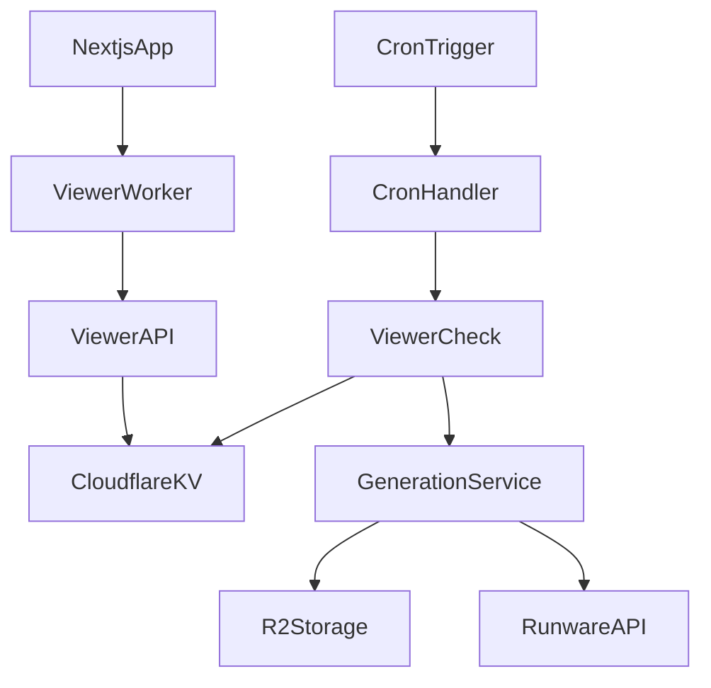
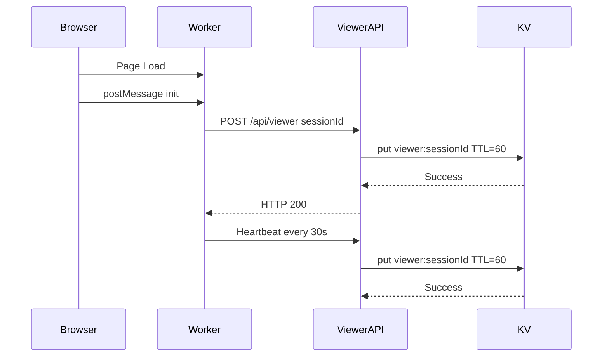
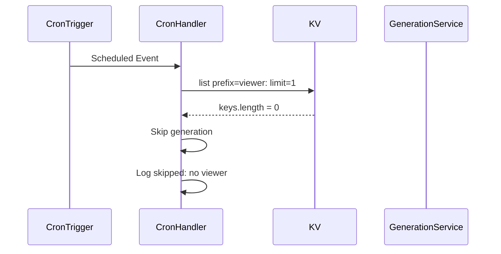
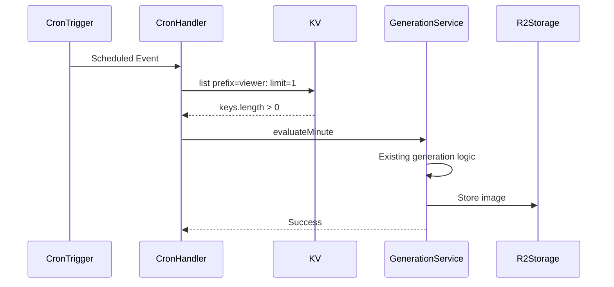
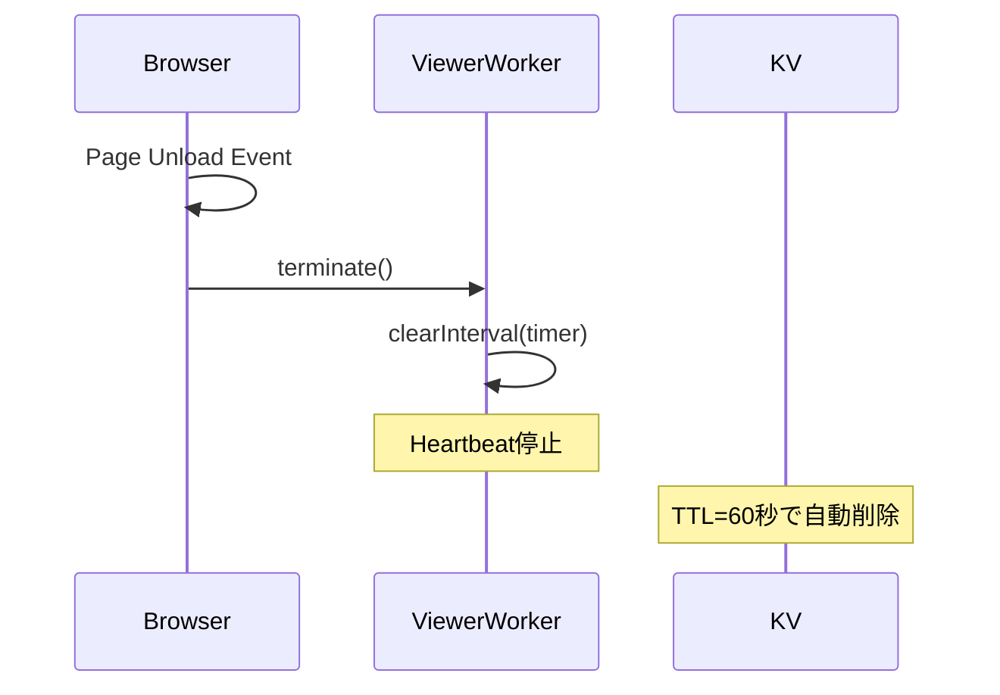

# Technical Design Document

## Overview

Viewer Check 機能は、既存のDOOM Indexシステムにリアルタイム閲覧者チェック機能を追加し、リアルタイムで閲覧しているユーザーが少なくとも1人いるかどうかを判定し、閲覧者が存在しない時間帯の画像生成コストを回避する。Cloudflare Workers の cron により 60 秒ごとにトリガーされる生成処理において、Cloudflare KV に保存された閲覧者情報を確認し、アクティブな閲覧者が存在する場合のみ生成処理を実行する。

**Purpose**: この機能は、無人時間帯の無駄な画像生成コスト（1生成あたり $0.002）を完全に排除し、実トラフィックに応じた効率的な運用を実現する。**本機能はプロジェクト初期のコスト最適化機能であり、十分にtrade volumeが出てきて画像の生成コストよりも収益が出てきたら無くても良い一時的な機能である。**

**Users**: システム運用者とエンドユーザーが間接的に恩恵を受ける。運用者はコスト削減により、エンドユーザーは安定したサービス提供により利益を得る。

**Impact**: 現在のシステムは常に1分間隔で画像生成を実行しているが、本機能により、閲覧者が存在しない時間帯は生成をスキップし、コストを削減する。

### Goals

- 閲覧者情報をCloudflare KVで管理し、リアルタイムで閲覧しているユーザーを追跡する
- Cron実行時に閲覧者が少なくとも1人いるかをチェックし、存在しない場合は生成をスキップする
- フロントエンドからWeb Worker経由でheartbeatを送信し、閲覧者情報を維持する
- ページ離脱時に`navigator.sendBeacon`で離脱通知を送信する
- 既存の生成処理フローを最小限の変更で統合する

### Non-Goals

- Bot判定機能（すべてのアクセスを閲覧者として記録）
- 閲覧者履歴の永続化（TTLによる自動削除のみ）
- 複数ユーザー間の閲覧者共有機能
- 閲覧者情報の可視化UI
- 長期的な機能としての維持（プロジェクト初期のみ）

## Architecture

### Existing Architecture Analysis

既存のDOOM Indexシステムは以下の構造を持つ：

- **Cron処理**: `src/cron.ts` の `handleScheduledEvent` がCloudflare Workers Cron Triggersで1分間隔で実行される
- **サービス層**: `src/services/container.ts` の `createServicesForWorkers` でサービスコンテナを作成
- **生成サービス**: `GenerationService.evaluateMinute()` が画像生成を実行
- **ストレージ**: Cloudflare R2を使用して画像と状態を保存
- **API層**: Next.js App RouterのAPI Routes（`src/app/api/`）でRESTful APIを提供
- **エラーハンドリング**: `neverthrow`の`Result`型を使用

既存パターンを維持しつつ、以下の拡張を行う：

- Cloudflare KVバインディングを追加して閲覧者情報を管理
- `/api/viewer` エンドポイントを追加
- Cron処理に閲覧者チェックを追加
- フロントエンドにWeb Workerとviewerフックを追加

### High-Level Architecture



**Architecture Integration**:

- 既存パターン維持: App Router、services層のResult戻り、ストレージを継続利用
- 新規コンポーネント導入: Viewer API、Viewer Service、Web Worker、viewerフックを追加
- 技術整合性: KVバインディングを追加し、既存のR2ストレージと並行して使用
- Cloudflare統合: KVバインディングを`wrangler.toml`に追加し、Cron処理とAPI Routesで共有

### Technology Alignment

- **Runtime**: Cloudflare Workers（Cron Triggers で 1 分間隔実行、API Routes）
- **Frontend Hosting**: Cloudflare Pages（Next.js with @opennextjs/cloudflare）
- **Storage**: Cloudflare R2（既存） + Cloudflare KV（新規追加）
- **Scheduling**: Cloudflare Cron Triggers（`wrangler.toml` で `crons = ["* * * * *"]` 定義）
- **Frontend**: Next.js App Router、Web Worker（クラシック形式）
- **Error Handling**: `neverthrow`の`Result`型を継続使用
- **Logging**: `utils/logger`（info/ debug/ warn/ error）＋ JSON ライクな payload

### Configuration Requirements

**wrangler.toml への追加**:

```toml
# KV Namespace Binding
[[kv_namespaces]]
binding = "VIEWER_KV"
id = "your-kv-namespace-id"  # 実際のKV Namespace IDに置き換え
```

**KV Namespace の作成**:

```bash
# KV Namespaceを作成
npx wrangler kv:namespace create "VIEWER_KV"

# 出力されたIDをwrangler.tomlに設定
# 例: id = "abc123def456ghi789"
```

**TypeScript型定義の更新**:

1. **KV Namespaceの型定義**:

`src/types/worker-configuration.d.ts`にKV Namespaceの型を追加（`wrangler types`コマンドで自動生成されるが、手動で追加する場合）:

```typescript
declare namespace Cloudflare {
  interface Env {
    // ... 既存の型定義 ...
    VIEWER_KV: KVNamespace;
  }
}
```

2. **Web Workerの型定義**:

`tsconfig.json`の`compilerOptions.lib`に`"WebWorker"`を追加（既に含まれている場合は不要）:

```json
{
  "compilerOptions": {
    "lib": ["dom", "dom.iterable", "esnext", "WebWorker"]
  }
}
```

これにより、Worker内で`self`、`postMessage`、`addEventListener`などのWorker APIが型安全に使用できます。

3. **Workerメッセージの型定義**:

`src/types/viewer.ts`にWorkerメッセージの型を定義:

```typescript
export interface ViewerWorkerMessage {
  type: "init" | "stop";
  payload?: {
    sessionId: string;
    endpoint?: string;
  };
}

export interface ViewerRequest {
  sessionId: string;
  bye?: boolean;
}

export interface ViewerResponse {
  success: boolean;
  error?: string;
}
```

**Next.jsでのWeb Worker実装の注意点**:

- `new Worker(new URL(...), import.meta.url)`形式を使用することで、Next.jsが自動的にWorkerファイルをバンドルし、適切なパスに配置します（[参考](https://zenn.dev/sora_kumo/articles/65420761a0bec2)）
- Workerファイルは`src/workers/`ディレクトリに配置し、`export default null;`を追加してモジュールとして認識させます
- `{ type: "module" }`オプションを指定することで、ESM形式のWorkerとして実行されます
- TypeScriptで実装することで、型安全性が向上し、開発時のエラー検出が容易になります

### Key Design Decisions

- **Decision: Cloudflare KVによる閲覧者管理**
  - Context: 閲覧者情報は一時的で、TTLによる自動削除が必要。R2は永続ストレージのため不適切。
  - Alternatives: R2（永続化不要）、Durable Objects（過剰）、メモリ（再起動で消失）。
  - Selected Approach: Cloudflare KVを使用し、`viewer:{sessionId}` キーにTTL=60秒を設定。heartbeatでTTLを更新。
  - Rationale: KVはTTL機能をネイティブサポートし、低レイテンシで高速な読み書きが可能。無料枠で十分。
  - Trade-offs: KVのTTL削除に数秒〜十数秒の遅延があるが、1分周期処理のため問題なし。

- **Decision: TypeScript Web Workerによるheartbeat実装**
  - Context: メインスレッドの負荷を避け、バックグラウンドでheartbeatを送信する必要がある。型安全性と開発体験の向上も重要。
  - Alternatives:
    - Next.js Scriptコンポーネントの`worker` strategy: 実験的でApp Routerでは動作しない（[参考](https://nextjs.org/docs/pages/api-reference/components/script#worker)）
    - クラシックWeb Worker（`/public/viewer.worker.js`）: JavaScriptのみ、型安全性なし
    - `setInterval`（メインスレッド負荷）: メインスレッドをブロック
    - Service Worker（複雑）: 過剰な機能
    - ポーリング（非効率）: リソース消費が大きい
  - Selected Approach: TypeScript Web Worker（`src/workers/viewer.worker.ts`）を使用し、`new Worker(new URL(...), import.meta.url)`形式で読み込み、30秒間隔でheartbeatを送信。
  - Rationale:
    - Next.js Scriptコンポーネントの`worker` strategyは実験的で、App Routerでは動作しないため使用不可
    - Next.jsが`import.meta.url`形式を自動的にバンドルし、適切に処理する（[参考](https://zenn.dev/sora_kumo/articles/65420761a0bec2)）
    - TypeScriptで実装することで、型安全性が向上し、開発時のエラー検出が容易
    - `export default null;`を追加することで、モジュールとして認識され、TypeScript警告を回避
    - `{ type: "module" }`オプションでESM形式のWorkerとして実行可能
    - 独自のWorkerファイルを作成することで、完全な制御が可能
  - Trade-offs:
    - クラシックWorkerと比較して、Next.jsのバンドル処理が必要だが、型安全性と開発体験の向上により十分に補償される
    - ビルド時にWorkerファイルがバンドルされるため、開発時のホットリロードが若干遅くなる可能性があるが、実用上問題なし

- **Decision: Cron処理での閲覧者チェック**
  - Context: 生成処理を実行する前にリアルタイム閲覧者が少なくとも1人いるかをチェックし、存在しない場合はスキップする必要がある。
  - Alternatives: 生成処理内でチェック（処理開始後の無駄）、別のCron処理（複雑化）、イベント駆動（過剰）。
  - Selected Approach: `handleScheduledEvent`の最初でKVの`list({ prefix: "viewer:", limit: 1 })`を実行し、結果に応じて生成処理をスキップまたは実行。
  - Rationale: 最小限の変更で既存の生成処理フローに統合できる。`limit: 1`で存在確認のみを行い、パフォーマンスを最適化。
  - Trade-offs: 閲覧者が存在しても生成がスキップされる可能性があるが、既存のhashベースのスキップロジックと併用される。

## System Flows

### Viewer Registration Flow



### Generation Skip Flow



### Generation Execution Flow



### Page Unload Flow



## Requirements Traceability

| Requirement | Requirement Summary                   | Components                     | Interfaces         | Flows                     |
| ----------- | ------------------------------------- | ------------------------------ | ------------------ | ------------------------- |
| 1.1         | ページロード時にsessionIdを生成しPOST | useViewer Hook, ViewerWorker   | POST /api/viewer   | Viewer Registration Flow  |
| 1.2         | KVにviewer:sessionIdをTTL=60で保存    | ViewerService                  | KV.put             | Viewer Registration Flow  |
| 2.1         | Web Workerで30秒間隔heartbeat         | ViewerWorker                   | Worker.postMessage | Viewer Registration Flow  |
| 2.2         | HeartbeatでTTLを60秒に更新            | ViewerService                  | KV.put             | Viewer Registration Flow  |
| 3.1         | ページ離脱時にWorkerを終了            | useViewer Hook                 | Worker.terminate   | Page Unload Flow          |
| 3.2         | Worker終了でheartbeat停止             | ViewerWorker                   | clearInterval      | Page Unload Flow          |
| 4.1         | Cron実行時にKVでviewerチェック        | CronHandler                    | KV.list            | Generation Skip Flow      |
| 4.2         | Viewerが無ければスキップ              | CronHandler                    | Log skipped        | Generation Skip Flow      |
| 4.3         | Viewerがあれば生成実行                | CronHandler, GenerationService | evaluateMinute     | Generation Execution Flow |
| 5.1-5.4     | KVデータ管理とTTL設定                 | ViewerService                  | KV.put/delete      | All Flows                 |

## Components and Interfaces

### Frontend Layer

#### useViewer Hook

**Responsibility & Boundaries**

- **Primary Responsibility**: ページロード時にWeb Workerを自動的に起動し、ページ離脱時にWorkerを終了する
- **Domain Boundary**: フロントエンドの閲覧者管理の初期化
- **Data Ownership**: Workerインスタンスの管理のみ（sessionIdはWorker内で生成）
- **Transaction Boundary**: クライアント側のみ、サーバーとの通信は非同期

**Dependencies**

- **Inbound**: クライアントコンポーネントから呼び出される
- **Outbound**: Web Worker (`src/workers/viewer.worker.ts`)
- **External**: なし

**Contract Definition**

```typescript
// 引数なしのシンプルなhook
export function useViewer(): void;
```

- **Preconditions**: ブラウザ環境で実行される（`typeof window !== "undefined"`）
- **Postconditions**: Web Workerが起動し、heartbeatが開始される
- **Invariants**: hookが呼び出される度にWorkerが起動される（通常はレイアウトで一度だけ呼び出し）

**Implementation Details**

**File**: `src/hooks/use-viewer.ts`

```typescript
"use client";

import { useEffect, useRef } from "react";

export function useViewer() {
  const workerRef = useRef<Worker | null>(null);

  useEffect(() => {
    if (typeof window === "undefined") return;

    // Web Workerを起動（Worker内でsessionId生成とheartbeat送信を自動的に開始）
    const w = new Worker(new URL("@/workers/viewer.worker", import.meta.url), { type: "module" });
    workerRef.current = w;

    // ページ離脱時の処理（Workerを終了）
    const onUnload = () => {
      if (w) {
        w.terminate();
      }
    };

    // ページ離脱イベントを監視
    window.addEventListener("pagehide", onUnload);
    window.addEventListener("beforeunload", onUnload);

    // クリーンアップ
    return () => {
      onUnload();
      workerRef.current = null;
    };
  }, []); // 依存配列は空（マウント時に一度だけ実行）
}
```

**Key Implementation Points**:

- `"use client"`ディレクティブでクライアントコンポーネントとして実行
- `useEffect`の依存配列は空（`[]`）で、マウント時に一度だけ実行
- Workerを起動するだけ（メッセージのやり取りは不要）
- Worker内でsessionId生成とheartbeat送信を自動的に開始
- ページ離脱時にWorkerを終了するだけ
- 引数なしのシンプルなhook

**レイアウトへの統合**:

**File**: `src/app/layout.tsx` (修正版)

```typescript
"use client";

import { useViewer } from "@/hooks/use-viewer";

export default function RootLayout({
  children,
}: Readonly<{
  children: React.ReactNode;
}>) {
  useViewer(); // hookを呼び出すだけ

  return (
    <html lang="en" style={{ margin: 0, padding: 0, width: "100%", height: "100%" }}>
      <body
        className={`${cinzelDecorative.variable} antialiased`}
        style={{ margin: 0, padding: 0, width: "100%", height: "100%", overflow: "hidden" }}
      >
        <QueryProvider>{children}</QueryProvider>
      </body>
    </html>
  );
}
```

**注意**: レイアウトがServer Componentの場合、hookを使用できないため、別のクライアントコンポーネントを作成する必要があります。

**代替案: クライアントコンポーネントラッパー**

レイアウトがServer Componentの場合は、以下のようにクライアントコンポーネントでラップします：

**File**: `src/components/viewer-provider.tsx`

```typescript
"use client";

import { useViewer } from "@/hooks/use-viewer";

export function ViewerProvider() {
  useViewer();
  return null;
}
```

**File**: `src/app/layout.tsx` (Server Componentのまま)

```typescript
import { ViewerProvider } from "@/components/viewer-provider";

export default function RootLayout({
  children,
}: Readonly<{
  children: React.ReactNode;
}>) {
  return (
    <html lang="en" style={{ margin: 0, padding: 0, width: "100%", height: "100%" }}>
      <body
        className={`${cinzelDecorative.variable} antialiased`}
        style={{ margin: 0, padding: 0, width: "100%", height: "100%", overflow: "hidden" }}
      >
        <ViewerProvider />
        <QueryProvider>{children}</QueryProvider>
      </body>
    </html>
  );
}
```

#### ViewerWorker

**Responsibility & Boundaries**

- **Primary Responsibility**: バックグラウンドで30秒間隔でheartbeatを送信する
- **Domain Boundary**: Web Worker内のheartbeat管理
- **Data Ownership**: `sessionId`と`endpoint`の保持
- **Transaction Boundary**: Web Worker内のみ

**Dependencies**

- **Inbound**: `useViewer` hookからWorkerが起動される（メッセージ通信は不要）
- **Outbound**: `/api/viewer` APIにfetchリクエストを送信
- **External**: なし

**Contract Definition**

- **Preconditions**: Workerが起動される
- **Postconditions**: Worker起動時にsessionIdを生成し、30秒間隔でheartbeatが送信される
- **Invariants**: Worker起動時に自動的にheartbeatが開始される

**Implementation Details**

Next.jsでは、TypeScriptでWeb Workerを実装する場合、`new Worker(new URL(...), import.meta.url)`の形式を使用します。これにより、Next.jsが自動的にWorkerファイルをバンドルし、適切に処理します。

**File**: `src/workers/viewer.worker.ts`

```typescript
export default null; // TypeScript警告避け（モジュールとして認識させる）

const endpoint = "/api/viewer";

// Worker起動時にsessionIdを生成
const sessionId = crypto.randomUUID();

async function ping(): Promise<void> {
  try {
    const body = JSON.stringify({ sessionId });
    await fetch(endpoint, {
      method: "POST",
      headers: { "content-type": "application/json" },
      body,
      keepalive: true,
    });
  } catch (error) {
    // エラーは無視（次のheartbeatで再試行）
  }
}

// Worker起動時に即座に1回pingを送信
ping();

// 30秒間隔でheartbeatを送信
const timer = setInterval(ping, 30_000);

// Worker終了時にタイマーをクリーンアップ（通常は不要だが、念のため）
self.addEventListener("beforeunload", () => {
  clearInterval(timer);
});
```

**Key Implementation Points**:

- `export default null;`を追加してTypeScriptのモジュール警告を回避（[参考](https://zenn.dev/sora_kumo/articles/65420761a0bec2)）
- Worker起動時に`crypto.randomUUID()`でsessionIdを自動生成
- Worker起動時に即座に1回pingを送信し、その後30秒間隔で継続
- メッセージのやり取りは不要（Worker起動時に自動的にheartbeatが開始）
- `fetch`を使用（Worker内では`navigator.sendBeacon`が使用できないため）
- `keepalive: true`オプションでページ遷移後もリクエストを送信可能
- エラーは無視し、次のheartbeatサイクルで自動的に再試行
- endpointは固定値（`/api/viewer`）

### API Layer

#### ViewerAPI

**Responsibility & Boundaries**

- **Primary Responsibility**: `/api/viewer`エンドポイントで閲覧者登録、heartbeat、離脱通知を処理する
- **Domain Boundary**: Next.js API Routes
- **Data Ownership**: なし（KVへの読み書きのみ）
- **Transaction Boundary**: 各リクエストは独立して処理される

**Dependencies**

- **Inbound**: フロントエンドからのHTTPリクエスト
- **Outbound**: `ViewerService`を使用してKV操作を実行
- **External**: なし

**Contract Definition**

**API Contract**:

| Method | Endpoint    | Request                                | Response               | Errors   |
| ------ | ----------- | -------------------------------------- | ---------------------- | -------- |
| POST   | /api/viewer | `{ sessionId: string, bye?: boolean }` | `{ success: boolean }` | 400, 500 |

**Request Schema**:

```typescript
interface ViewerRequest {
  sessionId: string;
  bye?: boolean; // trueの場合は離脱通知
}
```

**Response Schema**:

```typescript
interface ViewerResponse {
  success: boolean;
}
```

- **Preconditions**: リクエストボディに`sessionId`が含まれる
- **Postconditions**: KVに`viewer:{sessionId}`が保存または削除される
- **Invariants**: `bye=true`の場合は削除、それ以外は保存または更新

**Implementation Details**

**File**: `src/app/api/viewer/route.ts`

```typescript
import { NextResponse } from "next/server";
import { getCloudflareContext } from "@opennextjs/cloudflare";
import { logger } from "@/utils/logger";
import { createViewerService } from "@/services/viewer";

interface ViewerRequest {
  sessionId: string;
  bye?: boolean;
}

export async function POST(request: Request) {
  try {
    // Cloudflare環境からKV Namespaceを取得
    const { env } = await getCloudflareContext({ async: true });
    const kvNamespace = (env as Cloudflare.Env).VIEWER_KV as KVNamespace | undefined;

    if (!kvNamespace) {
      logger.error("viewer.api.error", {
        message: "VIEWER_KV binding is not configured",
      });
      return NextResponse.json({ success: false, error: "KV not configured" }, { status: 500 });
    }

    // リクエストボディをパース
    const body: ViewerRequest = await request.json();

    if (!body.sessionId) {
      return NextResponse.json({ success: false, error: "sessionId is required" }, { status: 400 });
    }

    // ViewerServiceを作成
    const viewerService = createViewerService({ kvNamespace });

    // bye=trueの場合は削除、それ以外は登録または更新
    if (body.bye) {
      const result = await viewerService.removeViewer(body.sessionId);
      if (result.isErr()) {
        logger.error("viewer.api.remove.error", {
          error: result.error,
          sessionId: body.sessionId,
        });
        return NextResponse.json({ success: false, error: "Failed to remove viewer" }, { status: 500 });
      }
      logger.info("viewer.api.remove", { sessionId: body.sessionId });
    } else {
      // 初回登録またはheartbeat更新
      const result = await viewerService.registerViewer(body.sessionId);
      if (result.isErr()) {
        logger.error("viewer.api.register.error", {
          error: result.error,
          sessionId: body.sessionId,
        });
        return NextResponse.json({ success: false, error: "Failed to register viewer" }, { status: 500 });
      }
      logger.debug("viewer.api.register", { sessionId: body.sessionId });
    }

    return NextResponse.json({ success: true }, { status: 200 });
  } catch (error) {
    const message = error instanceof Error ? error.message : String(error);
    logger.error("viewer.api.error", { error: message });
    return NextResponse.json({ success: false, error: "Internal server error" }, { status: 500 });
  }
}
```

**Key Implementation Points**:

- `getCloudflareContext({ async: true })`でCloudflare環境からKV Namespaceを取得
- リクエストボディのバリデーション（`sessionId`必須）
- `request.json()`でJSONをパース（`fetch`で`Content-Type: application/json`として送信される）
- `bye`フラグに応じて削除または登録/更新を実行
- エラーハンドリングとログ記録
- `neverthrow`の`Result`型を使用してエラーを処理

### Service Layer

#### ViewerService

**Responsibility & Boundaries**

- **Primary Responsibility**: Cloudflare KVに対する閲覧者操作を抽象化する
- **Domain Boundary**: サービス層の閲覧者管理
- **Data Ownership**: KV内の`viewer:`プレフィックスキーの管理
- **Transaction Boundary**: 各操作は独立して実行される

**Dependencies**

- **Inbound**: `ViewerAPI`、`CronHandler`から使用される
- **Outbound**: Cloudflare KV Namespace
- **External**: なし

**Contract Definition**

**Service Interface**:

```typescript
interface ViewerService {
  registerViewer(sessionId: string): Promise<Result<void, AppError>>;
  updateViewer(sessionId: string): Promise<Result<void, AppError>>;
  removeViewer(sessionId: string): Promise<Result<void, AppError>>;
  hasActiveViewer(): Promise<Result<boolean, AppError>>;
}
```

- **Preconditions**: KV Namespaceが利用可能
- **Postconditions**: KV操作が実行される
- **Invariants**: `viewer:{sessionId}`キーの形式を維持する

**Implementation Details**

**File**: `src/services/viewer.ts`

```typescript
import { err, ok, Result } from "neverthrow";
import type { AppError } from "@/types/app-error";
import { logger } from "@/utils/logger";

const VIEWER_KEY_PREFIX = "viewer:";
const VIEWER_TTL_SECONDS = 60;

type ViewerServiceDeps = {
  kvNamespace: KVNamespace;
  log?: typeof logger;
};

export type ViewerService = {
  registerViewer(sessionId: string): Promise<Result<void, AppError>>;
  updateViewer(sessionId: string): Promise<Result<void, AppError>>;
  removeViewer(sessionId: string): Promise<Result<void, AppError>>;
  hasActiveViewer(): Promise<Result<boolean, AppError>>;
};

export function createViewerService({ kvNamespace, log = logger }: ViewerServiceDeps): ViewerService {
  function getViewerKey(sessionId: string): string {
    return `${VIEWER_KEY_PREFIX}${sessionId}`;
  }

  async function registerViewer(sessionId: string): Promise<Result<void, AppError>> {
    try {
      const key = getViewerKey(sessionId);
      await kvNamespace.put(key, "1", {
        expirationTtl: VIEWER_TTL_SECONDS,
      });
      log.debug("viewer.service.register", { sessionId, key });
      return ok(undefined);
    } catch (error) {
      const message = error instanceof Error ? error.message : String(error);
      return err({
        type: "StorageError",
        op: "put",
        key: getViewerKey(sessionId),
        message: `KV put failed: ${message}`,
      });
    }
  }

  async function updateViewer(sessionId: string): Promise<Result<void, AppError>> {
    // updateViewerはregisterViewerと同じ実装（KV.putでTTLを更新）
    return registerViewer(sessionId);
  }

  async function removeViewer(sessionId: string): Promise<Result<void, AppError>> {
    try {
      const key = getViewerKey(sessionId);
      await kvNamespace.delete(key);
      log.debug("viewer.service.remove", { sessionId, key });
      return ok(undefined);
    } catch (error) {
      const message = error instanceof Error ? error.message : String(error);
      return err({
        type: "StorageError",
        op: "delete",
        key: getViewerKey(sessionId),
        message: `KV delete failed: ${message}`,
      });
    }
  }

  async function hasActiveViewer(): Promise<Result<boolean, AppError>> {
    try {
      const listResult = await kvNamespace.list({
        prefix: VIEWER_KEY_PREFIX,
        limit: 1,
      });
      const hasViewer = listResult.keys.length > 0;
      log.debug("viewer.service.check", { hasViewer });
      return ok(hasViewer);
    } catch (error) {
      const message = error instanceof Error ? error.message : String(error);
      return err({
        type: "StorageError",
        op: "list",
        key: VIEWER_KEY_PREFIX,
        message: `KV list failed: ${message}`,
      });
    }
  }

  return {
    registerViewer,
    updateViewer,
    removeViewer,
    hasActiveViewer,
  };
}
```

**Key Implementation Points**:

- Cloudflare KV APIの使用方法:
  - `kvNamespace.put(key, value, { expirationTtl })`: TTL付きでキーを保存
  - `kvNamespace.delete(key)`: キーを削除
  - `kvNamespace.list({ prefix, limit })`: プレフィックスでキーを検索（存在確認のみ）
- `expirationTtl`は秒単位で指定（60秒 = 1分）
- `limit: 1`で存在確認のみを行い、パフォーマンスを最適化
- `neverthrow`の`Result`型を使用してエラーを処理
- 既存の`AppError`型を使用してエラーを統一

#### CronHandler

**Responsibility & Boundaries**

- **Primary Responsibility**: Cron実行時にリアルタイム閲覧者が少なくとも1人いるかをチェックし、存在しない場合は生成処理をスキップする
- **Domain Boundary**: Cloudflare Workers Cron処理
- **Data Ownership**: なし（`ViewerService`と`GenerationService`を使用）
- **Transaction Boundary**: 各Cron実行は独立して処理される

**Dependencies**

- **Inbound**: Cloudflare Cron Triggersから呼び出される
- **Outbound**: `ViewerService`、`GenerationService`を使用
- **External**: なし

**Contract Definition**

**Service Interface**:

```typescript
interface CronHandler {
  handleScheduledEvent(event: ScheduledEvent, env: Cloudflare.Env, ctx: ExecutionContext): Promise<void>;
}
```

- **Preconditions**: Cronイベントがトリガーされる
- **Postconditions**: 閲覧者チェック結果に応じて生成処理をスキップまたは実行する
- **Invariants**: 閲覧者が存在しない場合は生成処理を実行しない

**Integration Strategy**:

- **Modification Approach**: 既存の`src/cron.ts`の`handleScheduledEvent`を拡張し、最初に閲覧者チェックを追加
- **Backward Compatibility**: 既存の生成処理フローを維持し、閲覧者チェックを前置する
- **Migration Path**: KVバインディングを追加し、Cron処理に閲覧者チェックを統合

**Implementation Details**

**File**: `src/cron.ts` (修正版)

```typescript
import { createServicesForWorkers } from "./services/container";
import { createViewerService } from "./services/viewer";
import { logger } from "./utils/logger";

export async function handleScheduledEvent(
  event: ScheduledEvent,
  env: Cloudflare.Env,
  _ctx: ExecutionContext,
): Promise<void> {
  const startTime = Date.now();

  console.info("Cron triggered", {
    scheduledTime: new Date(event.scheduledTime).toISOString(),
    cron: event.cron,
  });

  try {
    // 閲覧者チェック
    const kvNamespace = env.VIEWER_KV as KVNamespace | undefined;
    if (kvNamespace) {
      const viewerService = createViewerService({ kvNamespace });
      const viewerResult = await viewerService.hasActiveViewer();

      if (viewerResult.isErr()) {
        logger.error("viewer.check.error", {
          error: viewerResult.error,
          durationMs: Date.now() - startTime,
        });
        // エラーが発生しても生成処理は続行（フォールバック）
      } else if (!viewerResult.value) {
        // 閲覧者が存在しない場合は生成をスキップ
        logger.info("Cron skipped: no viewer", {
          durationMs: Date.now() - startTime,
        });
        return;
      }
      logger.debug("viewer.check.found", {
        durationMs: Date.now() - startTime,
      });
    } else {
      logger.warn("viewer.check.skip", {
        message: "VIEWER_KV binding not configured, skipping viewer check",
      });
    }

    // 既存の生成処理を実行
    const services = createServicesForWorkers(env.R2_BUCKET);
    const result = await services.generationService.evaluateMinute();

    if (result.isErr()) {
      console.error("Generation failed", {
        error: result.error,
        durationMs: Date.now() - startTime,
      });
      return;
    }

    const { status, hash, imageUrl } = result.value;

    console.info("Cron success", {
      status,
      hash,
      imageUrl,
      durationMs: Date.now() - startTime,
    });
  } catch (error) {
    const message = error instanceof Error ? error.message : String(error);
    const stack = error instanceof Error ? error.stack : undefined;

    console.error("Cron failed", {
      error: message,
      stack,
      durationMs: Date.now() - startTime,
    });
  }
}
```

**Key Implementation Points**:

- Cron処理の最初に閲覧者チェックを追加
- KV Namespaceが設定されていない場合は警告を出して生成処理を続行（フォールバック）
- 閲覧者が存在しない場合は早期リターンで生成処理をスキップ
- エラーが発生しても生成処理は続行（閲覧者チェック機能は補助機能のため）
- 既存の生成処理フローは変更せず、前置する形で統合

## Data Models

### Physical Data Model

#### Cloudflare KV Schema

**viewer:{sessionId}**

- **Key Pattern**: `viewer:{sessionId}`（例: `viewer:550e8400-e29b-41d4-a716-446655440000`）
- **Value**: `"1"`（固定値、存在確認のみに使用）
- **TTL**: 60秒（heartbeatで更新）
- **Purpose**: リアルタイムで閲覧しているユーザーの存在を示す

**Cloudflare KV API Usage**:

```typescript
// KV Namespaceの取得（Workers環境）
const kvNamespace = env.VIEWER_KV as KVNamespace;

// キーの保存（TTL付き）
await kvNamespace.put("viewer:session-id", "1", {
  expirationTtl: 60, // 60秒後に自動削除
});

// キーの更新（TTLをリセット）
await kvNamespace.put("viewer:session-id", "1", {
  expirationTtl: 60, // 既存キーのTTLを更新
});

// キーの削除
await kvNamespace.delete("viewer:session-id");

// プレフィックスでキーを検索（存在確認）
const listResult = await kvNamespace.list({
  prefix: "viewer:",
  limit: 1, // 1件のみ取得（存在確認のみ）
});
const hasViewer = listResult.keys.length > 0;
```

**Important Notes**:

- `expirationTtl`は秒単位で指定（60 = 60秒）
- `put`操作で既存キーのTTLを更新できる
- `list`操作は`limit`パラメータで結果数を制限可能（パフォーマンス最適化）
- TTLによる自動削除には数秒〜十数秒の遅延があるが、1分周期処理のため問題なし

**genlock:{minute}**

- **Key Pattern**: `genlock:{minute}`（例: `genlock:2025-11-11T12:00`）
- **Value**: `"1"`（固定値）
- **TTL**: 55秒
- **Purpose**: 同一分バケット内の重複生成を防止（既存機能）

**last_snapshot**

- **Key Pattern**: `last_snapshot`
- **Value**: `JSON({ objectKey: string, ts: string })`
- **TTL**: 3600秒
- **Purpose**: 最新生成画像のメタ情報（既存機能）

### Data Contracts & Integration

**API Data Transfer**:

- **Request**: JSON形式で`{ sessionId: string, bye?: boolean }`を送信
- **Response**: JSON形式で`{ success: boolean }`を返却
- **Validation**: `sessionId`は必須、UUID形式を推奨（検証は任意）

**Cross-Service Data Management**:

- **Eventual Consistency**: KVのTTL削除に数秒〜十数秒の遅延があるが、1分周期処理のため問題なし
- **Idempotency**: 同一`sessionId`での複数回の登録は冪等（TTLが更新されるのみ）

## Error Handling

### Error Strategy

プレゼンス機能は生成処理の最適化のための補助機能であるため、エラーが発生しても生成処理への影響を最小限に抑える。

### Error Categories and Responses

**User Errors** (4xx):

- **Invalid Request**: `sessionId`が欠如している場合 → HTTP 400を返却し、ログに記録
- **Response**: エラーレスポンスを返却するが、フロントエンドは生成処理への影響を与えない

**System Errors** (5xx):

- **KV Operation Failure**: KV操作が失敗した場合 → HTTP 500を返却し、ログに記録
- **Cron Processing Failure**: Cron処理中のエラー → ログに記録し、生成処理をスキップ
- **Response**: エラーをログに記録するが、システム全体の動作を停止させない

**Business Logic Errors** (422):

- 該当なし（プレゼンス機能は単純な登録/削除のみ）

### Monitoring

- **Logging**: `utils/logger`を使用してプレゼンス操作をログに記録
- **Metrics**: KV操作の成功/失敗、Cron処理のスキップ回数を追跡
- **Health Check**: KV Namespaceの可用性を確認

## Testing Strategy

### Unit Tests

- **ViewerService**: KV操作のモックを使用して各メソッドをテスト
  - `registerViewer`: 正常な登録、エラー処理
  - `updateViewer`: TTL更新の確認
  - `removeViewer`: 削除の確認
  - `hasActiveViewer`: 存在確認のロジック
- **useViewer Hook**: Web Workerのモックを使用して初期化とクリーンアップをテスト
- **ViewerWorker**: Worker内のheartbeatロジックをテスト

### Integration Tests

- **ViewerAPI**: Next.js API Routesのテストで、KV操作の統合を確認
  - POST `/api/viewer`: 正常な登録、heartbeat、離脱通知
  - エラーハンドリング: KV操作失敗時の挙動
- **CronHandler**: Cron処理での閲覧者チェック統合をテスト
  - Viewerが存在しない場合のスキップ
  - Viewerが存在する場合の生成実行

### E2E Tests

- **Viewer Flow**: ブラウザでページを開き、heartbeatが送信されることを確認
- **Generation Skip**: 閲覧者が無い状態でCronが実行され、生成がスキップされることを確認
- **Page Unload**: ページを閉じた際に`sendBeacon`が送信されることを確認

### Performance Tests

- **KV Operations**: `list`操作のパフォーマンスを測定（`limit: 1`で最適化）
- **Concurrent Viewer**: 複数の同時アクセス時のKV操作のパフォーマンス
