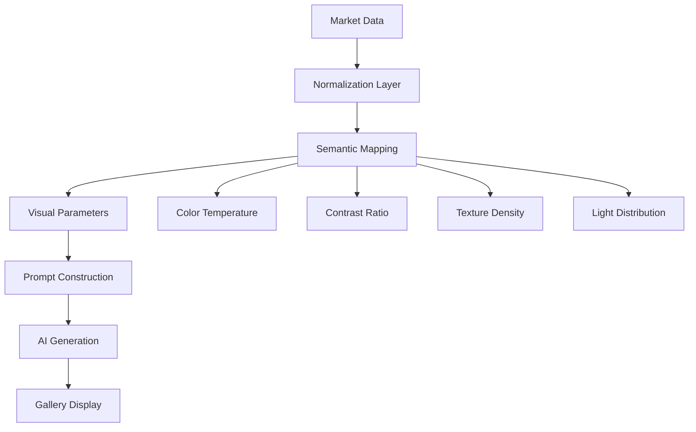
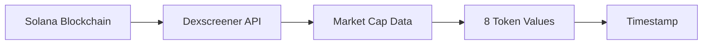
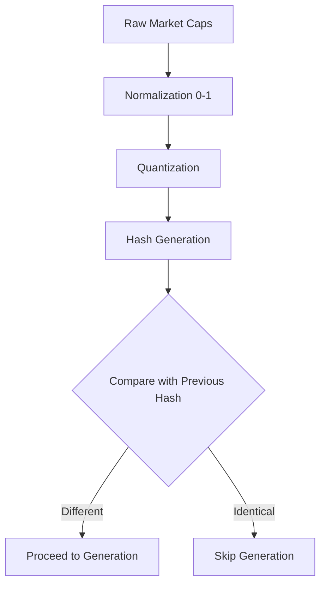
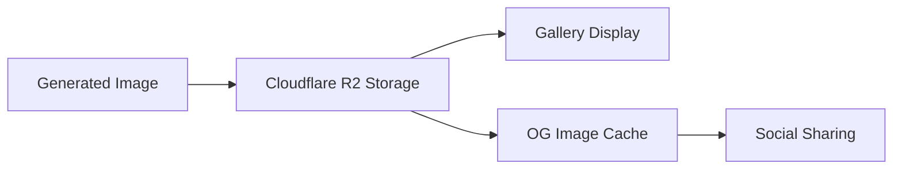
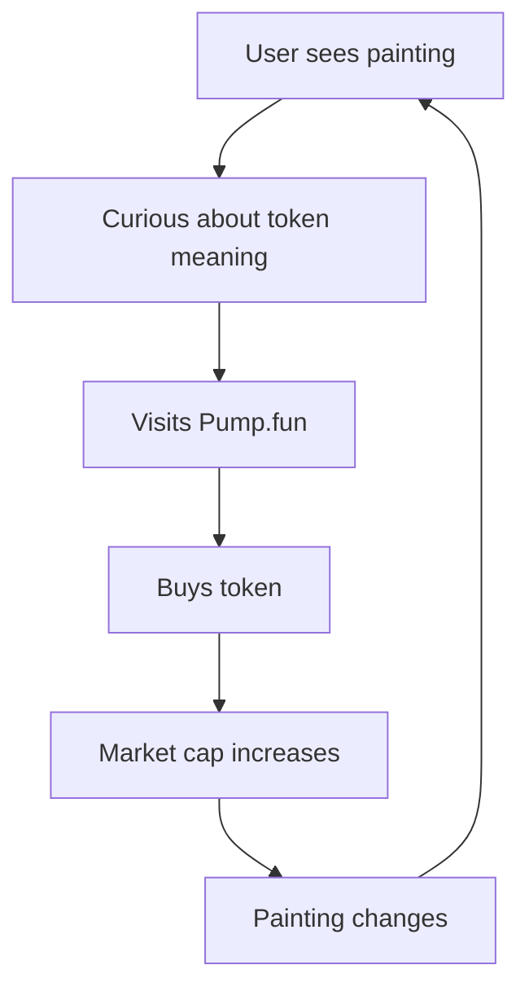

export const metadata = {
  title: "DOOM INDEX: A Market-Driven Generative Art System",
  authors: ["DOOM INDEX Research Team"],
  date: "November 13, 2025",
  institution: "Solana Blockchain Network",
  version: "v1.0",
};

<div className="paper-header">
  <div className="paper-metadata">
    <div className="paper-date">{metadata.date}</div>
    <div className="paper-version">{metadata.version}</div>
  </div>
  <h1 className="paper-title">{metadata.title}</h1>
  <div className="paper-authors">
    {metadata.authors.map((author, i) => (
      <span key={i} className="paper-author">
        {author}
      </span>
    ))}
  </div>
  <div className="paper-institution">{metadata.institution}</div>
  <div className="paper-epigraph">
    <em>"Every buy paints the apocalypse. Every sell erases hope."</em>
  </div>
</div>

<div className="abstract-section">

## Abstract

DOOM INDEX is an experimental art project that transforms on-chain market activity into continuously evolving generative artwork. By monitoring the market capitalization of eight thematic tokens on the Solana blockchain, the system generates unique AI-driven paintings every minute, creating a real-time visual representation of humanity's collective anxieties and aspirations as expressed through financial speculation.

This whitepaper presents the conceptual framework, symbolic architecture, and generative methodology underlying DOOM INDEX, exploring the intersection of blockchain economics, artificial intelligence, and contemporary art practice.

</div>

---

## 1. Project Genesis: What is DOOM INDEX?

DOOM INDEX operates at the convergence of three domains:

1. **Financial Markets**: Real-time market capitalization data from Solana-based tokens
2. **Artificial Intelligence**: Generative image synthesis driven by market-derived parameters
3. **Digital Art**: A virtual gallery space presenting the continuously evolving artwork

### 1.1 Core Concept

The project reframes cryptocurrency trading as an unintentional form of collective artistic expression. Each transaction—whether driven by speculation, fear, or hope—becomes a brushstroke in an ever-changing canvas depicting "the state of the world."

The system monitors eight thematic tokens, each representing a different dimension of contemporary global concerns:

- **Environmental collapse** (CO2, ICE, FOREST)
- **Existential threats** (NUKE, PANDEMIC)
- **Technological dominance** (MACHINE)
- **Psychological states** (FEAR, HOPE)

As traders buy and sell these tokens, their collective market activity directly influences the visual characteristics of the generated artwork, creating a feedback loop between economic behavior and aesthetic output.

### 1.2 The Gallery Experience

The artwork is presented in a minimalist virtual museum environment—a dark gallery space with a single baroque gold frame containing the current generated painting. This deliberate aesthetic choice emphasizes:

- **Singularity**: One painting at a time, demanding focused attention
- **Temporality**: The artwork changes every minute, never to be seen again
- **Ritual**: The viewing experience becomes a meditation on impermanence

---

## 2. The Painting: Semantic Architecture

Each generated painting is not merely decorative—it functions as a **data visualization**, a **cultural artifact**, and a **speculative fiction** simultaneously.

### 2.1 Visual Semantics

The AI-generated paintings synthesize multiple visual motifs corresponding to the eight tracked indicators:

| Visual Element            | Meaning                          | Market Driver       |
| ------------------------- | -------------------------------- | ------------------- |
| **Atmospheric density**   | Environmental degradation        | CO2 market cap      |
| **Glacial luminosity**    | Climate tipping points           | ICE market cap      |
| **Organic patterns**      | Biodiversity and natural systems | FOREST market cap   |
| **Radiative glow**        | Nuclear threat and energy        | NUKE market cap     |
| **Mechanical structures** | AI/automation dominance          | MACHINE market cap  |
| **Fractal diffusion**     | Pandemic spread patterns         | PANDEMIC market cap |
| **Shadow depth**          | Collective anxiety               | FEAR market cap     |
| **Light intensity**       | Resilience and optimism          | HOPE market cap     |

### 2.2 Compositional Logic

The painting's composition follows a multi-layered synthesis model:



Each token's market cap is normalized to a 0-1 scale, then mapped to specific visual parameters that influence the AI's generative process. The resulting image is deterministic—given the same market state, the system produces the same painting.

---

## 3. The Eight Tokens: Symbolic Framework

Each token represents a dimension of contemporary existential concern, functioning as both financial instrument and cultural signifier.

### 3.1 Environmental Indicators

#### CO2 — Atmospheric Degradation


**Symbolic Meaning**: Carbon emissions, climate change, industrial pollution

**Visual Influence**:

- Higher market cap → Increased fog density
- Desaturated color palette
- Hazy atmospheric effects
- Reduced visibility and clarity

**Market Interpretation**: Rising CO2 market cap suggests increased attention to climate concerns, manifesting as visual opacity and environmental distress in the painting.

---

#### ICE — Cryospheric Collapse


**Symbolic Meaning**: Polar ice melt, glacial retreat, temperature extremes

**Visual Influence**:

- Higher market cap → Enhanced reflectivity
- Cool color temperature (blue shift)
- Crystalline structures
- Luminous highlights

**Market Interpretation**: ICE market activity reflects concern for polar regions and climate tipping points, translated into cold, reflective visual elements.

---

#### FOREST — Biosphere Vitality


**Symbolic Meaning**: Deforestation, biodiversity, natural ecosystems

**Visual Influence**:

- Higher market cap → Increased vegetation density
- Organic, fractal patterns
- Green color saturation
- Natural texture complexity

**Market Interpretation**: FOREST trading volume indicates attention to ecological preservation, manifesting as organic growth patterns and natural complexity in the artwork.

---

### 3.2 Existential Threat Indicators

#### NUKE — Nuclear Catastrophe


**Symbolic Meaning**: Nuclear weapons, radiation, warfare, energy risk

**Visual Influence**:

- Higher market cap → Radiative glow effects
- Particle noise and debris
- Flash highlights
- Ash-like textures

**Market Interpretation**: NUKE market activity reflects geopolitical tensions and nuclear anxiety, creating explosive visual elements and destructive aesthetics.

---

#### PANDEMIC — Biological Threat


**Symbolic Meaning**: Disease spread, public health crises, biological vulnerability

**Visual Influence**:

- Higher market cap → Fractal diffusion patterns
- Organic spread effects
- Bioluminescent elements
- Cellular structures

**Market Interpretation**: PANDEMIC trading suggests heightened awareness of biological threats, visualized through spreading, organic patterns reminiscent of viral propagation.

---

### 3.3 Technological Indicator

#### MACHINE — Artificial Dominance


**Symbolic Meaning**: AI advancement, automation, technological control

**Visual Influence**:

- Higher market cap → Mechanical pattern density
- Geometric structures
- Metallic textures
- Grid-like organization

**Market Interpretation**: MACHINE market cap reflects concerns about AI and automation, manifesting as rigid, mechanical visual elements that suggest technological dominance over organic forms.

---

### 3.4 Psychological Indicators

#### FEAR — Collective Anxiety


**Symbolic Meaning**: Societal dread, surveillance, oppression

**Visual Influence**:

- Higher market cap → Deeper shadows
- High contrast (chiaroscuro)
- Dark color dominance
- Red accent highlights

**Market Interpretation**: FEAR trading volume indicates collective anxiety levels, creating oppressive shadows and dramatic contrasts in the visual composition.

---

#### HOPE — Resilient Optimism


**Symbolic Meaning**: Human resilience, optimism, regeneration

**Visual Influence**:

- Higher market cap → Increased light intensity
- Warm color temperature
- Luminous elements
- Transparent, ethereal qualities

**Market Interpretation**: HOPE market activity suggests collective optimism, manifesting as light sources, warm colors, and uplifting visual elements that counterbalance darker themes.

---

### 3.5 Token Interaction Dynamics

The eight tokens do not operate in isolation—their combined market states create emergent visual narratives:

- **Environmental Collapse Scenario**: High CO2 + Low ICE + Low FOREST → Toxic, barren landscape
- **Technological Dystopia**: High MACHINE + High FEAR + Low HOPE → Mechanical, oppressive atmosphere
- **Pandemic Crisis**: High PANDEMIC + High FEAR + Low HOPE → Organic threat with dark undertones
- **Balanced Tension**: Moderate values across all tokens → Complex, nuanced composition
- **Hope Dominance**: High HOPE + Low FEAR → Luminous, optimistic despite other threats

---

## 4. AI Generation Flow: From Market to Canvas

The transformation of market data into visual art follows a rigorous, deterministic pipeline:

### 4.1 Data Acquisition



Every minute, the system queries current market capitalization for all eight tokens via the Dexscreener API, which aggregates real-time trading data from Solana DEXs.

### 4.2 Normalization & Hashing



**Normalization**: Each token's market cap is scaled to a 0-1 range based on historical min/max values.

**Quantization**: Values are rounded to reduce noise and prevent unnecessary regeneration from minor fluctuations.

**Hash Comparison**: The system generates a cryptographic hash of the current market state. If identical to the previous state, generation is skipped to conserve resources.

### 4.3 Prompt Construction

The normalized values are embedded into a structured natural language prompt:

```
Square surreal oil painting in a baroque gold frame, dark museum lighting.
Depict the current state of the world based on on-chain market data:

CO2({mc_CO2}), ICE({mc_ICE}), FOREST({mc_FOREST}), NUKE({mc_NUKE}),
MACHINE({mc_MACHINE}), PANDEMIC({mc_PANDEMIC}), FEAR({mc_FEAR}), HOPE({mc_HOPE})

Blend visual motifs:
- Toxic atmospheric haze (CO2)
- Glacial reflective surfaces (ICE)
- Dense organic vegetation (FOREST)
- Nuclear ash and radiation glow (NUKE)
- Mechanical lattice structures (MACHINE)
- Pandemic fractal diffusion (PANDEMIC)
- Oppressive shadows (FEAR)
- Resilient light sources (HOPE)

Visual parameters:
- Intensity = {entropy_value}
- Contrast = {contrast_ratio}
- Color Temperature = {temp_value}

Style: Hyperrealistic oil painting texture, cinematic chiaroscuro lighting,
baroque composition, 1:1 aspect ratio, 1024x1024px.

Seed: {deterministic_seed}
```

The deterministic seed ensures reproducibility—the same market state always produces the same painting.

### 4.4 AI Generation

The prompt is sent to an AI image generation service (Runware, OpenAI DALL-E, or fallback mock generator), which synthesizes the visual elements according to the specified parameters.

### 4.5 Storage & Display



The generated image is stored in Cloudflare R2 with metadata (timestamp, market caps, hash), then displayed in the 3D gallery environment.

---

## 5. Pump.fun: The Economic Substrate

### 5.1 What is Pump.fun?

[Pump.fun](https://pump.fun) is a Solana-based platform for launching and trading meme tokens with minimal friction. It enables anyone to create a token and establish a liquidity pool instantly, democratizing token creation.

### 5.2 DOOM INDEX Token Economics

Each of the eight DOOM INDEX tokens is launched on Pump.fun, creating a decentralized market where:

1. **Anyone can trade**: No permission required
2. **Price discovery is continuous**: Market cap fluctuates based on buy/sell pressure
3. **Trading fees generate revenue**: 0.05% fee on each transaction

### 5.3 The Art-Economy Feedback Loop



This creates a unique dynamic where:

- **Art influences economics**: Compelling visuals drive interest in tokens
- **Economics influences art**: Trading activity directly modifies the artwork
- **Speculation becomes creation**: Every trade is an artistic contribution

### 5.4 Revenue Model

The project sustains itself through trading fees:

- **Fee per trade**: 0.05% (0.0005)
- **Average trade size**: $1,000
- **Fee per $1,000 trade**: $0.50

With minimal trading activity (0.02 trades/minute across all 8 tokens), monthly revenue exceeds operational costs, making the project economically sustainable while remaining artistically focused.

---

## 6. Philosophical Implications

### 6.1 Market as Medium

DOOM INDEX challenges traditional notions of artistic authorship. Who is the artist?

- The AI that generates the image?
- The traders whose actions determine the parameters?
- The system designer who created the mapping?
- The collective unconscious expressed through market behavior?

### 6.2 Impermanence and Value

Each painting exists for exactly one minute before being replaced. This radical impermanence questions:

- What gives art value—permanence or experience?
- Can a continuously changing artwork be "collected"?
- How do we preserve ephemeral digital art?

### 6.3 Speculation as Expression

By treating trading as artistic input, DOOM INDEX reframes financial speculation as a form of collective expression—perhaps the most honest representation of contemporary values.

---

## 7. Conclusion

DOOM INDEX is an experiment in **market-driven aesthetics**, **algorithmic curation**, and **collective unconscious visualization**. It transforms the abstract, often invisible world of cryptocurrency trading into a tangible, visual experience that reflects humanity's deepest concerns and aspirations.

As markets fluctuate, so does our collective portrait of the apocalypse—sometimes dark and oppressive, sometimes luminous with hope. The painting never stops changing, because the world never stops changing.

> _"The market is chaos. But chaos, visualized and aestheticized, becomes poetry."_

---

## References

- Solana Blockchain: https://solana.com
- Pump.fun Platform: https://pump.fun
- Dexscreener API: https://dexscreener.com
- Project Repository: https://github.com/posaune0423/doom-index
